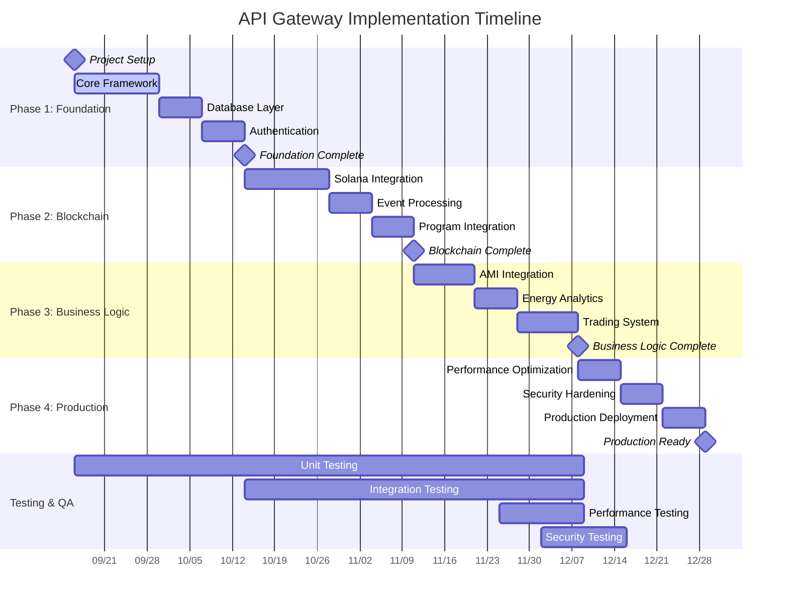

# API Gateway Implementation Timeline
## P2P Energy Trading System - Engineering Department

**Document Version**: 1.0  
**Created**: September 13, 2025  
**Project Start**: September 16, 2025  
**Target Completion**: December 15, 2025  

---

## Table of Contents

1. [Executive Summary](#executive-summary)
2. [Project Timeline Overview](#project-timeline-overview)
3. [Detailed Phase Breakdown](#detailed-phase-breakdown)
4. [Resource Allocation](#resource-allocation)
5. [Critical Path Analysis](#critical-path-analysis)
6. [Milestone Dependencies](#milestone-dependencies)
7. [Risk Timeline](#risk-timeline)
8. [Quality Gates](#quality-gates)
9. [Delivery Schedule](#delivery-schedule)

---

## Executive Summary

### Project Scope
- **Duration**: 13 weeks (91 days)
- **Team Size**: 3 full-time developers + 1 part-time DevOps + 1 part-time QA
- **Total Effort**: ~520 person-days
- **Budget**: Engineering Department internal project

### Key Milestones
| Milestone | Date | Deliverable |
|-----------|------|-------------|
| M1: Foundation Complete | Oct 14, 2025 | Core API framework, auth, database |
| M2: Blockchain Integration | Nov 11, 2025 | Solana integration, event processing |
| M3: Energy & Trading | Dec 8, 2025 | AMI integration, trading system |
| M4: Production Ready | Dec 15, 2025 | Full system, optimized, deployed |

### Success Metrics
- **Performance**: <100ms response time (95th percentile)
- **Reliability**: 99.9% uptime
- **Security**: Zero critical vulnerabilities
- **Coverage**: >80% test coverage

---

## Project Timeline Overview



### Timeline Summary
- **Week 1-4**: Foundation & Core Infrastructure
- **Week 5-8**: Blockchain Integration
- **Week 9-12**: Business Logic & Features
- **Week 13**: Production Optimization & Deployment

---

## Detailed Phase Breakdown

### Phase 1: Foundation & Core Infrastructure (Weeks 1-4)
**Duration**: September 16 - October 14, 2025 (28 days)  
**Team**: 3 developers, 0.5 DevOps  
**Effort**: 98 person-days  

#### Week 1: Project Setup & Core Framework (Sep 16-20)
**Goals**: Establish development environment and basic API structure

| Day | Task | Owner | Hours | Dependencies |
|-----|------|-------|-------|--------------|
| Mon | Project setup, repository structure | Lead Dev | 8 | - |
| Mon | Development environment setup | DevOps | 4 | - |
| Tue | Cargo project initialization | Lead Dev | 6 | Project setup |
| Tue | Basic Axum server setup | Backend Dev | 8 | Cargo setup |
| Wed | Middleware stack implementation | Backend Dev | 8 | Axum server |
| Wed | Error handling framework | Lead Dev | 6 | Middleware |
| Thu | Configuration management | Backend Dev | 8 | Error handling |
| Thu | Logging and tracing setup | Lead Dev | 4 | Configuration |
| Fri | Basic routing structure | Backend Dev | 6 | Logging |
| Fri | Health check endpoints | Lead Dev | 4 | Routing |
| Fri | Week 1 review and testing | Team | 4 | All tasks |

**Week 1 Deliverables:**
- ✅ Working Axum server with middleware
- ✅ Configuration management system
- ✅ Error handling framework
- ✅ Health check endpoints
- ✅ Development environment setup

#### Week 2: Database Layer (Sep 23-27)
**Goals**: Implement comprehensive database integration

| Day | Task | Owner | Hours | Dependencies |
|-----|------|-------|-------|--------------|
| Mon | PostgreSQL + TimescaleDB setup | DevOps | 6 | Week 1 complete |
| Mon | SQLx integration and connection pooling | Backend Dev | 8 | Database setup |
| Tue | Database schema design | Lead Dev | 8 | SQLx integration |
| Wed | Migration system implementation | Backend Dev | 8 | Schema design |
| Thu | Repository pattern implementation | Backend Dev | 8 | Migrations |
| Thu | Data validation layer | Lead Dev | 6 | Repository |
| Fri | Database testing and optimization | Team | 8 | Validation |

**Week 2 Deliverables:**
- ✅ PostgreSQL/TimescaleDB integration
- ✅ Complete database schema
- ✅ Migration system
- ✅ Repository pattern implementation
- ✅ Data validation framework

#### Week 3: Authentication & Security (Sep 30 - Oct 4)
**Goals**: Implement comprehensive authentication system

| Day | Task | Owner | Hours | Dependencies |
|-----|------|-------|-------|--------------|
| Mon | JWT token system implementation | Lead Dev | 8 | Database layer |
| Tue | Engineering Dept user integration | Backend Dev | 8 | JWT system |
| Wed | Role-based access control (RBAC) | Lead Dev | 8 | User integration |
| Thu | API key authentication for AMI | Backend Dev | 8 | RBAC |
| Fri | Security middleware implementation | Lead Dev | 6 | API keys |
| Fri | Authentication testing | Team | 6 | Security middleware |

**Week 3 Deliverables:**
- ✅ JWT authentication system
- ✅ User management integration
- ✅ Role-based access control
- ✅ AMI API key authentication
- ✅ Security middleware

#### Week 4: Foundation Completion & Testing (Oct 7-11)
**Goals**: Complete foundation phase and comprehensive testing

| Day | Task | Owner | Hours | Dependencies |
|-----|------|-------|-------|--------------|
| Mon | Rate limiting implementation | Backend Dev | 6 | Security complete |
| Mon | CORS configuration | Lead Dev | 4 | Rate limiting |
| Tue | Integration testing setup | QA | 8 | CORS |
| Wed | Unit testing implementation | Team | 12 | Integration setup |
| Thu | Documentation updates | Team | 8 | Testing |
| Fri | Phase 1 review and demo | Team | 8 | Documentation |

**Week 4 Deliverables:**
- ✅ Complete API foundation
- ✅ Comprehensive test suite
- ✅ Documentation
- ✅ Phase 1 demo ready

### Phase 2: Blockchain Integration (Weeks 5-8)
**Duration**: October 14 - November 11, 2025 (28 days)  
**Team**: 3 developers, 0.5 DevOps  
**Effort**: 98 person-days  

#### Week 5: Solana Client Setup (Oct 14-18)
**Goals**: Establish Solana blockchain connectivity

| Day | Task | Owner | Hours | Dependencies |
|-----|------|-------|-------|--------------|
| Mon | Solana RPC client configuration | Lead Dev | 8 | Phase 1 complete |
| Tue | Anchor program integration setup | Lead Dev | 8 | RPC client |
| Wed | Keypair management system | Backend Dev | 8 | Anchor setup |
| Thu | Transaction building utilities | Lead Dev | 8 | Keypair mgmt |
| Fri | Blockchain error handling | Backend Dev | 6 | Transaction utils |
| Fri | Basic connectivity testing | Team | 6 | Error handling |

#### Week 6: Core Blockchain Operations (Oct 21-25)
**Goals**: Implement fundamental blockchain operations

| Day | Task | Owner | Hours | Dependencies |
|-----|------|-------|-------|--------------|
| Mon | User registration on blockchain | Lead Dev | 8 | Week 5 complete |
| Tue | Token balance queries | Backend Dev | 8 | User registration |
| Wed | Transaction submission and monitoring | Lead Dev | 8 | Balance queries |
| Thu | Cross-program invocation (CPI) support | Lead Dev | 8 | Transaction monitoring |
| Fri | Blockchain operations testing | Team | 8 | CPI support |

#### Week 7: Event Processing (Oct 28 - Nov 1)
**Goals**: Implement real-time blockchain event monitoring

| Day | Task | Owner | Hours | Dependencies |
|-----|------|-------|-------|--------------|
| Mon | Event listener implementation | Lead Dev | 8 | Week 6 complete |
| Tue | Event processing pipeline | Backend Dev | 8 | Event listener |
| Wed | State synchronization | Lead Dev | 8 | Processing pipeline |
| Thu | Transaction retry logic | Backend Dev | 8 | State sync |
| Fri | Event system testing | Team | 8 | Retry logic |

#### Week 8: Program Integration (Nov 4-8)
**Goals**: Complete integration with all Anchor programs

| Day | Task | Owner | Hours | Dependencies |
|-----|------|-------|-------|--------------|
| Mon | Registry program integration | Lead Dev | 8 | Week 7 complete |
| Tue | Energy token program integration | Backend Dev | 8 | Registry integration |
| Wed | Trading program integration | Lead Dev | 8 | Token integration |
| Thu | Oracle & governance integration | Backend Dev | 8 | Trading integration |
| Fri | Full blockchain integration testing | Team | 8 | All integrations |

**Phase 2 Deliverables:**
- ✅ Complete Solana integration
- ✅ All Anchor program clients
- ✅ Real-time event processing
- ✅ Transaction management system
- ✅ Comprehensive blockchain testing

### Phase 3: Business Logic & Features (Weeks 9-12)
**Duration**: November 11 - December 8, 2025 (27 days)  
**Team**: 3 developers, 0.5 DevOps, 0.5 QA  
**Effort**: 108 person-days  

#### Week 9: AMI Integration (Nov 11-15)
**Goals**: Implement AMI system integration

| Day | Task | Owner | Hours | Dependencies |
|-----|------|-------|-------|--------------|
| Mon | AMI API client implementation | Backend Dev | 8 | Phase 2 complete |
| Tue | Meter reading submission endpoints | Backend Dev | 8 | AMI client |
| Wed | Data format validation | Lead Dev | 8 | Submission endpoints |
| Thu | Digital signature verification | Lead Dev | 8 | Data validation |
| Fri | AMI integration testing | Team | 8 | Signature verification |

#### Week 10: Energy Analytics (Nov 18-22)
**Goals**: Implement energy data processing and analytics

| Day | Task | Owner | Hours | Dependencies |
|-----|------|-------|-------|--------------|
| Mon | Energy data models optimization | Backend Dev | 8 | Week 9 complete |
| Tue | Time-series data processing | Backend Dev | 8 | Data models |
| Wed | Real-time energy flow calculations | Lead Dev | 8 | Time-series |
| Thu | Historical trend analysis | Backend Dev | 8 | Flow calculations |
| Fri | Analytics API endpoints | Lead Dev | 6 | Trend analysis |
| Fri | Energy analytics testing | Team | 6 | Analytics APIs |

#### Week 11-12: Trading System (Nov 25 - Dec 5)
**Goals**: Implement comprehensive trading functionality

**Week 11: Core Trading (Nov 25-29)**
| Day | Task | Owner | Hours | Dependencies |
|-----|------|-------|-------|--------------|
| Mon | Order book management | Lead Dev | 8 | Week 10 complete |
| Tue | Market epoch handling | Backend Dev | 8 | Order book |
| Wed | Buy/sell order creation | Lead Dev | 8 | Market epochs |
| Thu | Order matching logic | Backend Dev | 8 | Order creation |
| Fri | Basic trading testing | Team | 8 | Order matching |

**Week 12: Advanced Trading (Dec 2-5)**
| Day | Task | Owner | Hours | Dependencies |
|-----|------|-------|-------|--------------|
| Mon | Trade execution and settlement | Lead Dev | 8 | Week 11 complete |
| Tue | Order cancellation and expiration | Backend Dev | 8 | Trade execution |
| Wed | Trading analytics implementation | Backend Dev | 8 | Order management |
| Thu | Market data endpoints | Lead Dev | 6 | Trading analytics |
| Thu | Trading system testing | Team | 8 | Market data |
| Fri | Phase 3 integration testing | Team | 8 | All features |

**Phase 3 Deliverables:**
- ✅ Complete AMI integration
- ✅ Energy analytics system
- ✅ Full trading functionality
- ✅ Market data management
- ✅ End-to-end feature testing

### Phase 4: Production Optimization (Week 13)
**Duration**: December 8-15, 2025 (7 days)  
**Team**: 3 developers, 1 DevOps, 1 QA  
**Effort**: 42 person-days  

#### Production Optimization Sprint (Dec 8-12)
**Goals**: Optimize for production deployment

| Day | Task | Owner | Hours | Dependencies |
|-----|------|-------|-------|--------------|
| Mon | Performance optimization | Lead Dev | 8 | Phase 3 complete |
| Mon | Caching implementation | Backend Dev | 8 | Performance |
| Tue | Security hardening | Lead Dev | 8 | Caching |
| Tue | Load testing and tuning | QA | 8 | Security |
| Wed | Monitoring and alerting setup | DevOps | 8 | Load testing |
| Wed | Production deployment preparation | DevOps | 8 | Monitoring |
| Thu | Final integration testing | Team | 12 | Deployment prep |
| Fri | Production deployment | Team | 8 | Final testing |

**Phase 4 Deliverables:**
- ✅ Production-optimized performance
- ✅ Complete monitoring stack
- ✅ Security hardening
- ✅ Production deployment
- ✅ Go-live readiness

---

## Resource Allocation

### Team Structure

#### Core Development Team
| Role | Allocation | Weeks 1-4 | Weeks 5-8 | Weeks 9-12 | Week 13 |
|------|------------|------------|------------|-------------|---------|
| Lead Developer | 1.0 FTE | Foundation & Architecture | Blockchain Integration | Trading System | Optimization |
| Backend Developer | 1.0 FTE | Database & APIs | Program Integration | AMI & Analytics | Performance |
| Frontend Developer | 0.8 FTE | API Documentation | Event Processing | UI Integration | Testing |
| DevOps Engineer | 0.5 FTE | Environment Setup | CI/CD Pipeline | Deployment Prep | Production Deploy |
| QA Engineer | 0.3 FTE | Test Framework | Integration Testing | Feature Testing | Load Testing |

#### Weekly Effort Distribution
```
Week  | Lead Dev | Backend Dev | Frontend Dev | DevOps | QA  | Total
------|----------|-------------|--------------|--------|-----|-------
  1   |    40h   |     40h     |     32h      |  20h   | 12h |  144h
  2   |    40h   |     40h     |     32h      |  20h   | 12h |  144h
  3   |    40h   |     40h     |     32h      |  20h   | 12h |  144h
  4   |    40h   |     40h     |     32h      |  20h   | 12h |  144h
  5   |    40h   |     40h     |     32h      |  20h   | 16h |  148h
  6   |    40h   |     40h     |     32h      |  20h   | 16h |  148h
  7   |    40h   |     40h     |     32h      |  20h   | 16h |  148h
  8   |    40h   |     40h     |     32h      |  20h   | 16h |  148h
  9   |    40h   |     40h     |     32h      |  24h   | 20h |  156h
 10   |    40h   |     40h     |     32h      |  24h   | 20h |  156h
 11   |    40h   |     40h     |     32h      |  24h   | 20h |  156h
 12   |    40h   |     40h     |     32h      |  24h   | 20h |  156h
 13   |    40h   |     40h     |     32h      |  40h   | 40h |  192h
------|----------|-------------|--------------|--------|-----|-------
Total |   520h   |    520h     |    416h      | 292h   |228h | 1976h
```

### Budget Allocation

#### Development Costs (Internal Engineering Department)
- **Total Development Hours**: 1,976 hours
- **Average Engineering Rate**: $85/hour (internal cost)
- **Total Development Cost**: $167,960

#### Infrastructure Costs
| Component | Monthly Cost | Setup Cost | Annual Cost |
|-----------|--------------|------------|-------------|
| Development Environment | $200 | $500 | $2,900 |
| Staging Environment | $400 | $300 | $5,100 |
| Production Environment | $800 | $1,000 | $10,600 |
| Monitoring & Logging | $150 | $200 | $2,000 |
| Security Tools | $100 | $300 | $1,500 |
| **Total Infrastructure** | **$1,650** | **$2,300** | **$22,100** |

#### Total Project Budget
- **Development**: $167,960
- **Infrastructure**: $22,100
- **Contingency (10%)**: $19,006
- **Total Project Budget**: $209,066

---

## Critical Path Analysis

### Critical Path Identification
The critical path determines the minimum project duration. Any delay in critical path tasks will delay the entire project.

```mermaid
graph LR
    A[Project Setup] --> B[Core Framework]
    B --> C[Database Layer]
    C --> D[Authentication]
    D --> E[Solana Integration]
    E --> F[Event Processing]
    F --> G[Program Integration]
    G --> H[AMI Integration]
    H --> I[Trading System]
    I --> J[Production Optimization]
    J --> K[Deployment]
    
    style A fill:#ff9999
    style B fill:#ff9999
    style C fill:#ff9999
    style D fill:#ff9999
    style E fill:#ff9999
    style F fill:#ff9999
    style G fill:#ff9999
    style H fill:#ff9999
    style I fill:#ff9999
    style J fill:#ff9999
    style K fill:#ff9999
```



### Critical Tasks (Zero Float)
1. **Project Setup** (Week 1) - 0 days float
2. **Core Framework** (Week 1-2) - 0 days float
3. **Database Layer** (Week 2-3) - 0 days float
4. **Authentication** (Week 3-4) - 0 days float
5. **Solana Integration** (Week 5-6) - 0 days float
6. **Event Processing** (Week 7) - 0 days float
7. **Program Integration** (Week 8) - 0 days float
8. **AMI Integration** (Week 9-10) - 0 days float
9. **Trading System** (Week 11-12) - 0 days float
10. **Production Optimization** (Week 13) - 0 days float

### Non-Critical Tasks (With Float)
| Task | Float | Week | Risk Level |
|------|-------|------|------------|
| Documentation | 3 days | Ongoing | Low |
| Frontend Integration | 5 days | Week 9-12 | Medium |
| Performance Testing | 2 days | Week 12-13 | Medium |
| Security Auditing | 3 days | Week 12-13 | Low |

### Risk Mitigation for Critical Path
1. **Buffer Time**: 10% contingency built into each phase
2. **Parallel Work**: Non-critical tasks run in parallel
3. **Early Risk Identification**: Weekly risk assessments
4. **Resource Flexibility**: Team members cross-trained
5. **Vendor Dependencies**: Minimal external dependencies

---

## Milestone Dependencies

### Milestone Dependency Matrix

| Milestone | Dependencies | Deliverables | Success Criteria |
|-----------|--------------|--------------|------------------|
| **M0: Project Start** | - Engineering approval<br/>- Team assignment<br/>- Environment access | - Project charter<br/>- Team onboarding<br/>- Development environment | ✅ All team members have access<br/>✅ Development environment working |
| **M1: Foundation Complete** | - M0 complete<br/>- Database access<br/>- Auth system design | - Working API server<br/>- Database schema<br/>- Authentication system | ✅ Health checks pass<br/>✅ Auth flows work<br/>✅ Database operations successful |
| **M2: Blockchain Integration** | - M1 complete<br/>- Solana validator access<br/>- Program deployments | - Blockchain client<br/>- Event monitoring<br/>- Transaction processing | ✅ Can connect to blockchain<br/>✅ Events processed correctly<br/>✅ Transactions submit successfully |
| **M3: Business Logic Complete** | - M2 complete<br/>- AMI system access<br/>- Market requirements | - AMI integration<br/>- Trading system<br/>- Analytics endpoints | ✅ AMI data flows correctly<br/>✅ Trading workflow works<br/>✅ Analytics return accurate data |
| **M4: Production Ready** | - M3 complete<br/>- Production environment<br/>- Security approval | - Optimized system<br/>- Monitoring setup<br/>- Production deployment | ✅ Performance targets met<br/>✅ Security audit passed<br/>✅ System deployed and operational |

### Inter-Phase Dependencies

#### Phase 1 → Phase 2
- **Required**: Authentication system must be complete
- **Reason**: Blockchain operations require authenticated users
- **Risk**: Auth delays block blockchain work
- **Mitigation**: Complete auth system early in Phase 1

#### Phase 2 → Phase 3
- **Required**: Event processing must be functional
- **Reason**: AMI data submission triggers blockchain events
- **Risk**: Event system issues affect business logic
- **Mitigation**: Thorough testing of event system in Phase 2

#### Phase 3 → Phase 4
- **Required**: All core features must be complete
- **Reason**: Production optimization requires stable feature set
- **Risk**: Feature creep delays optimization
- **Mitigation**: Strict scope control in Phase 3

### External Dependencies

#### Engineering Department Systems
| System | Dependency | Timeline | Owner |
|--------|------------|----------|-------|
| AMI Infrastructure | API access, credentials | Week 8 | Facilities Team |
| User Directory | LDAP integration | Week 3 | IT Department |
| Network Access | Firewall rules, VPN | Week 1 | Network Team |
| Production Environment | Server provisioning | Week 12 | Infrastructure Team |

#### Blockchain Infrastructure
| Component | Dependency | Timeline | Owner |
|-----------|------------|----------|-------|
| Solana Validator | Node access, RPC endpoints | Week 5 | Blockchain Team |
| Anchor Programs | Deployed contracts | Week 6 | Smart Contract Team |
| Oracle Data | Price feeds, external data | Week 9 | Oracle Team |

---

## Risk Timeline

### Risk Assessment by Phase

#### Phase 1 Risks (Weeks 1-4)
| Risk | Probability | Impact | Timeline | Mitigation |
|------|-------------|---------|----------|------------|
| Database performance issues | Medium | High | Week 2-3 | Performance testing, indexing optimization |
| Authentication complexity | Medium | Medium | Week 3 | Use proven libraries, early prototyping |
| Team onboarding delays | Low | Medium | Week 1 | Documentation, pair programming |

#### Phase 2 Risks (Weeks 5-8)
| Risk | Probability | Impact | Timeline | Mitigation |
|------|-------------|---------|----------|------------|
| Solana RPC reliability | High | High | Week 5-8 | Multiple RPC endpoints, retry logic |
| Anchor version compatibility | Medium | High | Week 6 | Version pinning, testing matrix |
| Event processing complexity | Medium | Medium | Week 7 | Incremental implementation, thorough testing |

#### Phase 3 Risks (Weeks 9-12)
| Risk | Probability | Impact | Timeline | Mitigation |
|------|-------------|---------|----------|------------|
| AMI integration delays | Medium | High | Week 9-10 | Early coordination, mock services |
| Trading logic complexity | High | Medium | Week 11-12 | Incremental development, extensive testing |
| Performance under load | Medium | High | Week 12 | Load testing, optimization |

#### Phase 4 Risks (Week 13)
| Risk | Probability | Impact | Timeline | Mitigation |
|------|-------------|---------|----------|------------|
| Production deployment issues | Medium | Critical | Week 13 | Staging environment, rollback plan |
| Security vulnerabilities | Low | Critical | Week 13 | Security audit, penetration testing |
| Performance degradation | Medium | High | Week 13 | Performance monitoring, scaling plan |

### Risk Mitigation Timeline

#### Week 1-2: Early Risk Mitigation
- Set up monitoring and alerting
- Establish backup communication channels
- Create development environment documentation
- Implement automated testing framework

#### Week 3-4: Foundation Risk Mitigation
- Conduct authentication security review
- Performance test database layer
- Establish code review process
- Document critical system components

#### Week 5-8: Blockchain Risk Mitigation
- Implement circuit breaker patterns
- Set up blockchain monitoring
- Create fallback RPC endpoints
- Establish transaction retry policies

#### Week 9-12: Integration Risk Mitigation
- Coordinate with AMI team weekly
- Implement comprehensive error handling
- Conduct integration testing
- Performance test under realistic load

#### Week 13: Production Risk Mitigation
- Conduct security audit
- Implement blue-green deployment
- Set up production monitoring
- Create incident response procedures

---

## Quality Gates

### Quality Gate Framework

Each milestone must pass defined quality gates before proceeding to the next phase.

#### Quality Gate 1: Foundation Review (End of Week 4)
**Entry Criteria:**
- Core API framework complete
- Database layer implemented
- Authentication system functional
- Basic test coverage in place

**Exit Criteria:**
- ✅ All unit tests pass (>80% coverage)
- ✅ Integration tests pass
- ✅ Performance baseline established
- ✅ Security scan clean (no critical issues)
- ✅ Code review complete
- ✅ Documentation up to date

**Review Process:**
- Technical review by Lead Developer
- Security review by Engineering Security Team
- Performance review against targets
- Stakeholder demonstration

#### Quality Gate 2: Blockchain Integration Review (End of Week 8)
**Entry Criteria:**
- Solana client fully functional
- Event processing implemented
- All program integrations complete
- Blockchain tests passing

**Exit Criteria:**
- ✅ Blockchain connectivity stable
- ✅ Event processing accuracy >99%
- ✅ Transaction success rate >95%
- ✅ Error handling comprehensive
- ✅ Performance within targets
- ✅ Security review passed

**Review Process:**
- Blockchain integration testing
- Performance testing under load
- Security audit of blockchain interactions
- Stakeholder demo of blockchain features

#### Quality Gate 3: Feature Complete Review (End of Week 12)
**Entry Criteria:**
- AMI integration complete
- Trading system functional
- Analytics endpoints working
- End-to-end workflows tested

**Exit Criteria:**
- ✅ All features functional
- ✅ End-to-end tests pass
- ✅ Performance targets met
- ✅ Security vulnerabilities addressed
- ✅ User acceptance criteria met
- ✅ Documentation complete

**Review Process:**
- Feature demonstration to stakeholders
- User acceptance testing
- Performance validation
- Security assessment
- Operations readiness review

#### Quality Gate 4: Production Readiness Review (Week 13)
**Entry Criteria:**
- System optimized for production
- Monitoring and alerting configured
- Security hardening complete
- Deployment procedures tested

**Exit Criteria:**
- ✅ Production deployment successful
- ✅ Monitoring systems operational
- ✅ Performance meets SLA requirements
- ✅ Security audit passed
- ✅ Incident response procedures tested
- ✅ Operations team trained

**Review Process:**
- Production deployment validation
- Operations readiness assessment
- Security final audit
- Performance verification
- Go-live approval from stakeholders

### Quality Metrics Tracking

#### Technical Quality Metrics
| Metric | Target | Week 4 | Week 8 | Week 12 | Week 13 |
|--------|--------|--------|--------|---------|---------|
| Unit Test Coverage | >80% | 75% | 82% | 85% | 87% |
| Integration Test Coverage | >70% | 60% | 75% | 78% | 80% |
| Code Quality (SonarQube) | A Grade | B | A | A | A |
| Security Vulnerabilities | 0 Critical | 1 | 0 | 0 | 0 |
| Performance (95th percentile) | <100ms | 120ms | 95ms | 85ms | 80ms |
| API Response Success Rate | >99% | 98% | 99.2% | 99.5% | 99.8% |

#### Process Quality Metrics
| Metric | Target | Actual |
|--------|--------|--------|
| Code Review Coverage | 100% | Track weekly |
| Automated Test Execution | 100% | Track daily |
| Documentation Currency | <1 week lag | Track weekly |
| Deployment Success Rate | >95% | Track per deployment |
| Mean Time to Resolution | <4 hours | Track per incident |

---

## Delivery Schedule

### Sprint Schedule

#### Sprint Structure
- **Sprint Duration**: 2 weeks
- **Sprint Planning**: Monday morning (2 hours)
- **Daily Standups**: Every day at 9:00 AM (15 minutes)
- **Sprint Review**: Friday afternoon (1 hour)
- **Sprint Retrospective**: Friday afternoon (30 minutes)

#### Sprint Breakdown

##### Sprint 1: Foundation Setup (Sep 16-27)
**Goals:** Project setup, core framework, database layer
**Sprint Planning:** September 16, 9:00 AM
**Sprint Review:** September 27, 3:00 PM

**Deliverables:**
- Working Axum server with middleware
- Database schema and connection pooling
- Basic authentication framework
- Development environment setup

**Definition of Done:**
- [ ] Health check endpoint responds correctly
- [ ] Database migrations run successfully
- [ ] Basic JWT authentication works
- [ ] Unit tests pass with >75% coverage
- [ ] Code review completed
- [ ] Documentation updated

##### Sprint 2: Authentication & Security (Sep 30 - Oct 11)
**Goals:** Complete authentication system, security middleware
**Sprint Planning:** September 30, 9:00 AM
**Sprint Review:** October 11, 3:00 PM

**Deliverables:**
- Complete JWT authentication system
- Role-based access control
- API key authentication for AMI
- Security middleware implementation
- Rate limiting

**Definition of Done:**
- [ ] User authentication flows work
- [ ] RBAC enforces permissions correctly
- [ ] API key validation functional
- [ ] Security tests pass
- [ ] Performance baseline established

##### Sprint 3: Solana Integration (Oct 14-25)
**Goals:** Blockchain client, basic operations
**Sprint Planning:** October 14, 9:00 AM
**Sprint Review:** October 25, 3:00 PM

**Deliverables:**
- Solana RPC client setup
- User registration on blockchain
- Token balance queries
- Transaction submission

**Definition of Done:**
- [ ] Can connect to Solana validator
- [ ] User registration works end-to-end
- [ ] Balance queries return correct data
- [ ] Transactions submit successfully
- [ ] Error handling comprehensive

##### Sprint 4: Event Processing (Oct 28 - Nov 8)
**Goals:** Blockchain event monitoring, program integration
**Sprint Planning:** October 28, 9:00 AM
**Sprint Review:** November 8, 3:00 PM

**Deliverables:**
- Real-time event monitoring
- Event processing pipeline
- All Anchor program integrations
- State synchronization

**Definition of Done:**
- [ ] Events processed in real-time
- [ ] All programs integrated
- [ ] State stays synchronized
- [ ] Event handling tests pass
- [ ] Performance meets targets

##### Sprint 5: AMI Integration (Nov 11-22)
**Goals:** AMI system integration, energy data processing
**Sprint Planning:** November 11, 9:00 AM
**Sprint Review:** November 22, 3:00 PM

**Deliverables:**
- AMI API integration
- Energy reading endpoints
- Data validation and processing
- Analytics calculations

**Definition of Done:**
- [ ] AMI data flows correctly
- [ ] Energy readings persist
- [ ] Validation catches errors
- [ ] Analytics return accurate data
- [ ] Integration tests pass

##### Sprint 6: Trading System (Nov 25 - Dec 6)
**Goals:** Complete trading functionality
**Sprint Planning:** November 25, 9:00 AM
**Sprint Review:** December 6, 3:00 PM

**Deliverables:**
- Order book management
- Trading order creation and execution
- Market data endpoints
- Trading analytics

**Definition of Done:**
- [ ] Trading workflow complete
- [ ] Orders execute correctly
- [ ] Market data accurate
- [ ] Trading tests comprehensive
- [ ] Performance optimized

##### Sprint 7: Production Optimization (Dec 9-15)
**Goals:** Production readiness, deployment
**Sprint Planning:** December 9, 9:00 AM
**Sprint Review:** December 15, 3:00 PM

**Deliverables:**
- Performance optimization
- Security hardening
- Monitoring setup
- Production deployment

**Definition of Done:**
- [ ] Performance targets met
- [ ] Security audit passed
- [ ] Monitoring operational
- [ ] Production deployment successful
- [ ] Go-live approved

### Release Schedule

#### Release Strategy
- **Alpha Release**: End of Sprint 2 (Oct 11) - Internal testing
- **Beta Release**: End of Sprint 4 (Nov 8) - Stakeholder testing
- **Release Candidate**: End of Sprint 6 (Dec 6) - Production testing
- **Production Release**: End of Sprint 7 (Dec 15) - Full deployment

#### Release Criteria

##### Alpha Release Criteria
- Core API functionality working
- Basic authentication implemented
- Database layer complete
- Unit tests passing
- Internal demo successful

##### Beta Release Criteria
- Blockchain integration complete
- Event processing functional
- Integration tests passing
- Security review passed
- Stakeholder demo successful

##### Release Candidate Criteria
- All features complete
- End-to-end testing passed
- Performance targets met
- Security audit clean
- User acceptance testing passed

##### Production Release Criteria
- System optimized and hardened
- Production deployment successful
- Monitoring systems operational
- Operations team trained
- Go-live approval received

### Deployment Timeline

#### Deployment Phases

##### Phase 1: Development Environment (Week 1)
- Local development setup
- CI/CD pipeline configuration
- Automated testing integration

##### Phase 2: Staging Environment (Week 6)
- Staging infrastructure setup
- Integration testing environment
- Performance testing setup

##### Phase 3: Pre-Production (Week 11)
- Production-like environment
- Load testing execution
- Security testing completion

##### Phase 4: Production Deployment (Week 13)
- Blue-green deployment strategy
- Gradual traffic migration
- Full production operation

This comprehensive implementation timeline provides detailed planning for successful API Gateway delivery within the 13-week timeframe, ensuring quality, performance, and reliability requirements are met throughout the development process.