# Blockchain Consensus Mechanism - Engineering Department Single Validator

**Date**: September 11, 2025  
**System**: P2P Energy Trading Platform  
**Blockchain**: Solana with Engineering Department Authority  
**Consensus Type**: Proof of Stake (Single Validator)  

## Overview

The P2P Energy Trading system employs a specialized consensus mechanism designed for university campus deployment. The Engineering Department operates a single validator node that processes all energy trading transactions, providing centralized control while maintaining blockchain benefits of immutability and transparency.

## Consensus Architecture

### Single Validator Model

```mermaid
graph TB
    subgraph "University Campus Network"
        subgraph "Engineering Department Data Center"
            V1["🏛️ Engineering Validator<br/>🔧 Solana Node<br/>⚡ Transaction Processing"]
            
            subgraph "Validator Components"
                TP["📋 Transaction Pool<br/>Mempool Management"]
                BP["🔨 Block Production<br/>Slot Leader Always"]
                VS["✅ Vote Submission<br/>Self-Validation"]
                LD["📚 Ledger Storage<br/>Transaction History"]
            end
        end
        
        subgraph "Campus Energy Infrastructure"
            SM1["📊 Smart Meter 1<br/>Engineering Building"]
            SM2["📊 Smart Meter 2<br/>Solar Array"]
            API["🔗 API Gateway<br/>Data Processing"]
        end
        
        subgraph "User Transactions"
            P1["👥 Prosumers<br/>Energy Sellers"]
            P2["👥 Consumers<br/>Energy Buyers"]
            OR["🤖 Oracle Program<br/>Automated Operations"]
        end
    end
    
    %% Transaction Flow
    SM1 -->|Energy Data| API
    SM2 -->|Energy Data| API
    API -->|Oracle Calls| V1
    
    P1 -->|Sell Orders| V1
    P2 -->|Buy Orders| V1
    OR -->|Market Clearing| V1
    
    %% Validator Internal Flow
    V1 --> TP
    TP --> BP
    BP --> VS
    VS --> LD
    
    %% Styling
    classDef validator fill:#e3f2fd,stroke:#1565c0,stroke-width:3px
    classDef infrastructure fill:#fff3e0,stroke:#ef6c00,stroke-width:2px
    classDef users fill:#e8f5e8,stroke:#2e7d32,stroke-width:2px
    
    class V1,TP,BP,VS,LD validator
    class SM1,SM2,API infrastructure
    class P1,P2,OR users
```

## Consensus Mechanism Details

### 1. Engineering Department Authority

#### **Validator Authority**
- **Single Validator**: Engineering Department operates the sole validator node
- **Complete Control**: All transaction validation and block production
- **Network Authority**: Determines network parameters and upgrades
- **Security Responsibility**: Ensures network integrity and uptime

#### **Authority Structure**

**Engineering Department Validator:**
- **Role**: Sole Network Validator
- **Responsibilities**:
  - Transaction validation and ordering
  - Block production and finalization
  - Network parameter management
  - Program deployment approval
  - User access control

**Technical Specifications:**
- **Hardware**: High-performance server in Engineering data center
- **Network**: Dedicated campus fiber connection
- **Backup**: Redundant systems for continuous operation
- **Monitoring**: 24/7 system health monitoring

### 2. Proof of Stake Implementation

#### **Why Proof of Stake for Campus Energy Trading?**

**Energy Efficiency Alignment**
- **Low Energy Consumption**: PoS uses minimal computational energy compared to Proof of Work
- **Sustainable Operations**: Aligns with university sustainability goals and renewable energy focus
- **No Mining Hardware**: Eliminates need for energy-intensive mining equipment
- **Green Technology**: Supports the environmental mission of the energy trading platform

**Economic Model Compatibility**
- **Stake as Energy Investment**: Validator stake represents investment in energy infrastructure
- **No Token Rewards**: Single validator eliminates token distribution complexity
- **Cost Predictability**: Fixed operational costs without mining reward fluctuations
- **University Ownership**: Engineering Department owns 100% stake, ensuring complete control

**Technical Advantages for Energy Trading**
- **Fast Finality**: PoS enables sub-second transaction confirmation for real-time energy trading
- **Deterministic Performance**: Predictable block times essential for 15-minute market clearing
- **Scalability**: PoS scales better than PoW for high-frequency energy transactions
- **Network Efficiency**: Optimal for campus-scale deployment with known participants

#### **Comparison with Alternative Consensus Mechanisms**

**Proof of Work (PoW):**
- **Energy Consumption**: ❌ Very High (contradicts sustainability goals)
- **Speed**: ❌ Slow (10+ minute block times)
- **Cost**: ❌ High electricity bills
- **Scalability**: ❌ Limited TPS
- **Campus Suitability**: ❌ Poor fit for energy trading platform

**Proof of Authority (PoA):**
- **Energy Consumption**: ✅ Low
- **Speed**: ✅ Fast
- **Cost**: ✅ Low operational costs
- **Control**: ⚠️ Requires multiple trusted authorities
- **Campus Suitability**: ⚠️ Good but requires multi-party coordination

**Proof of Stake (PoS) - Single Validator:**
- **Energy Consumption**: ✅ Minimal
- **Speed**: ✅ Sub-second finality
- **Cost**: ✅ Very low operational costs
- **Control**: ✅ Complete Engineering Department control
- **Campus Suitability**: ✅ Optimal for university deployment

#### **Stake Distribution**
- **100% Stake**: Engineering Department validator holds all network stake
- **No Delegation**: No external stake delegation required
- **Consensus Authority**: Validator has complete consensus control

#### **Philosophical Alignment with Energy Trading**

**Proof of Stake mirrors Energy Investment Philosophy:**
- **Stake = Energy Infrastructure Investment**: Validator stake represents the university's investment in renewable energy infrastructure
- **Long-term Commitment**: PoS encourages long-term network participation, similar to solar panel installations
- **Economic Incentive Alignment**: Validator's success is tied to network success, mirroring prosumer incentives
- **Resource Efficiency**: Both PoS and renewable energy prioritize resource efficiency over raw consumption

**Security Model Advantages:**
- **Economic Security**: Validator's stake creates economic incentive to maintain network integrity
- **No External Dependencies**: No reliance on external miners or validators
- **Predictable Economics**: Fixed stake model provides predictable network economics
- **Institutional Trust**: University governance provides additional security layer beyond economic incentives

#### **PoS Benefits for Engineering Department Operations**

**Operational Simplicity:**

**Traditional PoW Requirements:**
- High-performance mining hardware (ASICs/GPUs)
- Massive electricity consumption (megawatts)
- Cooling infrastructure for mining equipment
- 24/7 mining operations management
- Volatile mining rewards affecting economics

**PoS Single Validator Requirements:**
- Standard server hardware (enterprise grade)
- Minimal electricity consumption (kilowatts)
- Standard data center cooling
- Network validation operations
- Predictable operational costs

**Academic Research Benefits:**
- **Reproducible Results**: Deterministic block production enables reproducible research outcomes
- **Controlled Environment**: Single validator provides controlled environment for energy trading experiments
- **Data Consistency**: Consistent performance metrics for academic analysis
- **Research Focus**: Resources focused on energy trading research rather than consensus complexity

**Integration with University Systems:**
- **Identity Management**: PoS validator integrates seamlessly with university identity systems
- **Compliance**: Easier compliance with university IT security policies
- **Audit Trail**: Complete transaction history supports academic transparency requirements
- **Cost Management**: Predictable costs align with university budget planning cycles

#### **Block Production Process**

### 3. Transaction Processing Flow

#### **Energy Trading Transaction Lifecycle**
1. **Transaction Submission**: User submits energy buy/sell order
2. **Validation**: Engineering validator validates transaction format and signatures
3. **Execution**: Anchor programs execute trading logic
4. **Block Inclusion**: Transaction included in next block (400ms slots)
5. **Finalization**: Block immediately finalized (single validator)
6. **Settlement**: Energy tokens transferred, orders matched

#### **Consensus Decision Process**

The Engineering Department validator processes transactions in 400ms slots with immediate finalization. Each slot includes:

1. **Transaction Collection**: Gather pending transactions from mempool
2. **Validation**: Verify signatures, balances, and program instructions  
3. **Execution**: Process transactions through Anchor programs
4. **Block Production**: Create block with validated transactions
5. **Self-Validation**: Immediate consensus as sole validator
6. **Finalization**: Commit block to ledger with sub-second finality

## Engineering Department Specific Features

### 1. Campus Network Integration

#### **Network Configuration**

The Engineering Department validator is configured for campus-only operation with:
- **Internal network access**: Campus network isolation (127.0.0.1:8001)
- **RPC endpoint**: Standard Solana RPC on port 8899
- **Ledger storage**: Dedicated path for Engineering Department data
- **Security**: No external hard forks or network partitions
- **Logging**: Full transaction history and detailed logging enabled

### 2. Energy Trading Specific Consensus Rules

#### **Custom Validation Rules**

The Engineering Department validator implements energy-specific validation:

**Program Authorization:**
- **Registry Program**: Only Engineering Department can register users and meters
- **Token Program**: Energy token operations follow 1 GRID = 1 kWh rules
- **Trading Program**: Orders must be from registered users with valid energy amounts
- **Oracle Program**: Updates must be from authorized AMI service with verified meter data

**Energy Token Rules:**
- **Minting**: Only authorized Oracle Program with verified AMI data
- **Burning**: Only for actual energy consumption
- **Transfer**: Standard SPL token transfers always allowed
- **Conservation**: Total tokens equal total verified energy generation

### 3. Performance Characteristics

#### **Network Performance Metrics**

**Consensus Performance:**
- **Block Time**: 400ms (Solana standard slot time)
- **Finality**: Immediate (single validator)
- **TPS Capacity**: 65,000+ theoretical (limited by hardware)
- **Actual TPS**: ~100-1000 (campus energy trading load)

**Energy Trading Specific:**
- **Market Clearing Interval**: 15 minutes (900 seconds)
- **Transactions per Clearing**: ~50-100 orders
- **Oracle Updates**: Every 15 minutes (AMI data)
- **Peak Load**: During high solar generation periods

**Reliability Metrics:**
- **Uptime Target**: 99.9% (24/7 energy trading)
- **Recovery Time**: < 5 minutes (redundant systems)
- **Data Backup**: Real-time replication
- **Disaster Recovery**: Off-site backup validator

## Security Considerations

### 1. Single Point of Failure Mitigation

#### **Redundancy Measures**
- **Hardware Redundancy**: Multiple servers in Engineering data center
- **Network Redundancy**: Multiple fiber connections to campus network
- **Data Redundancy**: Real-time ledger replication to backup systems
- **Power Redundancy**: UPS and generator backup power

#### **Security Controls**

**Access Control:**
- **Physical**: Restricted access to Engineering data center
- **Network**: Campus firewall protection
- **Logical**: Multi-factor authentication for validator management
- **Monitoring**: 24/7 security monitoring and alerting

**Key Management:**
- **Validator Keys**: Hardware security modules (HSM)
- **Program Authority**: Multi-signature requirements
- **Backup Keys**: Secure off-site storage
- **Key Rotation**: Regular rotation schedule

**Operational Security:**
- **Updates**: Controlled update process with testing
- **Monitoring**: Real-time performance and security monitoring
- **Incident Response**: Defined procedures for security incidents
- **Audit**: Regular security audits and penetration testing

### 2. Consensus Integrity

#### **Validation Integrity Measures**
- **Transaction Validation**: Multi-layer validation of all transactions
- **Program Verification**: Only authorized Anchor programs can execute
- **Data Integrity**: Cryptographic hashing of all blocks
- **Audit Trail**: Complete transaction history preservation

## Advantages of Single Validator Consensus
## ข้อดีของ Single Validator Consensus

### 1. **Simplified Operations**
- No complex validator coordination required
- Immediate transaction finality
- Simplified network management
- Reduced operational complexity

### 2. **Performance Benefits**
- Sub-second transaction confirmation
- No network consensus delays
- Optimal resource utilization
- Predictable performance characteristics

### 3. **Control and Governance**
- Complete Engineering Department control
- Rapid decision-making capability
- Simplified compliance management
- Clear accountability structure

### 4. **Cost Effectiveness**
- Lower infrastructure costs
- Reduced operational overhead
- No token rewards to external validators
- Simplified maintenance procedures

## Limitations and Trade-offs

### 1. **Centralization Concerns**
- Single point of control (mitigated by Engineering Department governance)
- Requires trust in Engineering Department (acceptable for campus deployment)
- No external validation (appropriate for private network)

### 2. **Scalability Considerations**
- Limited to single validator capacity (sufficient for campus scale)
- No horizontal scaling of consensus (not required for current load)

### 3. **Network Effects**
- No external network effects (intentional for private campus network)
- Limited interoperability (acceptable for closed system)

## Future Considerations

### 1. **Potential Expansion**
- Multi-campus deployment could add additional validators
- Inter-university energy trading could require multi-validator consensus
- Integration with public networks could need bridge mechanisms

### 2. **Technology Evolution**
- Solana consensus improvements benefit the system automatically
- Anchor framework updates enhance program capabilities
- Hardware improvements increase validator performance
---

## Conclusion

The Engineering Department single validator consensus mechanism provides an optimal balance of control, performance, and simplicity for campus-scale P2P energy trading. While centralized, this approach aligns with university governance structures and provides the necessary performance characteristics for real-time energy trading operations.

The consensus mechanism ensures:
- **Immediate Finality**: Sub-second transaction confirmation
- **Reliable Performance**: Predictable transaction processing
- **Complete Control**: Engineering Department authority over network
- **Energy Trading Focus**: Optimized for energy market operations
- **Campus Integration**: Seamless integration with university infrastructure

This consensus model serves as an effective foundation for the P2P Energy Trading platform while maintaining the flexibility to evolve as requirements change.

---

**Last Updated**: September 11, 2025  
**Document Version**: 1.0  
**Next Review**: December 11, 2025

---

**Last Updated**: September 11, 2025  
**Document Version**: 1.0  
**Next Review**: December 11, 2025