# P2P Energy Trading Platform - Complete Architecture Documentation
## Engineering Department - Comprehensive Architecture Guide

**Document Version**: 5.0  
**Created**: September 13, 2025  
**Last Updated**: September 20, 2025  
**Current Status**: Production Architecture  

---

## Table of Contents

1. [System Architecture Overview](#system-architecture-overview)
2. [Smart Contract Architecture](#smart-contract-architecture)
3. [Proof of Authority (PoA) Network](#proof-of-authority-poa-network)
4. [Technical Summary](#technical-summary)
5. [Component Interactions](#component-interactions)
6. [Security Architecture](#security-architecture)
7. [Scalability Design](#scalability-design)

---

## System Architecture Overview

### Platform Architecture

The P2P Energy Trading Platform is a decentralized blockchain-based system built on Solana with Anchor framework v0.29.0. The system enables peer-to-peer energy trading through smart contracts, featuring automated deployment via the `contact` service, comprehensive monitoring, and multi-network support.

```
┌─────────────────────────────────────────────────────────────┐
│                    P2P Energy Trading System               │
├─────────────────────────────────────────────────────────────┤
│  ┌─────────────────┐  ┌──────────────────┐  ┌─────────────┐ │
│  │ Solana Validator│  │ Contact Service  │  │  Frontend   │ │
│  │   Container     │  │    Container     │  │  Container  │ │
│  │                 │  │                  │  │             │ │
│  │ • Test Validator│  │ • Anchor Build   │  │ • React App │ │
│  │ • Health checks │  │ • Smart Contract │  │ • Production │ │
│  │ • Platform deps │  │   Deployment     │  │   Optimized │ │
│  └─────────────────┘  └──────────────────┘  └─────────────┘ │
├─────────────────────────────────────────────────────────────┤
│  ┌─────────────┐  ┌──────────┐  ┌───────┐  ┌──────────────┐ │
│  │ PostgreSQL  │  │  Redis   │  │API GW │  │   Grafana    │ │
│  │ TimescaleDB │  │  Cache   │  │ Rust  │  │  Monitoring  │ │
│  └─────────────┘  └──────────┘  └───────┘  └──────────────┘ │
└─────────────────────────────────────────────────────────────┘
```

### Core Services Architecture

#### **1. Contact Service (Smart Contract Deployment)**

**Core Functionality:**
- **Multi-Network Deployment**: Supports local validator, Solana devnet, and mainnet
- **Container Orchestration**: Optimized Docker container with multi-stage builds
- **Script Automation**: Simplified deployment scripts for all contract operations
- **Health Monitoring**: Comprehensive service and deployment verification
- **Flexible Configuration**: Environment-based network switching

**Available Scripts:**
```
/usr/local/bin/
├── wait-for-validator.sh      # Network connectivity verification
├── build-contracts.sh         # Anchor smart contract compilation  
├── deploy-all-contracts.sh    # Complete deployment pipeline
├── verify-deployment.sh       # Post-deployment verification
├── setup-poa.sh              # Proof of Authority initialization
└── health-monitor.sh         # Comprehensive health checks
```

#### **2. API Gateway (Rust/Axum)**
- **High Performance**: Asynchronous request handling with connection pooling
- **Security**: JWT authentication with role-based authorization
- **Integration**: Seamless blockchain and database integration
- **Monitoring**: Comprehensive logging and metrics collection

#### **3. Frontend (React/TypeScript)**
- **User Interface**: Responsive web application for energy trading
- **Real-time Updates**: WebSocket connections for live market data
- **Progressive Web App**: Mobile-optimized experience
- **Security**: Client-side encryption and secure authentication

#### **4. Database Layer**
- **PostgreSQL**: Primary data storage with ACID compliance
- **TimescaleDB**: Time-series energy data optimization
- **Redis**: Caching and session management
- **Backup Strategy**: Automated backups with point-in-time recovery

---

## Smart Contract Architecture

### Program Structure Diagram

```mermaid
graph TB
    subgraph "Solana Blockchain"
        subgraph "Energy Trading Programs"
            Registry["Registry Program<br/>🏢 User & Meter Management"]
            EnergyToken["Energy Token Program<br/>⚡ SPL Token Implementation"]
            Trading["Trading Program<br/>💱 P2P Marketplace"]
            Oracle["Oracle Program<br/>📡 External Data Integration"]
            Governance["Governance Program<br/>🏛️ PoA Administration"]
        end
    end
    
    subgraph "External Systems"
        AMI["Smart Meters<br/>📊 Energy Data"]
        GridData["Grid Systems<br/>🔌 Infrastructure"]
        Weather["Weather APIs<br/>🌤️ Environmental Data"]
    end
    
    subgraph "Engineering Authority"
        Validator["Engineering Validator<br/>✅ Network Authority"]
        Admin["Admin Dashboard<br/>🔧 System Management"]
    end
    
    AMI --> Oracle
    GridData --> Oracle
    Weather --> Oracle
    Oracle --> EnergyToken
    Oracle --> Trading
    Registry --> EnergyToken
    Registry --> Trading
    EnergyToken --> Trading
    Validator --> Governance
    Admin --> Governance
    Governance --> Registry
    Governance --> Trading
```



### Core Programs

#### **1. Registry Program** 🏢
**Purpose**: User and smart meter registration and management

**Key Features:**
- User account registration with Engineering Department validation
- Smart meter registration and verification
- Role-based access control (Student, Faculty, Admin)
- Device authentication and authorization
- Audit trail for all registrations

**Data Structures:**
```rust
pub struct UserAccount {
    pub authority: Pubkey,
    pub username: String,
    pub role: UserRole,
    pub department: String,
    pub wallet_address: Pubkey,
    pub active: bool,
    pub created_at: i64,
}

pub struct SmartMeter {
    pub meter_id: String,
    pub owner: Pubkey,
    pub location: String,
    pub capacity_kw: f64,
    pub meter_type: MeterType,
    pub registered_at: i64,
    pub active: bool,
}
```

#### **2. Energy Token Program** ⚡
**Purpose**: SPL token implementation for energy tokenization

**Key Features:**
- SPL token standard compliance
- Automated minting based on energy production
- Burning mechanism for energy consumption
- Transfer restrictions based on trading rules
- Decimal precision for micro-energy units

**Token Economics:**
- **Symbol**: GRID
- **Decimals**: 6 (supports micro-kWh)
- **Supply**: Dynamic based on energy production
- **Backing**: 1 GRID = 1 kWh of verified energy

#### **3. Trading Program** 💱
**Purpose**: P2P energy marketplace with automated order matching

**Key Features:**
- Order book management (buy/sell orders)
- Automated order matching algorithm
- Price discovery mechanism
- Settlement and clearing
- Market maker support
- Trading fees and revenue sharing

**Order Types:**
- **Market Orders**: Immediate execution at best available price
- **Limit Orders**: Execution at specified price or better
- **Stop Orders**: Risk management and automated trading
- **Time-based Orders**: Expiration and scheduling

**Trading Flow:**
```rust
pub enum OrderSide {
    Buy,
    Sell,
}

pub struct TradingOrder {
    pub order_id: u64,
    pub trader: Pubkey,
    pub side: OrderSide,
    pub quantity: u64,
    pub price: u64,
    pub filled_quantity: u64,
    pub status: OrderStatus,
    pub created_at: i64,
    pub expires_at: Option<i64>,
}
```

#### **4. Oracle Program** 📡
**Purpose**: External data integration and validation

**Key Features:**
- Smart meter data ingestion
- Weather data integration
- Grid status monitoring
- Data validation and verification
- Timestamp synchronization
- Fault tolerance and error handling

**Data Sources:**
- **AMI Systems**: Real-time energy consumption/production
- **Weather APIs**: Solar irradiance and temperature
- **Grid Systems**: Load balancing and demand response
- **Market Data**: Energy pricing and demand forecasts

#### **5. Governance Program** 🏛️
**Purpose**: Proof of Authority network administration

**Key Features:**
- Validator management and authorization
- Network parameter updates
- Emergency procedures and circuit breakers
- Upgrade mechanisms and versioning
- Fee structure management
- Compliance and regulatory features

**Governance Structure:**
```rust
pub struct GovernanceConfig {
    pub admin_authority: Pubkey,
    pub validator_authorities: Vec<Pubkey>,
    pub min_validators: u8,
    pub consensus_threshold: u8,
    pub upgrade_authority: Pubkey,
    pub emergency_authority: Pubkey,
}
```

### Program Interactions

#### **Energy Data Flow**
1. **Data Collection**: Smart meters collect energy production/consumption
2. **Oracle Submission**: Validated data submitted to Oracle Program
3. **Token Operations**: Energy tokens minted/burned based on net energy
4. **Trading Trigger**: Available tokens automatically listed for trading
5. **Settlement**: Completed trades settled with token transfers

#### **Trading Flow**
1. **Order Placement**: Users submit buy/sell orders to Trading Program
2. **Order Validation**: Registry Program validates user permissions
3. **Order Matching**: Trading engine matches compatible orders
4. **Token Transfer**: Energy Token Program executes transfers
5. **Settlement**: Oracle Program records successful trades

---

## Proof of Authority (PoA) Network

### Network Architecture

The Engineering Department operates as the sole validator authority in a Proof of Authority consensus mechanism, providing controlled and efficient blockchain operations for educational and research purposes.

#### **PoA Consensus Design**

```mermaid
graph TB
    subgraph "Engineering Department Authority"
        EngValidator["Engineering Validator<br/>🏛️ Primary Authority"]
        AdminConsole["Admin Console<br/>🔧 Network Management"]
        BackupSystems["Backup Systems<br/>💾 Redundancy"]
    end
    
    subgraph "Network Participants"
        Students["Students<br/>👨‍🎓 Energy Consumers/Producers"]
        Faculty["Faculty<br/>👩‍🏫 Research Participants"]
        External["External Partners<br/>🤝 Research Collaborators"]
    end
    
    subgraph "Smart Contracts"
        Programs["Anchor Programs<br/>📋 Trading Logic"]
        Tokens["SPL Tokens<br/>⚡ Energy Assets"]
        Data["Oracle Data<br/>📊 External Feeds"]
    end
    
    EngValidator --> Programs
    EngValidator --> Tokens
    EngValidator --> Data
    AdminConsole --> EngValidator
    BackupSystems --> EngValidator
    
    Students --> Programs
    Faculty --> Programs
    External --> Programs
```



#### **Authority Management**

**Primary Validator:**
- **Engineering Department**: Sole network authority
- **Hardware**: High-performance server infrastructure
- **Uptime**: 99.9% availability target
- **Security**: Multi-factor authentication and encryption

**Administrative Controls:**
- **Network Parameters**: Block time, transaction fees
- **User Management**: Account approvals and permissions
- **Emergency Procedures**: Network halt and recovery
- **Upgrade Management**: Smart contract updates

#### **Network Parameters**

**Performance Configuration:**
- **Block Time**: 400ms (Solana standard)
- **TPS Capacity**: 1000+ transactions per second
- **Slot Duration**: 400ms
- **Epoch Duration**: 24 hours
- **Fee Structure**: Minimal fees for educational use

**Security Configuration:**
- **Consensus**: Single authority (PoA)
- **Validator Requirements**: Engineering Department approval
- **Network Access**: Permissioned participation
- **Data Integrity**: Cryptographic verification

#### **Advantages of PoA for Educational Environment**

1. **Controlled Environment**: Predictable and stable network
2. **Cost Efficiency**: No mining or staking requirements
3. **Fast Finality**: Immediate transaction confirmation
4. **Educational Focus**: Designed for learning and research
5. **Regulatory Compliance**: Meets institutional requirements

#### **Network Monitoring and Management**

**Health Monitoring:**
```bash
# Validator health check
solana validators --url http://localhost:8899

# Network status monitoring
solana cluster-version --url http://localhost:8899

# Performance metrics
solana ping --url http://localhost:8899
```

**Administrative Tools:**
- **Solana CLI**: Command-line network management
- **Custom Dashboard**: Web-based monitoring interface
- **Grafana Integration**: Performance and health metrics
- **Alert System**: Automated incident response

---

## Technical Summary

### Technology Stack

#### **Blockchain Layer**
- **Platform**: Solana with Proof of Authority consensus
- **Smart Contracts**: Anchor Framework v0.29.0
- **Programming Language**: Rust for contracts, TypeScript for clients
- **Token Standard**: SPL (Solana Program Library)
- **Consensus**: Single authority (Engineering Department)

#### **Backend Infrastructure**
- **API Gateway**: Rust with Axum web framework
- **Database**: PostgreSQL 15 with TimescaleDB extension
- **Caching**: Redis 7.0 for session and performance
- **Authentication**: JWT tokens with role-based access
- **Monitoring**: Prometheus, Grafana, and custom metrics

#### **Frontend Applications**
- **Web Application**: React 18 with TypeScript
- **Build Tool**: Vite for optimized development and production
- **Styling**: Tailwind CSS with component library
- **State Management**: Zustand for client state
- **Blockchain Integration**: @solana/web3.js and Anchor client

#### **DevOps and Infrastructure**
- **Containerization**: Docker with multi-stage builds
- **Orchestration**: Docker Compose for development, Kubernetes for production
- **CI/CD**: GitHub Actions with automated testing and deployment
- **Load Balancing**: Nginx with SSL termination
- **Backup Strategy**: Automated database and blockchain state backups

### Performance Characteristics

#### **Throughput and Latency**
- **API Response Time**: <100ms (95th percentile)
- **Blockchain TPS**: 1000+ transactions per second
- **Database Queries**: <50ms average response time
- **WebSocket Updates**: <10ms real-time data propagation

#### **Scalability Metrics**
- **Concurrent Users**: 1000+ supported simultaneously
- **Data Volume**: 100GB+ energy data with time-series optimization
- **Transaction Volume**: 100,000+ daily transactions supported
- **Storage Growth**: Optimized archival and compression strategies

#### **Availability and Reliability**
- **System Uptime**: 99.9% target availability
- **Data Durability**: 99.999% with backup and replication
- **Fault Tolerance**: Automatic failover and recovery mechanisms
- **Disaster Recovery**: Full system restoration within 4 hours

### Security Architecture

#### **Multi-Layer Security Model**

**Application Layer Security:**
- **Authentication**: JWT tokens with RSA256 signing
- **Authorization**: Role-based access control (RBAC)
- **Input Validation**: Comprehensive sanitization and validation
- **Rate Limiting**: DDoS protection and abuse prevention

**Network Layer Security:**
- **TLS Encryption**: All communications encrypted in transit
- **VPN Access**: Secure administrative access
- **Firewall Rules**: Restrictive network access policies
- **Intrusion Detection**: Automated threat monitoring

**Blockchain Layer Security:**
- **Cryptographic Signatures**: Ed25519 for transaction signing
- **Program Security**: Anchor framework security features
- **Access Control**: On-chain permission validation
- **Audit Trail**: Immutable transaction history

**Data Layer Security:**
- **Encryption at Rest**: AES-256 database encryption
- **Backup Encryption**: Encrypted backup storage
- **Key Management**: Hardware security modules (HSM)
- **Access Logging**: Comprehensive audit trails

#### **Compliance and Governance**

**Educational Compliance:**
- **FERPA**: Student data privacy protection
- **Research Ethics**: IRB approval for data collection
- **Institutional Policies**: University IT security standards
- **Data Retention**: Appropriate data lifecycle management

**Technical Standards:**
- **Code Quality**: Automated testing and code review
- **Security Audits**: Regular penetration testing
- **Documentation**: Comprehensive technical documentation
- **Change Management**: Controlled deployment procedures

---

## Component Interactions

### System Integration Flow


### Data Flow Architecture

#### **Energy Data Pipeline**
1. **Smart Meter Collection**: 15-minute interval energy readings
2. **Oracle Validation**: Data integrity and timestamp verification
3. **Blockchain Submission**: Verified data submitted to Oracle Program
4. **Token Operations**: Automatic minting/burning based on net energy
5. **Trading Availability**: Energy tokens available for P2P trading

#### **Trading Order Pipeline**
1. **Order Submission**: User places buy/sell order through frontend
2. **Gateway Validation**: API Gateway validates user permissions
3. **Database Storage**: Order stored in PostgreSQL for tracking
4. **Blockchain Execution**: Order submitted to Trading Program
5. **Order Matching**: Automated matching with existing orders
6. **Settlement**: Token transfers and trade completion
7. **Notification**: Real-time updates to all participants

#### **Authentication and Authorization Flow**
1. **User Registration**: Engineering Department email validation
2. **Account Creation**: Database user record and blockchain account
3. **Login Process**: JWT token generation with user claims
4. **Request Authorization**: Role-based permission checking
5. **Blockchain Interaction**: Signed transactions with user authority

### Inter-Service Communication

#### **API Gateway Integration**
- **Database Queries**: Connection pooling with prepared statements
- **Blockchain RPC**: WebSocket and HTTP connections to Solana validator
- **Redis Cache**: Session storage and performance optimization
- **External APIs**: Weather and grid data integration

#### **Smart Contract Integration**
- **Program IDL**: TypeScript client generation from Anchor IDL
- **Transaction Building**: Automated instruction creation
- **Account Management**: Program-derived addresses (PDA)
- **Error Handling**: Comprehensive blockchain error interpretation

#### **Real-time Communication**
- **WebSocket Connections**: Live market data and order updates
- **Event Streaming**: Blockchain event monitoring and propagation
- **Push Notifications**: Order status and market alerts
- **Data Synchronization**: Frontend state consistency with backend

---

## Scalability Design

### Horizontal Scaling Strategy

#### **Application Tier Scaling**
- **Load Balancers**: Multiple API Gateway instances behind Nginx
- **Database Scaling**: Read replicas and connection pooling
- **Cache Scaling**: Redis cluster for distributed caching
- **CDN Integration**: Static asset distribution

#### **Blockchain Scaling**
- **RPC Load Balancing**: Multiple Solana RPC endpoints
- **Transaction Batching**: Optimized instruction bundling
- **State Management**: Efficient account data management
- **Archive Nodes**: Historical data access optimization

#### **Database Optimization**
- **Time-series Partitioning**: TimescaleDB automatic partitioning
- **Index Optimization**: Query-specific index strategies
- **Data Archival**: Automated historical data management
- **Connection Pooling**: PgBouncer for connection efficiency

### Performance Optimization

#### **Application Performance**
- **Async Processing**: Non-blocking I/O operations
- **Memory Management**: Rust zero-copy optimizations
- **Connection Reuse**: HTTP/2 and WebSocket persistence
- **Computational Efficiency**: Algorithmic optimization

#### **Database Performance**
- **Query Optimization**: Indexed queries and materialized views
- **Batch Processing**: Bulk operations for efficiency
- **Memory Configuration**: Optimized PostgreSQL settings
- **Storage Optimization**: SSD storage with proper RAID configuration

#### **Blockchain Performance**
- **Transaction Prioritization**: Fee-based transaction ordering
- **Batch Transactions**: Multiple instructions per transaction
- **Account Management**: Optimized account creation and access
- **Program Optimization**: Efficient smart contract execution

---

## Conclusion

The P2P Energy Trading Platform represents a sophisticated, scalable architecture that successfully integrates traditional web technologies with cutting-edge blockchain infrastructure. The system provides a robust foundation for educational energy trading while maintaining the flexibility to evolve with changing requirements and technological advances.

### Key Architectural Strengths
- ✅ **Modular Design**: Clean separation of concerns across all components
- ✅ **Scalable Infrastructure**: Horizontal scaling capabilities at every tier
- ✅ **Security-First Approach**: Comprehensive security measures throughout the stack
- ✅ **Educational Focus**: Designed specifically for academic research and learning
- ✅ **Production Ready**: Battle-tested technologies and best practices

### Innovation Highlights
- **Blockchain Integration**: Seamless Solana integration with educational governance
- **Real-time Trading**: Sub-second order matching and settlement
- **IoT Integration**: Smart meter data pipeline with oracle validation
- **Regulatory Compliance**: Educational institution security and privacy standards

The architecture successfully demonstrates the Engineering Department's capability to design and implement complex distributed systems while maintaining focus on educational objectives and research outcomes.