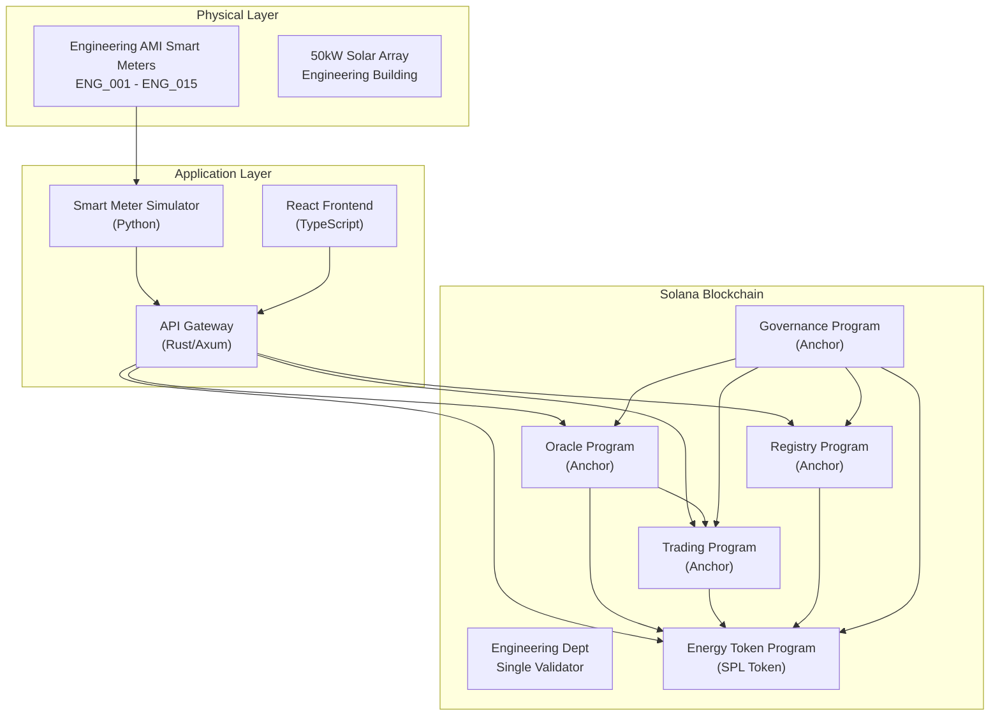

# การพัฒนาระบบการซื้อขายพลังงานแสงอาทิตย์แบบ Peer-to-Peer ด้วยเทคโนโลยี Solana Blockchain และ Anchor Smart Contracts: กรณีศึกษาคณะวิศวกรรมศาสตร์

## หัวข้อโครงงาน (Project Title)
**"Development of Peer-to-Peer Solar Energy Trading System using Solana Blockchain Technology and Anchor Smart Contracts: An Engineering Department Case Study"**

**หัวข้อภาษาไทย:** "การพัฒนาระบบการซื้อขายพลังงานแสงอาทิตย์แบบ Peer-to-Peer ด้วยเทคโนโลยี Solana Blockchain และ Anchor Smart Contracts: กรณีศึกษาคณะวิศวกรรมศาสตร์"

## ข้อมูลโปรเจค (Project Information)

### **สาขาวิชา:** วิศวกรรมคอมพิวเตอร์ / วิทยาการคอมพิวเตอร์
### **ประเภทโครงงาน:** การพัฒนาซอฟต์แวร์และระบบ Solana Blockchain
### **คำสำคัญ:** Solana, Anchor Framework, SPL Tokens, P2P Energy Trading, Engineering Department, Solar Energy, AMI Integration
### **ระดับความยาก:** สูง - ใช้เทคโนโลยี Solana Blockchain และ Anchor Framework ขั้นสูง

## บทคัดย่อ (Abstract)

โปรเจคนี้เป็นการพัฒนาระบบการซื้อขายพลังงานแสงอาทิตย์แบบ Peer-to-Peer (P2P Energy Trading System) ที่ใช้เทคโนโลยี Solana Blockchain และ Anchor Smart Contracts เพื่อให้นักศึกษาและอาจารย์ในคณะวิศวกรรมศาสตร์สามารถซื้อขายพลังงานแสงอาทิตย์ส่วนเกินได้โดยตรงกับกัน ผ่านระบบที่ควบคุมโดยคณะวิศวกรรมศาสตร์ในฐานะ Single Validator Authority

### วัตถุประสงค์หลัก (Main Objectives)
1. **พัฒนาระบบ Solana Blockchain**: สร้างระบบการซื้อขายพลังงานแบบ P2P บน Solana ด้วย Single Validator
2. **สร้าง Anchor Programs**: พัฒนา Smart Contracts ด้วย Anchor Framework บน Solana
3. **ออกแบบ SPL Token Economy**: สร้างระบบเศรษฐกิจ SPL Token สำหรับการแลกเปลี่ยนพลังงาน (1 GRID = 1 kWh)
4. **พัฒนา Oracle System**: สร้างระบบ Oracle เพื่อเชื่อมต่อข้อมูลจาก AMI Smart Meter ในอาคารวิศวกรรม
5. **สร้าง Full-Stack Application**: พัฒนา API Gateway และ Frontend สำหรับการใช้งานในคณะวิศวกรรม

### วัตถุประสงค์รอง (Secondary Objectives)
1. ศึกษาและประยุกต์ใช้ Solana Blockchain ในงานด้านพลังงาน
2. ออกแบบระบบที่สามารถขยายผลไปใช้ในคณะอื่น ๆ ของมหาวิทยาลัย
3. พัฒนาต้นแบบที่สามารถใช้เป็นเครื่องมือการเรียนการสอนในคณะวิศวกรรม
4. วิเคราะห์ประสิทธิภาพของ Single Validator Architecture

### เทคโนโลยีที่ใช้ (Technologies Used)
- **Blockchain**: Solana with Engineering Department Single Validator
- **Smart Contracts**: Anchor Framework 0.31.1 (Updated from 0.29.0)
- **Token Standard**: SPL Token (Solana Program Library)
- **Backend**: Rust API Gateway with Axum framework
- **Frontend**: React TypeScript with Vite
- **Database**: PostgreSQL with TimescaleDB extension
- **Containerization**: Docker & Docker Compose
- **Programming Language**: Rust (Edition 2021)
- **Development Environment**: Docker-based Solana validator with Anchor CLI
- **Cross-Program Communication**: Anchor CPI (Cross Program Invocation)
- **Wallet Integration**: Solana Wallet Adapter for React

### สถาปัตยกรรมระบบ (System Architecture)
ระบบประกอบด้วย 5 Anchor Programs หลัก และ Engineering Complex Smart Meter Simulation:

1. **Registry Program**: จัดการการลงทะเบียนผู้ใช้และ Smart Meters ภายใต้อำนาจคณะวิศวกรรม
2. **Energy Token Program**: SPL Token มาตรฐาน Solana สำหรับการซื้อขายพลังงาน
3. **Trading Program**: ระบบตลาดการซื้อขายแบบ Order Book ที่มีการ Automated Clearing
4. **Oracle Program**: เชื่อมต่อข้อมูลจาก AMI และทำ Market Clearing อัตโนมัติ
5. **Governance Program**: การจัดการระบบโดยคณะวิศวกรรมศาสตร์
6. **Engineering Smart Meter Simulator**: จำลองการทำงานของ Smart Meter ในอาคารวิศวกรรม

### คุณสมบัติหลัก (Key Features)
- การซื้อขายพลังงานแบบ Real-time ทุก 15 นาที (Market Epoch)
- ระบบ Automated Market Clearing ด้วย Oracle Program
- การควบคุมโดยคณะวิศวกรรมศาสตร์ในฐานะ Single Validator Authority
- ระบบ SPL Token Economy: 1 kWh = 1 GRID Token (9 decimal precision)
- Cross Program Invocation (CPI) Communication
- RESTful API สำหรับ Integration กับ Engineering Complex AMI
- Responsive Web Interface สำหรับนักศึกษาและอาจารย์วิศวกรรม
- **Engineering Complex AMI Integration**: การเชื่อมต่อกับ AMI ในอาคารวิศวกรรม
- **API-to-Blockchain Integration**: การส่งข้อมูลจาก AMI เข้าสู่ Solana Blockchain

### ผลลัพธ์ที่คาดหวัง (Expected Outcomes)
1. ระบบ P2P Energy Trading บน Solana ที่ทำงานได้จริงในคณะวิศวกรรม
2. การลดต้นทุนในการซื้อขายพลังงานภายในคณะวิศวกรรม
3. การเพิ่มประสิทธิภาพการใช้พลังงานหมุนเวียนในอาคารวิศวกรรม
4. ต้นแบบระบบ Solana Blockchain สำหรับการนำไปใช้ในคณะอื่น ๆ
5. การศึกษาประสิทธิภาพของ Single Validator Architecture

### การประยุกต์ใช้ (Applications)
- คณะวิศวกรรมศาสตร์ที่มีระบบ Solar Cells
- การขยายผลไปยังคณะอื่น ๆ ในมหาวิทยาลัย
- โครงการ Smart Campus Engineering Complex
- ระบบ Microgrid ในชุมชนวิศวกรรม
- การเรียนการสอนเรื่อง Blockchain ในคณะวิศวกรรม

---

## Project: Development of Peer-to-Peer Solar Energy Trading System using Solana Blockchain Technology and Anchor Smart Contracts: An Engineering Department Case Study

### Abstract

This project develops a peer-to-peer (P2P) energy trading system using Solana blockchain technology and Anchor smart contracts, enabling engineering students and faculty to directly trade surplus solar energy through a platform controlled by the Engineering Department as a single validator authority. The system leverages the Solana blockchain with Anchor framework to create a transparent, secure, and efficient energy marketplace within the Engineering Complex.

### Objectives
1. Develop a P2P energy trading system on Solana blockchain technology
2. Create Anchor programs using Rust language on Solana framework
3. Design an SPL token economy system for energy exchange (1 GRID = 1 kWh)
4. Develop an Oracle system to integrate AMI Smart Meter data from Engineering Complex
5. Build API Gateway and Frontend for Engineering Department users

### Technologies Used
- **Blockchain**: Solana with Engineering Department Single Validator
- **Smart Contracts**: Anchor Framework 0.31.1 (Updated from 0.29.0)
- **Token Standard**: SPL Token (Solana Program Library)
- **Backend**: Rust API Gateway with Axum framework
- **Frontend**: React TypeScript with Vite
- **Database**: PostgreSQL with TimescaleDB extension
- **Containerization**: Docker & Docker Compose
- **Programming Language**: Rust (Edition 2021)
- **Development Environment**: Docker-based Solana validator with Anchor CLI
- **Cross-Program Communication**: Anchor CPI (Cross Program Invocation)
- **Wallet Integration**: Solana Wallet Adapter for React

### System Architecture
The system consists of 5 core Anchor programs and Engineering Complex Smart Meter Simulation:

1. **Registry Program**: Manages user registration and Smart Meter assignments under Engineering Department authority
2. **Energy Token Program**: SPL token standard for energy trading
3. **Trading Program**: Automated order book-based trading marketplace with 15-minute clearing
4. **Oracle Program**: AMI data integration and automated market operations
5. **Governance Program**: Engineering Department system administration
6. **Engineering Smart Meter Simulator**: Simulates Smart Meter operations in Engineering Complex

### Key Features
- Real-time energy trading every 15 minutes (Market Epochs)
- Automated Market Clearing with Oracle Program integration
- Engineering Department Single Validator Authority
- SPL Token Economy: 1 kWh = 1 GRID Token (9 decimal precision)
- Cross Program Invocation (CPI) Communication
- RESTful API for Engineering Complex AMI integration
- Responsive Web Interface for Engineering students and faculty
- **Engineering Complex AMI Integration**: Real-time energy data from Engineering building
- **API-to-Blockchain Integration**: Data transmission from AMI to Solana Blockchain

### Expected Outcomes
1. Functional P2P Energy Trading System on Solana for Engineering Department
2. Reduced energy trading costs within Engineering Complex
3. Improved renewable energy utilization efficiency in Engineering building
4. Prototype Solana Blockchain system for implementation in other university departments
5. Performance study of Single Validator Architecture

### Applications
- Engineering departments with Solar Cell systems
- Expansion to other university departments
- Smart Campus Engineering Complex projects
- Community Microgrid systems in engineering communities
- Blockchain education in Engineering curriculum

---

## ข้อมูลเพิ่มเติมสำหรับการนำเสนอ (Additional Information for Presentation)

### จุดเด่นของโปรเจค (Project Highlights)
1. **นวัตกรรม**: ใช้เทคโนโลยี Solana และ Anchor Framework ที่ทันสมัย
2. **ความปลอดภัย**: Anchor Programs ที่ผ่านการ Type-safe validation
3. **ประสิทธิภาพ**: ระบบ Real-time trading บน Solana high-performance blockchain
4. **ความยั่งยืน**: ส่งเสริมการใช้พลังงานหมุนเวียนในคณะวิศวกรรม
5. **การควบคุมโดยคณะวิศวกรรม**: Single Validator Authority ที่ชัดเจนและมีประสิทธิภาพ

### ความท้าทายที่แก้ไข (Challenges Addressed)
1. การขาดระบบการซื้อขายพลังงานที่โปร่งใส
2. ต้นทุนสูงในการซื้อขายผ่านตัวกลาง
3. การไม่มีระบบติดตามพลังงานหมุนเวียนแบบ Real-time
4. ปัญหาความน่าเชื่อถือในการซื้อขาย P2P

## รายละเอียดเทคนิค Engineering Complex AMI Integration

### Engineering Complex Smart Meter Architecture
ระบบจำลอง Smart Meter ในอาคารวิศวกรรมประกอบด้วย:

#### 1. **Python Simulation Engine สำหรับคณะวิศวกรรม**
- จำลองการผลิตและใช้พลังงานแสงอาทิตย์จาก 50kW solar array บนหลังคาอาคารวิศวกรรม
- สร้างข้อมูลแบบ Real-time ทุก 15 นาที (Market Epoch)
- จำลองรูปแบบการใช้พลังงานของห้องเรียน ห้องปฏิบัติการ และสำนักงานในคณะวิศวกรรม
- ข้อมูล 15 Smart Meters ในอาคารวิศวกรรม (ENG_001 ถึง ENG_015)

#### 2. **API Integration Layer สำหรับ Engineering Department**
- **RESTful API**: ส่งข้อมูลจาก Engineering AMI ไปยัง Engineering Department API Gateway
- **Data Format**: JSON format ที่มี meter_id, energy_generated, energy_consumed, timestamp, engineering_authority
- **Authentication**: Engineering Department API key และ digital signature verification

#### 3. **Solana Blockchain Data Flow**
```
Engineering AMI → Engineering API Gateway → Oracle Program → SPL Token Program
```

#### 4. **Application-to-Blockchain Interaction Architecture**


#### 4. **Data Processing Pipeline**
1. **Data Generation**: Engineering Simulator สร้างข้อมูลพลังงานจาก 15 meters ในอาคารวิศวกรรม
2. **API Call**: POST ข้อมูลไปยัง `/api/engineering/meter-reading` endpoint
3. **Engineering Validation**: API Gateway ตรวจสอบความถูกต้องและ Engineering Department authority
4. **Oracle Processing**: Oracle Program รับข้อมูลและประมวลผลภายใต้ Engineering authority
5. **SPL Token Minting**: สร้าง SPL GRID Tokens สำหรับพลังงานที่ผลิตได้ (9 decimal precision)
6. **Trading Integration**: นำข้อมูลเข้าสู่ระบบการซื้อขายภายในคณะวิศวกรรม

#### 5. **Cross-Program Invocation (CPI) Implementation**
```rust
// Oracle Program minting tokens via CPI to SPL Token Program
pub fn mint_energy_tokens(ctx: Context<MintTokens>, amount: u64) -> Result<()> {
    let cpi_accounts = anchor_spl::token::MintTo {
        mint: ctx.accounts.mint.to_account_info(),
        to: ctx.accounts.user_token_account.to_account_info(),
        authority: ctx.accounts.mint_authority.to_account_info(),
    };
    
    anchor_spl::token::mint_to(
        CpiContext::new(ctx.accounts.token_program.to_account_info(), cpi_accounts),
        amount,
    )?;
    
    Ok(())
}
```

#### 6. **Frontend Wallet Integration**
```typescript
// React Frontend connecting to Solana blockchain
import { useWallet } from '@solana/wallet-adapter-react';
import * as anchor from '@coral-xyz/anchor';

const createSellOrder = async (energyAmount: number, pricePerKWh: number) => {
  const tx = await tradingProgram.methods
    .createSellOrder(
      new anchor.BN(energyAmount * 1e9), // 9 decimal precision
      new anchor.BN(pricePerKWh * 1e9)
    )
    .accounts({
      seller: publicKey,
      sellerTokenAccount: sellerTokenAccount,
      tradingAccount: tradingPda,
      tokenProgram: TOKEN_PROGRAM_ID,
    })
    .transaction();
    
  const signature = await sendTransaction(tx, connection);
  return signature;
};
```

### ข้อมูลที่จำลอง (Simulated Data)

#### **Engineering Complex Energy Generation Data**
- ข้อมูลการผลิตพลังงานจาก 50kW solar array บนหลังคาอาคารวิศวกรรม
- รูปแบบการผลิตตามช่วงเวลา (เช้า-เย็น) แบบ Sine Curve
- ข้อมูลที่ปรับตามฤดูกาล และตารางเรียนในคณะวิศวกรรม

#### **Engineering Complex Energy Consumption Data**
- ข้อมูลการใช้พลังงานของห้องเรียนวิศวกรรม ห้องปฏิบัติการ และสำนักงานอาจารย์
- รูปแบบการใช้งานตามตารางการเรียนการสอนของคณะวิศวกรรม
- ข้อมูลการใช้เครื่องปรับอากาศ เครื่องมือปฏิบัติการ และอุปกรณ์การเรียนการสอน

#### **Engineering Department Smart Meter Metadata**
- Meter ID (ENG_001 ถึง ENG_015) และ Location ในอาคารวิศวกรรม
- Owner Information (เชื่อมโยงกับ Registry Program)
- Engineering Department Authority Signature
- Timestamp และ Digital Signature

## ประโยชน์และนวัตกรรม (Benefits & Innovation)

### **ประโยชน์ต่อคณะวิศวกรรมศาสตร์**
1. **ลดค่าไฟฟ้า**: การซื้อขายภายในคณะลดการพึ่งพาระบบไฟฟ้าหลัก
2. **ส่งเสริมพลังงานสะอาด**: จูงใจให้ติดตั้งแผงโซลาร์เซลล์ในอาคารวิศวกรรม
3. **การศึกษาวิจัย**: เป็นแหล่งข้อมูลสำหรับการวิจัยด้าน Blockchain และพลังงาน
4. **ภาพลักษณ์**: แสดงความเป็นผู้นำด้านเทคโนโลยีสีเขียวของคณะวิศวกรรม
5. **การเรียนการสอน**: ใช้เป็นเครื่องมือการเรียนการสอนเรื่อง Blockchain

### **ข้อดีของ Engineering Department Single Validator Architecture**
1. **ความปลอดภัย**: การควบคุมการเข้าถึงและการจัดการโดยคณะวิศวกรรมโดยตรง
2. **การจัดการที่ง่าย**: มีจุดควบคุมเดียวสำหรับการบริหารจัดการ
3. **ความเชื่อถือได้**: ระบบมีการตรวจสอบและควบคุมโดยคณะวิศวกรรม
4. **ประสิทธิภาพสูง**: Single validator ทำให้ transaction processing เร็วกว่า
5. **ต้นทุนต่ำ**: ลดต้นทุนการดำเนินงานเมื่อเทียบกับ multi-validator networks

### **นวัตกรรมทางเทคนิค**
1. **Solana + Anchor**: ใช้เทคโนโลยี Blockchain ประสิทธิภาพสูง
2. **Cross Program Invocation (CPI)**: Anchor Programs ที่ทำงานร่วมกัน
3. **Real-time AMI Integration**: การเชื่อมต่อข้อมูล AMI แบบเรียลไทม์
4. **SPL Token Standard**: มาตรฐาน Token ของ Solana ecosystem
5. **Engineering Department Authority**: ระบบจัดการแบบ Single Validator เพื่อความปลอดภัยและควบคุม
6. **Docker-based Development Environment**: ระบบพัฒนาที่ใช้ Container สำหรับ Solana validator
7. **TypeScript Integration**: การใช้ Anchor IDL สำหรับ type-safe frontend development
8. **WebSocket Event Monitoring**: การติดตามเหตุการณ์บน blockchain แบบเรียลไทม์

## ความเป็นไปได้และความเสี่ยง (Feasibility & Risks)

### **ความเป็นไปได้**
- ✅ เทคโนโลยี Solana และ Anchor มีเอกสารและตัวอย่างเพียงพอ
- ✅ ทีมมีความรู้พื้นฐานด้าน Rust Programming และ Blockchain
- ✅ มีเวลาเพียงพอสำหรับการพัฒนา (1-2 เทอม)
- ✅ สามารถทดสอบได้ด้วย Engineering Complex Simulation

### **ความเสี่ยงและการแก้ไข**
1. **ความซับซ้อนของ Solana/Anchor**: แก้ไขด้วยการศึกษาเอกสารและ Tutorial
2. **การ Deploy Single Validator**: ใช้ Local Development และ Devnet testing
3. **ปัญหา Performance**: ออกแบบระบบให้เหมาะสมกับ Engineering Complex scale
4. **ข้อจำกัดเวลา**: แบ่งงานเป็น Milestone ที่ชัดเจน

## แผนการดำเนินงาน (Timeline)

### **Phase 1: การศึกษาและออกแบบ (4 สัปดาห์)**
- ศึกษา Solana และ Anchor Framework
- ออกแบบ System Architecture และ Database Schema สำหรับคณะวิศวกรรม
- สร้าง Project Setup และ Development Environment

### **Phase 2: การพัฒนา Anchor Programs (6 สัปดาห์)**
- พัฒนา Registry Program สำหรับ Engineering Department authority
- พัฒนา Energy Token Program (SPL Token)
- พัฒนา Trading Program with automated clearing
- พัฒนา Oracle Program สำหรับ AMI integration
- พัฒนา Governance Program สำหรับ Engineering Department
- Unit Testing และ Integration Testing
- **สถานะปัจจุบัน**: ✅ โครงสร้าง Anchor Programs พื้นฐานเสร็จแล้ว
- **การทดสอบ**: ✅ Docker-based development environment พร้อมใช้งาน

### **Phase 3: การพัฒนา Backend และ API (4 สัปดาห์)**
- สร้าง Rust API Gateway ด้วย Axum สำหรับ Engineering Department
- พัฒนา Engineering Complex Smart Meter Simulator
- สร้าง Database Schema และ Data Models
- API Testing และ Documentation
- **สถานะปัจจุบัน**: 🔄 API Gateway architecture ออกแบบแล้ว
- **การรวมระบบ**: 🔄 Solana RPC integration กำลังพัฒนา

### **Phase 4: การพัฒนา Frontend (4 สัปดาห์)**
- สร้าง React TypeScript Application สำหรับคณะวิศวกรรม
- ออกแบบ UI/UX สำหรับ Engineering Energy Trading
- สร้าง Dashboard สำหรับติดตามการซื้อขายในคณะวิศวกรรม
- Responsive Design และ Testing

### **Phase 5: การรวมระบบและทดสอบ (3 สัปดาห์)**
- Integration Testing ทั้งระบบบน Engineering Department validator
- Performance Testing สำหรับ Single Validator Architecture
- Security Testing สำหรับ Engineering Department authority
- Bug Fixes และ Optimization

### **Phase 6: การเตรียมนำเสนอ (1 สัปดาห์)**
- สร้างเอกสารโครงงานที่สมบูรณ์
- เตรียม Presentation และ Demo ระบบ Solana
- Video Demonstration ใน Engineering Complex context

## เกณฑ์การประเมินผล (Evaluation Criteria)

### **เกณฑ์ทางเทคนิค (70%)**
1. **Anchor Programs (25%)**: ความถูกต้องและประสิทธิภาพของ Solana programs
2. **System Integration (20%)**: การทำงานร่วมกันของส่วนต่าง ๆ บน Solana
3. **User Interface (15%)**: ความใช้งานง่ายและสวยงามสำหรับผู้ใช้ในคณะวิศวกรรม
4. **Code Quality (10%)**: การเขียนโค้ด Rust ที่ดี มี Documentation

### **เกณฑ์การนำเสนอ (30%)**
1. **การนำเสนอ (15%)**: ความชัดเจนและน่าสนใจของ Solana implementation
2. **การตอบคำถาม (10%)**: ความเข้าใจในโครงงานและเทคโนโลยี Solana
3. **เอกสาร (5%)**: ความสมบูรณ์ของเอกสารและ Engineering Department context

### การพัฒนาในอนาคต (Future Development)
1. **Multi-Department Expansion**: การขยายไปยังคณะอื่น ๆ ด้วย Multi-Validator Federation
2. **AI Energy Prediction**: ระบบ AI สำหรับทำนายการใช้พลังงานในคณะวิศวกรรม
3. **National Grid Integration**: การเชื่อมต่อกับระบบไฟฟ้าหลักของประเทศ
4. **Mobile Application**: แอปพลิเคชันมือถือสำหรับนักศึกษาวิศวกรรม
5. **Real IoT Integration**: เชื่อมต่อกับ Smart Meter จริงในอาคารวิศวกรรม
6. **Solana DeFi Integration**: การรวมเข้ากับ Solana DeFi ecosystem
7. **Carbon Credit Trading**: รวมระบบ Carbon Credit Trading บน Solana
8. **Cross-Chain Bridges**: เชื่อมต่อกับ blockchain อื่น ๆ ผ่าน Solana bridges

## สถานะการพัฒนาปัจจุบัน (Current Development Status)

### **เสร็จสมบูรณ์แล้ว (Completed) ✅**
- Docker-based Solana validator development environment
- Anchor CLI 0.31.1 installation และ configuration
- โครงสร้างพื้นฐาน Anchor Programs (Registry, Token, Trading, Oracle, Governance)
- Integration testing framework
- Docker Compose orchestration สำหรับ development environment

### **กำลังดำเนินการ (In Progress) 🔄**
- Cross-Program Invocation (CPI) implementation
- API Gateway development with Rust/Axum
- Smart Meter Simulator integration
- Frontend React TypeScript development

### **วางแผนไว้ (Planned) 📋**
- Production deployment to Engineering Department validator
- Real AMI integration
- Performance optimization
- Security audit และ testing
- Documentation completion

## ข้อท้าทายทางเทคนิคและการแก้ไข (Technical Challenges & Solutions)

### **1. ARM64 Compatibility Issues**
- **ปัญหา**: Solana CLI และ validator มีปัญหาบน ARM64 Mac (Apple Silicon)
- **แก้ไข**: ใช้ Docker container development environment และ fallback เป็น dev mode

### **2. Anchor Framework Learning Curve**
- **ปัญหา**: ความซับซ้อนของ Anchor และ Solana development
- **แก้ไข**: การศึกษาเอกสาร step-by-step และ hands-on development

### **3. Cross-Program Communication**
- **ปัญหา**: การออกแบบ CPI calls ระหว่าง Anchor programs
- **แก้ไข**: ใช้ Anchor CPI framework และ type-safe interfaces

## รายละเอียดการ Implementation ปัจจุบัน (Current Implementation Details)

### **1. Anchor Programs Architecture**
```
programs/
├── registry/          # User and meter registration under Engineering authority
├── energy-token/      # SPL Token implementation for GRID tokens
├── trading/          # Order book and automated market clearing
├── oracle/           # AMI data integration and market triggers
└── governance/       # Engineering Department system administration
```

### **2. Development Environment Setup**
```bash
# Docker-based Solana validator
docker-compose up -d solana-validator

# Anchor CLI development
docker exec -it p2p-anchor-dev anchor --version
# Output: anchor-cli 0.31.1

# Test project creation
anchor init test-project --template=single --package-manager npm
```

### **3. Program Derived Addresses (PDAs)**
```rust
// Registry Program PDAs
#[derive(Accounts)]
pub struct RegisterUser<'info> {
    #[account(
        init,
        payer = authority,
        space = UserAccount::SIZE,
        seeds = [b"user", user.key().as_ref()],
        bump
    )]
    pub user_account: Account<'info, UserAccount>,
    // ...
}
```

### **4. Token Economy Implementation**
- **GRID Token**: SPL Token มาตรฐาน Solana (9 decimal precision)
- **1 kWh = 1 GRID Token**: การแทนค่าพลังงานด้วย token
- **Mint Authority**: ควบคุมโดย Engineering Department ผ่าน Oracle Program
- **Associated Token Accounts**: การจัดการ token accounts สำหรับแต่ละผู้ใช้

### **5. API Integration Points**
```typescript
// API Gateway endpoints
POST /api/engineering/meter-reading    // AMI data submission
GET  /api/trading/orders              // Current market orders
POST /api/trading/sell-order          // Create sell order
POST /api/trading/buy-order           // Create buy order
GET  /api/user/balance               // User token balance
```

### **6. Real-time Event Processing**
```rust
// WebSocket subscriptions for blockchain events
let (mut logs_subscription, logs_receiver) = pubsub_client
    .logs_subscribe(
        RpcTransactionLogsFilter::Mentions(vec![
            registry_program_id.to_string(),
            trading_program_id.to_string(),
        ]),
        RpcTransactionLogsConfig {
            commitment: Some(CommitmentConfig::confirmed()),
        },
    )
    .await?;
```
