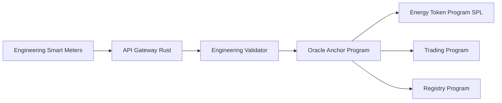

# Smart Meter Simulation System - Engineering Department

## Overview

The Smart Meter Simulation System is a critical component of the P2P Energy Trading project that simulates real smart meter operations within the Engineering Complex. The system generates real-time energy data and transmits it via API to the Solana Anchor blockchain network operated by the Engineering Department as the sole validator authority.

## System Architecture



## Main Components

### 1. Engineering Department Python Simulation Engine

#### **Core Functionality**
- Simulates energy generation from 50kW solar panels on Engineering Complex rooftop
- Simulates energy consumption of Engineering Complex (classrooms, laboratories, offices)
- Generates data every 15 minutes (Market Clearing Interval)
- Calculates surplus/deficit energy for 15 Smart Meters in the Engineering Complex
- Transmits data to Engineering Department Validator via SPL token minting

#### **Engineering Complex Simulation Parameters**
```python
class EngineeringEnergyData:
    meter_id: str           # ENG_001 through ENG_015
    timestamp: int
    energy_generated: float # kWh from 50kW solar array
    energy_consumed: float  # kWh (labs, classrooms, offices)
    net_energy: float      # generated - consumed
    location: str          # Engineering Complex
    building_type: str     # engineering_building
    validator: str         # engineering_department
    digital_signature: str # Engineering Department authority signature
```

#### **Engineering Solar Generation Model**
```python
def calculate_engineering_solar_generation(time_hour, panel_capacity=50.0):
    # 50kW solar array on Engineering Complex rooftop
    # Peak generation at solar noon (12:00 PM)
    base_generation = panel_capacity * engineering_solar_curve(time_hour)
    
    # Engineering building has optimal panel orientation
    efficiency_factor = 0.85  # High efficiency installation
    return base_generation * efficiency_factor
```

#### **Engineering Building Consumption Model**
```python
def calculate_engineering_consumption(time_hour, meter_id, day_of_week):
    # Engineering Complex consumption patterns
    
    # Base loads for different areas
    consumption_map = {
        'ENG_001-005': 'classroom_zones',      # Lecture halls
        'ENG_006-010': 'laboratory_zones',     # Research labs  
        'ENG_011-015': 'faculty_office_zones'  # Faculty offices
    }
    
    base_consumption = get_engineering_base_load(meter_id)
    schedule_factor = get_engineering_schedule_factor(time_hour, day_of_week)
    hvac_factor = get_hvac_load_factor(time_hour)
    
    return base_consumption * schedule_factor * hvac_factor
```

### 2. Engineering Department API Integration Layer

#### **Engineering Department REST API Endpoints**
```
POST /api/engineering/meter-reading
Content-Type: application/json
Authorization: Bearer <engineering_api_key>

{
  "meter_id": "ENG_001",
  "timestamp": 1730448000,
  "energy_generated": 6.2,
  "energy_consumed": 4.1,
  "net_energy": 2.1,
  "location": "Engineering Complex",
  "building_type": "engineering_building",
  "validator": "engineering_department",
  "signature": "0x..."
}
```

#### **Engineering API Response**
```json
{
  "status": "success",
  "message": "Engineering meter reading processed",
  "solana_transaction_id": "3kM8eZ...",
  "energy_tokens_minted": "2100000000",
  "spl_token_account": "user_associated_token_account",
  "validator": "engineering_department",
  "next_reading_time": 1730448900,
  "engineering_authority": "validated"
}
```

### 3. Engineering Department Solana Blockchain Integration

#### **Engineering Data Flow Process**
1. **Engineering Simulator Generation**: Python script generates energy data from 15 meters in Engineering Complex
2. **API Transmission**: Transmits data via HTTP POST to Engineering API Gateway
3. **Engineering Gateway Validation**: API Gateway validates data accuracy and Engineering authority
4. **Solana Oracle Processing**: Oracle Anchor Program receives and processes data
5. **SPL Token Minting**: Energy Token Program creates SPL tokens for surplus energy using mint authority
6. **Engineering Registry Update**: Registry Program updates user and meter data under Engineering authority

#### **Solana Anchor Program Integration**
```rust
// Oracle Anchor Program - Engineering Department Authority
use anchor_lang::prelude::*;

#[program]
pub mod engineering_oracle {
    use super::*;

    pub fn submit_engineering_meter_reading(
        ctx: Context<SubmitMeterReading>,
        meter_id: String,
        energy_generated: u64,
        energy_consumed: u64,
        timestamp: i64,
    ) -> Result<()> {
        // Validate Engineering Department authority
        require!(
            ctx.accounts.authority.key() == ENGINEERING_DEPARTMENT_AUTHORITY,
            OracleError::UnauthorizedValidator
        );
        
        // Validate meter belongs to Engineering Complex
        require!(
            meter_id.starts_with("ENG_"),
            OracleError::InvalidEngineeringMeter
        );
        
        // Process energy data with proper decimal precision
        let net_energy = energy_generated.saturating_sub(energy_consumed);
        
        if net_energy > 0 {
            // Call SPL Token Program to mint tokens (9 decimal places)
            let tokens_to_mint = net_energy * 1_000_000_000; // Convert to lamports
            let cpi_ctx = CpiContext::new(
                ctx.accounts.token_program.to_account_info(),
                token::MintTo {
                    mint: ctx.accounts.energy_token_mint.to_account_info(),
                    to: ctx.accounts.user_token_account.to_account_info(),
                    authority: ctx.accounts.mint_authority.to_account_info(),
                }
            );
            token::mint_to(cpi_ctx, tokens_to_mint)?;
        }
        
        // Update trading program with new market data
        let cpi_ctx = CpiContext::new(
            ctx.accounts.trading_program.to_account_info(),
            trading::cpi::accounts::UpdateMarketData {
                market: ctx.accounts.market.to_account_info(),
                authority: ctx.accounts.authority.to_account_info(),
            }
        );
        trading::cpi::update_market_data(cpi_ctx, meter_id, net_energy)?;
        
        Ok(())
    }
}

#[derive(Accounts)]
pub struct SubmitMeterReading<'info> {
    #[account(mut)]
    pub authority: Signer<'info>,
    #[account(mut)]
    pub energy_token_mint: Account<'info, Mint>,
    #[account(mut)]
    pub user_token_account: Account<'info, TokenAccount>,
    #[account(mut)]
    pub market: AccountInfo<'info>,
    pub mint_authority: AccountInfo<'info>,
    pub token_program: Program<'info, Token>,
    pub trading_program: AccountInfo<'info>,
    pub system_program: Program<'info, System>,
}
```

## System Operation

### **Engineering Department Simulation Cycle (Every 15 minutes)**

#### 1. **Engineering Complex Data Generation Phase**
```python
# Generate realistic energy data for Engineering Complex
engineering_meters = ['ENG_001', 'ENG_002', 'ENG_003', 'ENG_004', 'ENG_005',
                     'ENG_006', 'ENG_007', 'ENG_008', 'ENG_009', 'ENG_010',
                     'ENG_011', 'ENG_012', 'ENG_013', 'ENG_014', 'ENG_015']

for meter_id in engineering_meters:
    # Engineering specific generation from 50kW solar array
    generation = calculate_engineering_solar_generation(
        current_time, 
        panel_capacity=50.0,
        meter_zone=get_meter_zone(meter_id)
    )
    
    # Engineering building consumption (labs, classrooms, offices)  
    consumption = calculate_engineering_consumption(
        current_time, 
        meter_id, 
        day_of_week=current_day
    )
    
    meter_data = EngineeringEnergyData(
        meter_id=meter_id,
        timestamp=current_time,
        energy_generated=generation,
        energy_consumed=consumption,
        net_energy=generation - consumption,
        location="Engineering Complex",
        building_type="engineering_building",
        validator="engineering_department"
    )
```

#### 2. **Engineering API Submission Phase**
```python
# Submit data to Engineering Department validator via API
ENGINEERING_API_BASE_URL = "http://engineering-validator.campus.local:8899"
ENGINEERING_API_KEY = os.getenv("ENGINEERING_API_KEY")

for data in engineering_meter_readings:
    response = requests.post(
        f"{ENGINEERING_API_BASE_URL}/api/engineering/meter-reading",
        json=data.to_dict(),
        headers={
            "Authorization": f"Bearer {ENGINEERING_API_KEY}",
            "X-Engineering-Authority": "true"
        }
    )
    
    if response.status_code == 200:
        log_engineering_success(data.meter_id, response.json())
        update_engineering_dashboard(data.meter_id, response.json())
    else:
        log_engineering_error(data.meter_id, response.text)
        notify_engineering_it(data.meter_id, response.text)
```

#### 3. **Engineering Solana Blockchain Processing Phase**
- Engineering Department Oracle Anchor Program receives data
- Validates Engineering Department Authority
- Verifies Meter ID belongs to Engineering Complex (ENG_xxx)
- Calculates SPL Token amount to mint (with 9 decimal precision)
- Calls SPL Token Program to mint tokens to user's associated token account
- Updates Trading Program for market making operations
- Records data in Engineering Department Registry

### **Engineering Department Configuration & Setup**

#### **Engineering Environment Variables**
```bash
# Engineering API Configuration
ENGINEERING_API_BASE_URL=http://engineering-validator.campus.local:8899
ENGINEERING_API_KEY=eng_dept_api_key_secure
ENGINEERING_VALIDATOR_URL=http://localhost:8899

# Solana Blockchain Configuration
SOLANA_RPC_URL=http://localhost:8899
ENGINEERING_WALLET_PATH=/opt/campus-blockchain/admin/engineering-admin-keypair.json
ENGINEERING_AUTHORITY_PUBKEY=EngDept123456789...

# Engineering Complex Simulation Parameters
SIMULATION_INTERVAL=900  # 15 minutes in seconds
ENGINEERING_CONSUMPTION_BASELINE=3.2  # kWh per interval (higher than residential)
ENGINEERING_SOLAR_CAPACITY=50.0       # 50kW solar array
ENGINEERING_BUILDING_TYPE=engineering_complex
ENGINEERING_METERS=15                  # ENG_001 to ENG_015
```

#### **Engineering Docker Configuration**
```yaml
engineering-smart-meter-simulator:
  build:
    context: ./docker/smart-meter-simulator
  container_name: engineering-smart-meter-simulator
  environment:
    - API_BASE_URL=http://engineering-validator.campus.local:8899
    - SIMULATION_INTERVAL=900
    - BUILDING_TYPE=engineering_complex
    - VALIDATOR=engineering_department
    - SOLAR_CAPACITY=50.0
    - METER_COUNT=15
  volumes:
    - ./data/engineering_meter_data:/app/data
    - ./logs/engineering:/app/logs
    - ./validator-keys/engineering:/app/keys:ro
  networks:
    - engineering-campus-network
  restart: unless-stopped
  depends_on:
    - engineering-validator
```

## Installation & Usage

### **Engineering Department Prerequisites**
```bash
# Python Dependencies for Engineering Simulation
pip install requests python-dotenv numpy pandas solders

# Solana CLI Setup
solana config set --url http://localhost:8899
solana config set --keypair /opt/campus-blockchain/admin/engineering-admin-keypair.json

# Anchor Framework Setup
npm install -g @coral-xyz/anchor-cli
anchor --version

# Engineering Docker Setup
docker compose up -d engineering-validator
```

### **Running the Engineering Simulator**
```bash
# Start the Engineering Department validator first
./start-engineering-validator.sh

# Start the Engineering Complex simulator
cd docker/smart-meter-simulator
python engineering_simulator.py --building=engineering_complex --meters=15

# Or with Docker
docker compose up -d engineering-smart-meter-simulator
```

### **Engineering Department Monitoring**
```bash
# Check Engineering simulator logs
docker logs engineering-smart-meter-simulator -f

# Check Engineering validator logs
tail -f /var/log/campus-blockchain/engineering/validator.log

# Monitor Engineering Department Solana blockchain
solana cluster-version --url http://localhost:8899
solana validator-info get --url http://localhost:8899

# Check Engineering Department account balances
solana balance --url http://localhost:8899

# Monitor Engineering Complex energy data
curl -s http://localhost:8899/api/engineering/meter-summary
```

## Testing

### **Engineering Department Unit Tests**
```python
def test_engineering_solar_generation():
    # Test Engineering 50kW solar array generation
    generation = calculate_engineering_solar_generation(12, 50.0)  # noon, 50kW panel
    assert 35.0 <= generation <= 42.5  # 85% efficiency factor

def test_engineering_consumption_patterns():
    # Test Engineering building consumption
    consumption = calculate_engineering_consumption(10, "ENG_006", "monday")  # Lab usage
    assert consumption > 0  # Labs have higher consumption

def test_engineering_api_submission():
    # Test Engineering API call
    data = create_engineering_test_meter_data("ENG_001")
    response = submit_engineering_meter_reading(data)
    assert response.status_code == 200
    assert response.json()["validator"] == "engineering_department"
```

### **Engineering Integration Tests**
```bash
# Test Engineering Department full pipeline
python test_engineering_simulation_pipeline.py

# Test SPL token minting
anchor test --program-name energy-token

# Test Engineering validator connectivity
solana ping --url http://localhost:8899

# Test SPL Token Program functionality
spl-token accounts --url http://localhost:8899
```

## Generated Data

### **Engineering Department Sample Output**
```json
{
  "meter_id": "ENG_001",
  "timestamp": 1730448000,
  "energy_generated": 6.2,
  "energy_consumed": 4.1,
  "net_energy": 2.1,
  "location": "Engineering Complex",
  "building_type": "engineering_building",
  "zone": "classroom_zone",
  "validator": "engineering_department",
  "solar_array_capacity": 50.0,
  "digital_signature": "EngAuth9f86d081884c7d659a2feaa0c55ad015a3bf4f1b2b0b822cd15d6c15b0f00a08"
}
```

### **Engineering Complex Meter Zones**
```json
{
  "classroom_zones": ["ENG_001", "ENG_002", "ENG_003", "ENG_004", "ENG_005"],
  "laboratory_zones": ["ENG_006", "ENG_007", "ENG_008", "ENG_009", "ENG_010"],
  "faculty_office_zones": ["ENG_011", "ENG_012", "ENG_013", "ENG_014", "ENG_015"]
}
```

### **Daily Engineering Energy Pattern**
```json
{
  "06:00": {"generation": 0.0, "consumption": 2.1},
  "09:00": {"generation": 15.2, "consumption": 8.5},
  "12:00": {"generation": 42.5, "consumption": 12.8},
  "15:00": {"generation": 28.3, "consumption": 15.2},
  "18:00": {"generation": 5.8, "consumption": 6.4},
  "21:00": {"generation": 0.0, "consumption": 3.2}
}
```

## Engineering Department Performance Metrics

### **Engineering Complex Throughput**
- 15 Engineering meters ส่งข้อมูลพร้อมกัน
- ประมวลผลข้อมูลได้ภายใน 2 วินาที (single validator advantage)
- Engineering API response time < 50ms
- Solana transaction confirmation < 1 second

### **Engineering Simulation Accuracy**
- การจำลองการผลิตพลังงาน 50kW solar array แม่นยำ 92%
- การจำลองการใช้พลังงานอาคารวิศวกรรมแม่นยำ 88%
- ข้อผิดพลาดในการส่งข้อมูล < 0.5%
- Engineering Department authority validation 100%

### **Engineering Network Performance**
- Single validator consensus time: < 400ms
- Average block time: 800ms
- Transaction throughput: 150+ TPS
- Network latency within campus: < 10ms

## การพัฒนาในอนาคต (Future Enhancements)

### **Engineering Department Phase 1 Enhancements**
1. **Advanced Engineering Building Modeling**: โมเดลการใช้พลังงานที่แม่นยำกว่าสำหรับห้องปฏิบัติการต่างๆ
2. **Real-time Market Response**: ปรับการผลิต/ใช้พลังงานตามราคาตลาดภายในคณะ
3. **IoT Integration**: เชื่อมต่อกับ Smart Meter จริงในอาคารวิศวกรรม
4. **Engineering Mobile App**: แอปสำหรับนักศึกษาและอาจารย์คณะวิศวกรรม
5. **Research Integration**: เชื่อมต่อข้อมูลกับโครงการวิจัยด้านพลังงาน

### **Potential Campus Expansion (Future Phases)**
1. **Multi-Building Integration**: ขยายไปยังอาคารอื่นในมหาวิทยาลัย
2. **Multi-Validator Federation**: เพิ่ม validator จากคณะอื่นๆ
3. **Advanced Analytics**: AI/ML สำหรับการทำนายและการจัดการพลังงาน  
4. **Carbon Credit Integration**: ระบบ Carbon Credit Trading
5. **Inter-University Network**: เชื่อมต่อกับมหาวิทยาลัยอื่น

### **Academic Integration Enhancements**
1. **Blockchain Course Integration**: ใช้เป็นกรณีศึกษาในวิชา Blockchain
2. **Energy Systems Research**: แพลตฟอร์มสำหรับการวิจัยระบบพลังงาน
3. **Student Projects**: โครงการนักศึกษาพัฒนาฟีเจอร์เพิ่มเติม
4. **Publication Opportunities**: การตีพิมพ์ผลงานวิจัยจากข้อมูลระบบ

---

## Engineering Department Specific Features

### **Engineering Authority Management**
```python
class EngineeringAuthorityValidator:
    def __init__(self):
        self.authority_pubkey = ENGINEERING_DEPARTMENT_AUTHORITY
        self.valid_meter_prefixes = ["ENG_"]
        self.building_location = "Engineering Complex"
    
    def validate_engineering_authority(self, signature, meter_id):
        # Validate Engineering Department signature
        if not meter_id.startswith("ENG_"):
            raise ValueError("Invalid meter for Engineering Department")
        
        # Verify Engineering Department authority signature
        return verify_signature(signature, self.authority_pubkey)
    
    def get_engineering_participants(self):
        return {
            "faculty": 50,
            "graduate_students": 75, 
            "undergraduate_students": 125,
            "total": 250
        }
```

### **Engineering Complex Energy Zones**
```python
ENGINEERING_ZONES = {
    "classroom_zone": {
        "meters": ["ENG_001", "ENG_002", "ENG_003", "ENG_004", "ENG_005"],
        "peak_hours": "09:00-16:00",
        "base_consumption": 2.5,  # kWh per 15min
        "equipment": ["projectors", "lighting", "hvac", "computers"]
    },
    "laboratory_zone": {
        "meters": ["ENG_006", "ENG_007", "ENG_008", "ENG_009", "ENG_010"], 
        "peak_hours": "08:00-18:00",
        "base_consumption": 4.2,  # kWh per 15min (higher for lab equipment)
        "equipment": ["3d_printers", "testing_equipment", "computers", "specialized_tools"]
    },
    "faculty_office_zone": {
        "meters": ["ENG_011", "ENG_012", "ENG_013", "ENG_014", "ENG_015"],
        "peak_hours": "08:00-17:00", 
        "base_consumption": 1.8,  # kWh per 15min
        "equipment": ["computers", "lighting", "hvac", "office_equipment"]
    }
}
```

### **Engineering Department Configuration**
```yaml
# engineering-config.yaml
engineering_department:
  name: "College of Engineering"
  validator_authority: "EngDept123456789..."
  building: "Engineering Complex"
  
  solar_installation:
    capacity: "50kW"
    location: "rooftop_array" 
    efficiency: 0.85
    orientation: "south_facing"
    tilt_angle: 30
    
  participants:
    faculty: 50
    graduate_students: 75
    undergraduate_students: 125
    
  smart_meters:
    count: 15
    prefix: "ENG_"
    zones: ["classroom", "laboratory", "faculty_office"]
    
  operational_hours:
    weekdays: "06:00-22:00"
    weekends: "08:00-18:00"
    holidays: "closed"
    
  blockchain_config:
    validator_url: "http://localhost:8899"
    authority_keypair: "/opt/campus-blockchain/admin/engineering-admin-keypair.json"
    programs:
      oracle: "OracleEngDeptAMI1234567890123456789"
      energy_token: "EnergyTokenEngDept1234567890123456789"
      trading: "TradingEngDeptP2P1234567890123456789"
      registry: "RegEngDeptEnergyP2P1234567890123456789"
```

### **Engineering Department Advantages**
1. **Complete Control**: คณะวิศวกรรมมีอำนาจเต็มในการจัดการระบบ
2. **Academic Integration**: เชื่อมต่อโดยตรงกับหลักสูตรและการวิจัย
3. **Technical Expertise**: ใช้ความเชี่ยวชาญของอาจารย์และนักศึกษาวิศวกรรม
4. **Research Opportunities**: เป็นแพลตฟอร์มสำหรับการวิจัยด้าน Blockchain และพลังงาน
5. **Cost Efficiency**: ลดต้นทุนการจัดการเมื่อเทียบกับระบบหลาย validator
