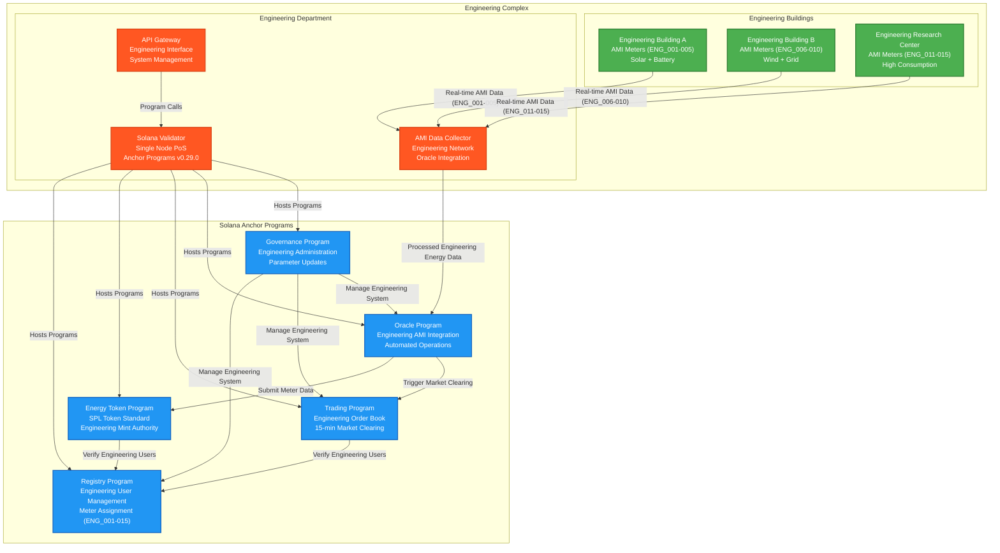

# System Architecture: Engineering Complex P2P Energy Trading Platform

## Overview

The Engineering Complex P2P Energy Trading Platform operates within the university's Engineering Department facilities with the Engineering Department acting as the sole blockchain authority. Built on Solana blockchain with Anchor framework v0.29.0, the system features a single validator operated by the Engineering Department. The Engineering Complex infrastructure consists of 15 Advanced Metering Infrastructure (AMI) smart meters (ENG_001-015) for energy monitoring and oracle integration managed exclusively by the Engineering Department.

## Architecture Components

### 1. Engineering Complex Infrastructure

#### **AMI Smart Meters (ENG_001-015)**
- **Purpose**: Real-time energy generation and consumption monitoring within Engineering Complex
- **Location**: Distributed across Engineering Department buildings and facilities
- **Scope**: 15 dedicated smart meters serving Engineering students and faculty
- **Functionality**:
  - Measure solar panel energy generation from Engineering buildings
  - Monitor wind turbine output from Engineering research installations
  - Track battery storage charge/discharge in Engineering labs
  - Record building energy consumption for Engineering facilities
  - Transmit data to Engineering Department IT systems via secure network

#### **Engineering Complex Buildings with AMI Integration**
```
Engineering Building A (ENG_001-005)
├── AMI Smart Meters (Generation & Consumption)
├── Rooftop Solar Panel Array
├── Battery Storage System
└── Student/Faculty Offices

Engineering Building B (ENG_006-010)
├── AMI Smart Meters (Generation & Consumption)
├── Research Wind Turbine Installation
├── Grid Connection Point
└── Engineering Laboratories

Engineering Research Center (ENG_011-015)
├── AMI Smart Meters (Consumption Heavy)
├── High-Performance Computing Lab
├── Renewable Energy Research Facility
└── Graduate Student Workspaces
```

### 2. Engineering Department Blockchain Authority

#### **Engineering Department**
- **Role**: Sole blockchain validator and system authority for Engineering Complex
- **Authority**: Complete control over Engineering Complex energy trading blockchain
- **Scope**: Exclusive governance of Engineering student and faculty energy trading
- **Responsibilities**:
  - Operate single Solana validator node for Engineering Complex
  - Manage all Anchor program deployments and upgrades
  - Engineering student and faculty registration and meter assignment
  - Oracle data validation and processing for Engineering AMI systems
  - System maintenance and security for Engineering operations
  - Energy token (SPL) minting authorization for Engineering participants
  - Trading platform oversight and market parameter management

### 3. System Data Flow



### 4. SPL Energy Token Process

#### **Step 1: Engineering Energy Generation Detection**
1. AMI smart meters (ENG_001-015) detect renewable energy generation within Engineering Complex
2. Real-time data transmitted to Engineering Department oracle via secure network
3. Energy data processed and validated for accuracy within Engineering systems
4. Net energy surplus calculated (generation - consumption) for Engineering participants

#### **Step 2: SPL Token Minting Authorization**
1. Oracle Program receives validated meter data from Engineering AMI systems
2. Includes: meter ID (ENG_001-015), energy amount, generation source, timestamp
3. Data verified against registered Engineering student/faculty accounts
4. Oracle triggers SPL token minting for verified energy generation within Engineering Complex

#### **Step 3: Engineering Department Validation**
1. Engineering Department oracle validates AMI data authenticity from Engineering meters
2. Cross-reference with Engineering Complex renewable energy installations
3. Verify meter assignments and Engineering user registrations
4. Validate energy generation data against Engineering system parameters
5. Authorize SPL token minting for verified energy generation by Engineering participants

#### **Step 4: SPL Token Minting and Trading**
1. SPL energy tokens minted directly by Oracle Program under Engineering authority
2. SPL tokens credited to Engineering prosumer's associated token account
3. Tokens immediately available for Engineering Complex energy trading
4. Available for trading within 15-minute market epochs among Engineering participants

### 5. Governance Structure

#### **Engineering Department Authority**
- **Role**: Complete system governance and operations for Engineering Complex
- **Scope**: Exclusive authority over Engineering student and faculty energy trading
- **Responsibilities**:
  - Operate single Solana validator node for Engineering Complex
  - Manage all Anchor program deployments and upgrades
  - Oversee Engineering AMI infrastructure integration (ENG_001-015)
  - Engineering user registration and system administration
  - Engineering Complex market operations and parameter updates
  - System maintenance and security for Engineering operations
  - SPL token mint authority for Engineering participants

#### **Single Validator Consensus (Engineering Department)**
- **Consensus Mechanism**: Proof of Stake (Single Engineering Validator)
- **Validator**: Engineering Department operated node exclusively
- **Block Production**: Engineering Department has complete authority over blockchain
- **Network Security**: Secured by Engineering Department infrastructure and protocols
- **Governance**: Engineering Department controls all system parameters and operations
- **User Base**: Limited to Engineering students and faculty (approximately 15 participants)

### 6. Technical Implementation

#### **Solana Anchor Programs (v0.29.0)**
1. **Registry Program**: Engineering student/faculty and AMI meter registration (ENG_001-015) under Engineering Department authority
2. **Energy Token Program**: SPL tokens with Engineering Department mint authority for Engineering Complex
3. **Trading Program**: Engineering Complex energy marketplace with automated 15-minute clearing
4. **Oracle Program**: Engineering AMI data integration and automated market operations
5. **Governance Program**: Engineering Department system administration and parameter control

#### **Engineering AMI Integration**
- Real-time energy data collection from Engineering Complex smart meters (ENG_001-015)
- Secure data transmission to Engineering Department oracle via dedicated network
- Data validation and processing before SPL token minting within Engineering systems
- Integration with Engineering Department managed infrastructure and protocols

#### **Engineering Department Operations**
- Single validator node operation and maintenance for Engineering Complex
- All program deployments and upgrades under Engineering authority
- Engineering user registration and meter assignment authority
- Complete control over SPL energy token minting for Engineering participants
- Engineering market parameter management and oversight
- System security and operational monitoring for Engineering Complex

## Key Benefits

### **Operational Simplicity for Engineering Complex**
- Single authority model eliminates complex consensus mechanisms
- Engineering Department has complete operational control over system
- Simplified decision-making and system administration for Engineering operations
- Rapid deployment and maintenance capabilities within Engineering infrastructure
- Clear accountability and responsibility structure under Engineering governance

### **Engineering Academic Integration**
- Seamless integration with Engineering Department curriculum and research
- Real-world Solana/Anchor blockchain application in controlled Engineering environment
- Hands-on experience with SPL tokens and Anchor framework v0.29.0 for Engineering students
- Research opportunities in Engineering Complex energy systems and blockchain technology
- Demonstration of sustainable engineering practices within Engineering Department

### **Technical Efficiency for Engineering Operations**
- Single validator reduces network overhead and complexity for Engineering use case
- Fast transaction processing with minimal latency for Engineering participants
- Lower operational costs compared to multi-validator networks for Engineering scale
- Simplified monitoring and troubleshooting procedures within Engineering infrastructure
- Direct integration with existing Engineering Department infrastructure and protocols

This architecture ensures that the Engineering Complex P2P energy trading system operates efficiently under clear Engineering Department authority while providing valuable educational and research opportunities in blockchain-based energy systems specifically for Engineering students and faculty.
