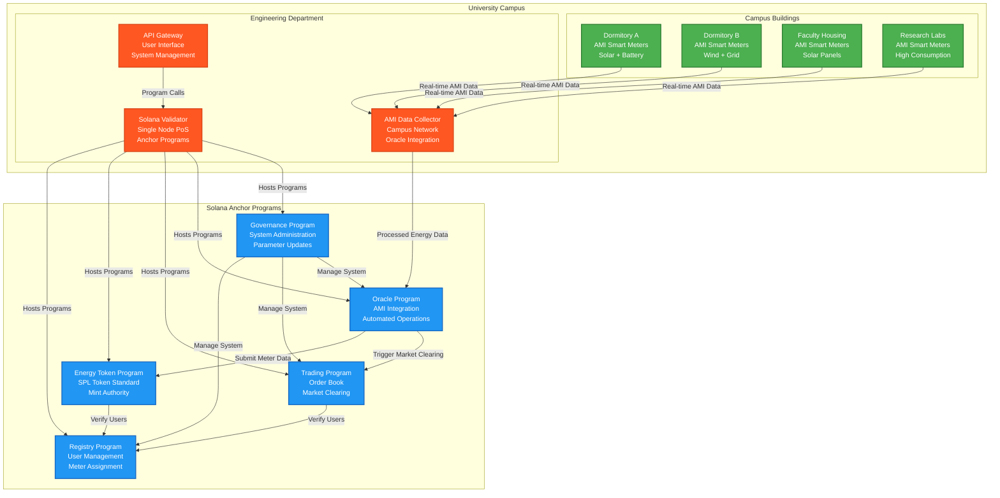

# System Architecture: University P2P Energy Trading with Engineering Department Authority

## Overview

The P2P Energy Trading System operates within a university campus environment with the Engineering Department acting as the sole blockchain authority for the campus energy trading network. Built on Solana blockchain with Anchor framework, the system features a single validator operated by the Engineering Department. The university infrastructure consists of Advanced Metering Infrastructure (AMI) smart meters for energy monitoring and oracle integration managed by the Engineering Department.

## Architecture Components

### 1. University Campus Infrastructure

#### **AMI Smart Meters Only**
- **Purpose**: Real-time energy generation and consumption monitoring
- **Location**: Distributed across all campus buildings
- **Functionality**:
  - Measure solar panel energy generation
  - Monitor wind turbine output
  - Track battery storage charge/discharge
  - Record building energy consumption
  - Transmit data to university IT systems

#### **Campus Buildings with AMI Integration**
```
Dormitory A
├── AMI Smart Meters (Generation & Consumption)
├── Solar Panel Array
└── Battery Storage System

Dormitory B  
├── AMI Smart Meters (Generation & Consumption)
├── Wind Turbine Installation
└── Grid Connection Point

Faculty Housing
├── AMI Smart Meters (Generation & Consumption)
├── Rooftop Solar Panels
└── Smart Grid Integration

Research Laboratories
├── AMI Smart Meters (Consumption Heavy)
├── High-Performance Computing
└── Laboratory Equipment Monitoring
```

### 2. Engineering Department Blockchain Authority

#### **Engineering Department**
- **Role**: Sole blockchain validator and system authority
- **Authority**: Complete control over campus energy trading blockchain
- **Responsibilities**:
  - Operate single Solana validator node
  - Manage all Anchor program deployments
  - User registration and meter assignment
  - Oracle data validation and processing
  - System maintenance and upgrades
  - Energy token minting authorization
  - Trading platform oversight

### 3. System Data Flow



### 4. Energy Token Process

#### **Step 1: Energy Generation Detection**
1. AMI smart meters detect renewable energy generation
2. Real-time data transmitted to Engineering Department oracle
3. Energy data processed and validated for accuracy
4. Net energy surplus calculated (generation - consumption)

#### **Step 2: Token Minting Authorization**
1. Oracle Program receives validated meter data
2. Includes: meter ID, energy amount, generation source, timestamp
3. Data verified against registered user accounts
4. Oracle triggers SPL token minting for verified generation

#### **Step 3: Engineering Department Validation**
1. Engineering Department oracle validates AMI data authenticity
2. Cross-reference with campus renewable energy installations
3. Verify meter assignments and user registrations
4. Validate energy generation data against system parameters
5. Authorize SPL token minting for verified energy generation

#### **Step 4: Token Minting and Trading**
1. Energy tokens minted directly by Oracle Program
2. SPL tokens credited to prosumer's associated token account
3. Tokens immediately available for campus energy trading
4. Available for trading within 15-minute market epochs

### 5. Governance Structure

#### **Engineering Department Authority**
- **Role**: Complete system governance and operations
- **Responsibilities**:
  - Operate single Solana validator node
  - Manage all Anchor program deployments
  - Oversee AMI infrastructure integration
  - User registration and system administration
  - Market operations and parameter updates
  - System maintenance and security

#### **Single Validator Consensus**
- **Consensus Mechanism**: Proof of Stake (Single Validator)
- **Validator**: Engineering Department operated node
- **Block Production**: Engineering Department has complete authority
- **Network Security**: Secured by Engineering Department infrastructure
- **Governance**: Engineering Department controls all system parameters

### 6. Technical Implementation

#### **Solana Anchor Programs**
1. **Registry Program**: User and AMI meter registration under Engineering Department authority
2. **Energy Token Program**: SPL tokens with Engineering Department mint authority
3. **Trading Program**: Campus energy marketplace with automated clearing
4. **Oracle Program**: AMI data integration and automated market operations
5. **Governance Program**: Engineering Department system administration

#### **AMI Integration**
- Real-time energy data collection from campus smart meters
- Secure data transmission to Engineering Department oracle
- Data validation and processing before token minting
- Integration with Engineering Department managed systems

#### **Engineering Department Operations**
- Single validator node operation and maintenance
- All program deployments and upgrades
- User registration and meter assignment authority
- Complete control over energy token minting
- Market parameter management and oversight
- System security and operational monitoring

## Key Benefits

### **Operational Simplicity**
- Single authority model eliminates complex consensus mechanisms
- Engineering Department has complete operational control
- Simplified decision-making and system administration
- Rapid deployment and maintenance capabilities
- Clear accountability and responsibility structure

### **Academic Integration**
- Seamless integration with university engineering curriculum
- Real-world blockchain application in controlled environment
- Hands-on experience with Solana/Anchor development
- Research opportunities in campus energy systems
- Demonstration of sustainable engineering practices

### **Technical Efficiency**
- Single validator reduces network overhead and complexity
- Fast transaction processing with minimal latency
- Lower operational costs compared to multi-validator networks
- Simplified monitoring and troubleshooting procedures
- Direct integration with existing campus infrastructure

This architecture ensures that the university's P2P energy trading system operates efficiently under clear Engineering Department authority while providing valuable educational and research opportunities in blockchain-based energy systems.
