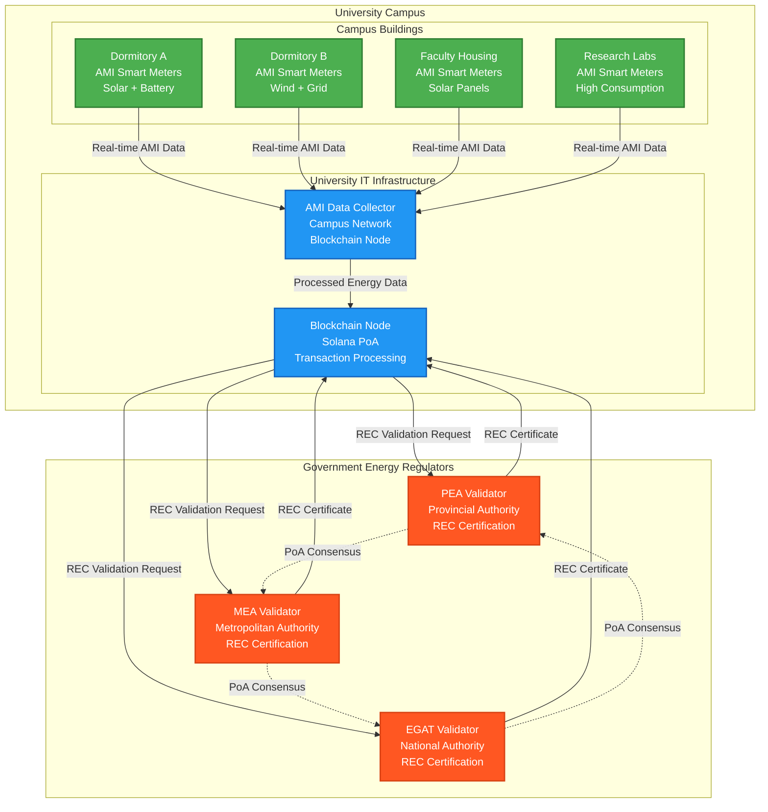

# System Architecture: University P2P Energy Trading with Regulatory REC Validation

## Overview

The P2P Energy Trading System operates within a university campus environment with university departments acting as REC (Renewable Energy Certificate) certification authority. The university infrastructure consists of Advanced Metering Infrastructure (AMI) smart meters for energy monitoring and REC validation nodes operated by university departments.

## Architecture Components

### 1. University Campus Infrastructure

#### **AMI Smart Meters Only**
- **Purpose**: Real-time energy generation and consumption monitoring
- **Location**: Distributed across all campus buildings
- **Functionality**:
  - Measure solar panel energy generation
  - Monitor wind turbine output
  - Track battery storage charge/discharge
  - Record building energy consumption
  - Transmit data to university IT systems

#### **Campus Buildings with AMI Integration**
```
Dormitory A
├── AMI Smart Meters (Generation & Consumption)
├── Solar Panel Array
└── Battery Storage System

Dormitory B  
├── AMI Smart Meters (Generation & Consumption)
├── Wind Turbine Installation
└── Grid Connection Point

Faculty Housing
├── AMI Smart Meters (Generation & Consumption)
├── Rooftop Solar Panels
└── Smart Grid Integration

Research Laboratories
├── AMI Smart Meters (Consumption Heavy)
├── High-Performance Computing
└── Laboratory Equipment Monitoring
```

### 2. University Department REC Validators

#### **Sustainability Office**
- **Role**: Primary REC validator and environmental compliance authority
- **Authority**: University sustainability policies and renewable energy standards
- **Responsibilities**:
  - Validate renewable energy generation claims
  - Issue university REC certificates
  - Maintain sustainability compliance standards
  - Audit energy generation data against university policies

#### **Engineering Department**
- **Role**: Technical REC validator and system oversight
- **Authority**: Technical validation of renewable energy systems
- **Responsibilities**:
  - Technical validation of renewable energy installations
  - System performance monitoring
  - Equipment certification and maintenance oversight
  - Integration with campus smart grid systems

#### **Facilities Management**
- **Role**: Infrastructure REC validator and operational oversight
- **Authority**: Campus infrastructure and facility operations
- **Responsibilities**:
  - Building energy system validation
  - Infrastructure maintenance and compliance
  - AMI system management and data integrity
  - Campus energy distribution coordination

### 3. System Data Flow



### 4. REC Validation Process

#### **Step 1: Energy Generation Detection**
1. AMI smart meters detect renewable energy generation
2. Real-time data transmitted to university IT systems
3. Energy data processed and validated for accuracy
4. Net energy surplus calculated (generation - consumption)

#### **Step 2: REC Certificate Request**
1. University blockchain node creates REC validation request
2. Includes: meter ID, energy amount, generation source, timestamp
3. Request signed by university authority
4. Submitted to regulatory authority validators

#### **Step 3: Regulatory Validation**
1. PEA/MEA/EGAT validators receive REC requests
2. Cross-reference with official renewable energy registrations
3. Verify university's renewable energy installation permits
4. Validate AMI data against regulatory standards
5. Issue official REC certificate if approved

#### **Step 4: Token Minting**
1. REC certificate validated by minimum 2 of 3 regulators
2. Energy tokens minted on blockchain
3. Tokens backed by official government REC certificates
4. Available for trading within campus energy market

### 5. Governance Structure

#### **University Authority**
- **Role**: Campus operations and blockchain node management
- **Responsibilities**:
  - Manage AMI infrastructure
  - Coordinate with regulatory authorities
  - Oversee campus energy trading operations
  - Ensure compliance with regulations

#### **Regulatory Authority Consensus**
- **Minimum Validators**: 2 out of 3 (PEA, MEA, EGAT)
- **Consensus Mechanism**: Proof of Authority (PoA)
- **Validation Requirements**:
  - Official government energy regulator status
  - Legal authority to issue REC certificates
  - Access to national renewable energy registry
  - Compliance with national energy policies

### 6. Technical Implementation

#### **Solana Anchor Programs**
1. **Registry Program**: User and AMI meter registration
2. **Energy Token Program**: SPL tokens with REC validation
3. **Trading Program**: Campus energy marketplace
4. **Oracle Program**: AMI data integration and processing
5. **Governance Program**: Regulatory authority management

#### **AMI Integration**
- Real-time energy data collection from smart meters
- Secure data transmission to university IT systems
- Data validation and processing before blockchain submission
- Integration with existing campus energy management systems

#### **Regulatory Compliance**
- All REC certificates issued by official government authorities
- Compliance with national renewable energy standards
- Audit trail for regulatory inspection and compliance
- Integration with national REC registry systems

## Key Benefits

### **Regulatory Compliance**
- Official government validation of all renewable energy certificates
- Compliance with national energy policies and standards
- Legal backing for all energy trading transactions
- Official audit trail for regulatory inspections

### **Operational Efficiency**
- Automated AMI data collection and processing
- Real-time energy monitoring and trading
- Reduced manual intervention through automation
- Seamless integration with existing campus systems

### **Academic Value**
- Real-world application of blockchain technology in energy sector
- Hands-on experience with regulatory compliance
- Research opportunities in renewable energy trading
- Demonstration of sustainable campus operations

This architecture ensures that the university's P2P energy trading system operates within the proper regulatory framework while maintaining the technological advantages of blockchain-based energy trading.
