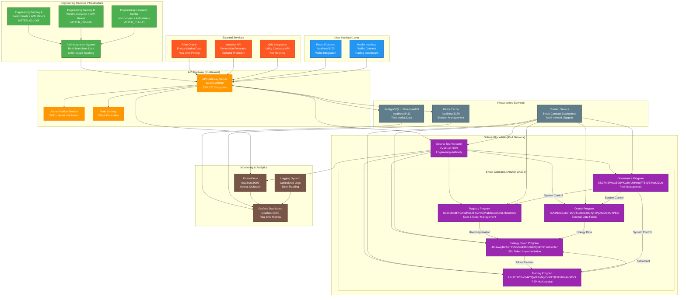
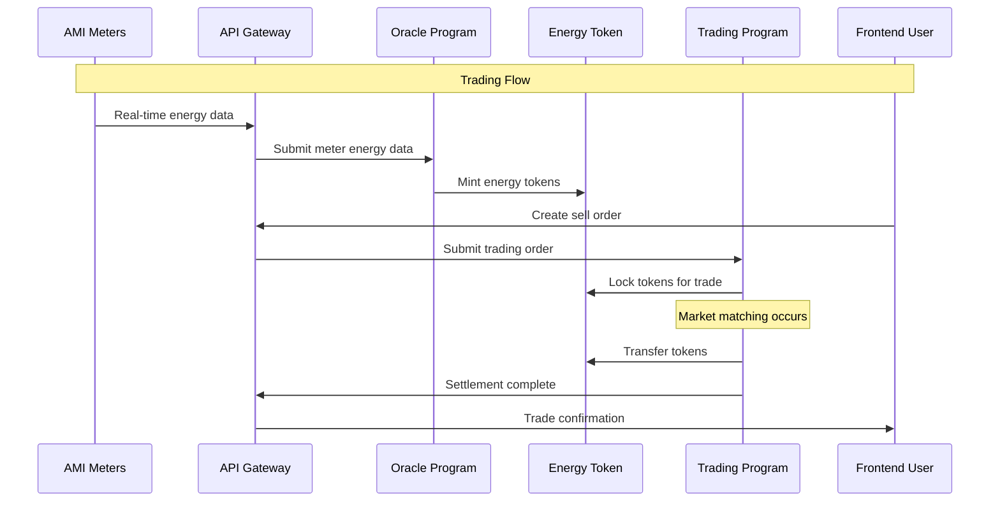
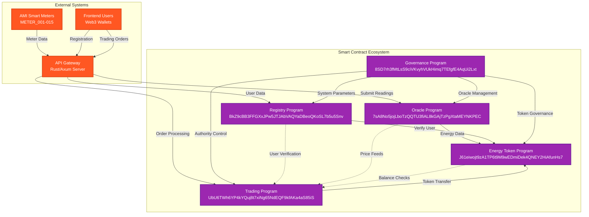
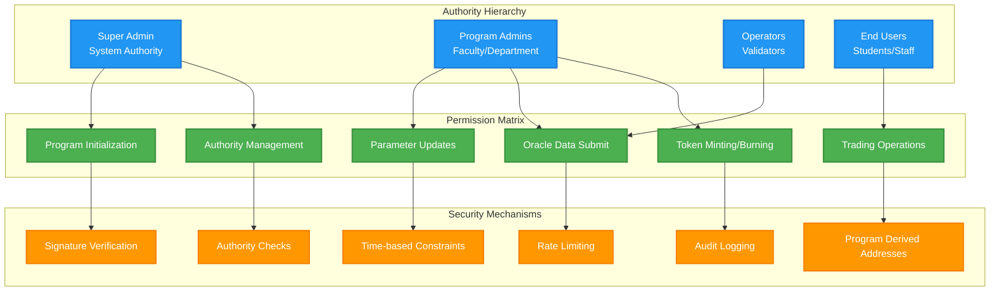
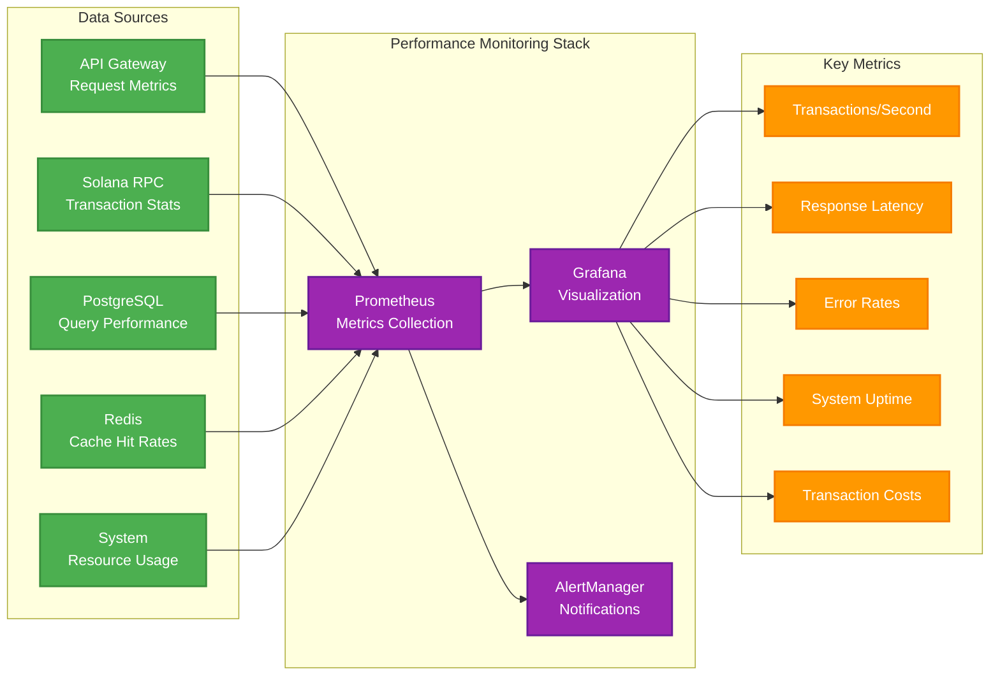

# System Architecture: P2P Energy Trading Platform

## Overview

The P2P Energy Trading Platform is a decentralized blockchain-based system built on Solana with Anchor framework v0.29.0. The system enables peer-to-peer energy trading through smart contracts, featuring automated deployment via the `contact` service, comprehensive monitoring, and multi-network support for development, testing, and production environments.

## Architecture Components

### 1. Complete System Architecture Diagram



### 2. Core Services Architecture

```
┌─────────────────────────────────────────────────────────────┐
│                    P2P Energy Trading System               │
├─────────────────────────────────────────────────────────────┤
│  ┌─────────────────┐  ┌──────────────────┐  ┌─────────────┐ │
│  │ Solana Validator│  │ Contact Service  │  │  Frontend   │ │
│  │   Container     │  │    Container     │  │  Container  │ │
│  │                 │  │                  │  │             │ │
│  │ • Test Validator│  │ • Anchor Build   │  │ • React App │ │
│  │ • Health checks │  │ • Smart Contract │  │ • Production │ │
│  │ • Platform deps │  │   Deployment     │  │   Optimized │ │
│  └─────────────────┘  └──────────────────┘  └─────────────┘ │
├─────────────────────────────────────────────────────────────┤
│  ┌─────────────┐  ┌──────────┐  ┌───────┐  ┌──────────────┐ │
│  │ PostgreSQL  │  │  Redis   │  │API GW │  │   Grafana    │ │
│  │ TimescaleDB │  │  Cache   │  │ Rust  │  │  Monitoring  │ │
│  └─────────────┘  └──────────┘  └───────┘  └──────────────┘ │
└─────────────────────────────────────────────────────────────┘
```

### 3. System Flow Overview



### 4. Contact Service (Smart Contract Deployment)

#### **Core Functionality**
- **Multi-Network Deployment**: Supports local validator, Solana devnet, and mainnet
- **Container Orchestration**: Optimized Docker container with multi-stage builds
- **Script Automation**: Simplified deployment scripts for all contract operations
- **Health Monitoring**: Comprehensive service and deployment verification
- **Flexible Configuration**: Environment-based network switching

#### **Available Scripts**
```
scripts/
├── dev-setup.sh               # Master development environment setup
│   ├── Prerequisites validation (Docker, Anchor, Solana CLI)
│   ├── Program deployment orchestration
│   ├── API Gateway startup (Rust/Axum)
│   ├── Frontend development server
│   └── Production-ready service coordination
├── dev-test.sh               # Comprehensive development & testing suite
│   ├── Environment configuration and validation
│   ├── Local Solana validator management
│   ├── Anchor program build and deployment
│   ├── Integration test execution
│   └── Development service orchestration
└── setup-poa.sh              # Proof of Authority initialization
    ├── PoA validator configuration and startup
    ├── Authority keypair generation and funding
    ├── Governance program initialization
    ├── Multi-authority account setup (Faculty/Student/REC)
    └── Network verification and status reporting
```
### 5. Smart Contract Architecture

#### **Program Interaction Diagram**


#### **Core Programs (Anchor v0.29.0)**

```
Solana Blockchain
├── Registry Program
│   ├── User registration and management
│   ├── Smart meter assignment tracking
│   └── Identity verification system
│
├── Energy Token Program (SPL)
│   ├── Tokenized energy units (kWh)
│   ├── Generation/consumption tracking
│   └── Automated minting/burning
│
├── Trading Program
│   ├── Peer-to-peer order matching
│   ├── Market clearing mechanisms
│   └── Settlement processing
│
├── Oracle Program
│   ├── External data integration
│   ├── Smart meter data processing
│   └── Price feed management
│
└── Governance Program (PoA)
    ├── Authority management
    ├── System parameter updates
    └── Emergency controls
```

#### **Deployment Flow**
```mermaid
graph TD
    START[Start Deployment]
    NET{Select Network}
    
    %% Network branches
### 7. Security Architecture

#### **Security Layers & Authentication Flow**
```mermaid
sequenceDiagram
    participant U as User/Device
    participant F as Frontend
    participant A as API Gateway
    participant B as Blockchain
    participant O as Oracle
    participant D as Database
    
    Note over U,D: Authentication & Authorization Flow
    
    U->>F: Connect Wallet
    F->>U: Request Signature
    U->>F: Signed Message
    F->>A: JWT Request + Signature
    A->>A: Verify Signature
    A->>D: Store Session
    A-->>F: JWT Token
    
    Note over U,D: Secured API Request Flow
    
    F->>A: API Request + JWT
    A->>A: Validate JWT
    A->>A: Check Permissions
    A->>B: Program Instruction
    B->>B: Execute Program Logic
    B-->>A: Transaction Result
    
    Note over U,D: Oracle Data Submission
    
    O->>A: Meter Data + API Key
    A->>A: Validate API Key
    A->>B: Submit Reading
    B->>B: Validate Authority
    B-->>A: Confirmation
```

#### **Smart Contract Security Model**


#### **Data Protection & Privacy**
- **On-Chain Data**: Only essential transaction data and energy readings
- **Off-Chain Storage**: Personal information in encrypted database
- **API Security**: JWT tokens, rate limiting, CORS protection
- **Smart Contract**: PDA-based account derivation, authority validation
- **Oracle Protection**: API key authentication, signed transactions

### 8. Performance & Monitoring

#### **System Performance Metrics**


#### **Performance Targets**
- **Transaction Throughput**: 1000+ TPS (theoretical Solana limit)
- **API Response Time**: < 200ms average
- **Database Query Time**: < 50ms for reads
- **Cache Hit Rate**: > 95% for frequently accessed data
- **System Uptime**: 99.9% availability target
    
    %% Contact service process
    subgraph "Contact Service Process"
        BUILD_STEP[1. Contract Build Phase]
        DEPLOY_STEP[2. Sequential Deployment]
        VERIFY_STEP[3. Verification Phase]
        INIT_STEP[4. Initialization Phase]
        
        BUILD_STEP --> DEPLOY_STEP
        DEPLOY_STEP --> VERIFY_STEP
        VERIFY_STEP --> INIT_STEP
    end
    
    L_BUILD --> BUILD_STEP
    D_BUILD --> BUILD_STEP
    M_BUILD --> BUILD_STEP
    
    %% Sequential deployment order
    subgraph "Program Deployment Sequence"
        DEPLOY1[Deploy Registry<br/>Foundation Program]
        DEPLOY2[Deploy Energy Token<br/>SPL Token Program]
        DEPLOY3[Deploy Oracle<br/>Data Integration]
        DEPLOY4[Deploy Trading<br/>Market Program]
        DEPLOY5[Deploy Governance<br/>PoA Authority]
        
        DEPLOY1 --> DEPLOY2
        DEPLOY2 --> DEPLOY3
        DEPLOY3 --> DEPLOY4
        DEPLOY4 --> DEPLOY5
    end
    
    DEPLOY_STEP --> DEPLOY1
    DEPLOY5 --> VERIFY_STEP
    
    %% Health check and initialization
    INIT_STEP --> HEALTH[Health Check<br/>All Programs Accessible]
    HEALTH --> SUCCESS[✅ Deployment Complete<br/>System Ready]
    
    classDef network fill:#2196F3,stroke:#1976D2,stroke-width:2px,color:#fff
    classDef process fill:#4CAF50,stroke:#388E3C,stroke-width:2px,color:#fff
    classDef deploy fill:#FF9800,stroke:#F57C00,stroke-width:2px,color:#fff
    classDef success fill:#8BC34A,stroke:#689F38,stroke-width:2px,color:#fff
    
    class NET,L_BUILD,D_BUILD,M_BUILD network
    class BUILD_STEP,DEPLOY_STEP,VERIFY_STEP,INIT_STEP process
    class DEPLOY1,DEPLOY2,DEPLOY3,DEPLOY4,DEPLOY5 deploy
    class SUCCESS,HEALTH success
```
    
    subgraph "Network Selection"
        NET{Select Network}
        LOCAL_NET[Local Validator<br/>localhost:8899]
        DEV_NET[Solana Devnet<br/>api.devnet.solana.com]
        MAIN_NET[Solana Mainnet<br/>api.mainnet-beta.solana.com]
    end
    
    subgraph "Contact Service Process"
        CHECK[Network Connectivity<br/>wait-for-validator.sh]
        BUILD[Build Contracts<br/>build-contracts.sh]
        DEPLOY[Deploy All Programs<br/>deploy-all-contracts.sh]
        VERIFY[Verify Deployment<br/>verify-deployment.sh]
        INIT[Initialize PoA<br/>setup-poa.sh]
        HEALTH[Health Monitor<br/>health-monitor.sh]
    end
    
    subgraph "Program Deployment Order"
        P1[1. Registry Program]
        P2[2. Energy Token Program]
        P3[3. Oracle Program]
        P4[4. Trading Program]
        P5[5. Governance Program]
    end
    
    RESULT[Deployment Complete<br/>System Ready]
    
    START --> NET
    NET --> LOCAL_NET
    NET --> DEV_NET
    NET --> MAIN_NET
    
    LOCAL_NET --> CHECK
    DEV_NET --> CHECK
    MAIN_NET --> CHECK
    
    CHECK --> BUILD
    BUILD --> DEPLOY
    
    DEPLOY --> P1
    P1 --> P2
    P2 --> P3
    P3 --> P4
    P4 --> P5
    
    P5 --> VERIFY
    VERIFY --> INIT
    INIT --> HEALTH
    HEALTH --> RESULT
    
    classDef process fill:#4CAF50,stroke:#2E7D32,stroke-width:2px,color:#fff
    classDef network fill:#2196F3,stroke:#1565C0,stroke-width:2px,color:#fff
    classDef program fill:#FF9800,stroke:#F57C00,stroke-width:2px,color:#fff
    
    class CHECK,BUILD,DEPLOY,VERIFY,INIT,HEALTH process
    class LOCAL_NET,DEV_NET,MAIN_NET network
    class P1,P2,P3,P4,P5 program
```

### 6. Network Configuration

#### **Multi-Network Architecture**

```mermaid
graph TB
    subgraph "Development Environment"
        DEV_VAL[Local Test Validator<br/>localhost:8899]
        DEV_FRONT[Frontend Dev Server<br/>localhost:5173]
        DEV_API[API Gateway<br/>localhost:8080]
        DEV_DB[PostgreSQL<br/>localhost:5432]
        DEV_CACHE[Redis<br/>localhost:6379]
        DEV_MON[Grafana<br/>localhost:3000]
    end
    
    subgraph "Testing Environment"
        TEST_NET[Solana Devnet<br/>api.devnet.solana.com]
        TEST_FRONT[Staging Frontend<br/>staging.example.com]
        TEST_API[Staging API<br/>api-staging.example.com]
        TEST_DB[Test Database<br/>Remote PostgreSQL]
        TEST_CACHE[Test Cache<br/>Remote Redis]
        TEST_MON[Test Monitoring<br/>monitoring-test.example.com]
    end
    
    subgraph "Production Environment"
        PROD_NET[Solana Mainnet<br/>api.mainnet-beta.solana.com]
        PROD_FRONT[Production Frontend<br/>app.example.com]
        PROD_API[Production API<br/>api.example.com]
        PROD_DB[Production Database<br/>High Availability PostgreSQL]
        PROD_CACHE[Production Cache<br/>Redis Cluster]
        PROD_MON[Production Monitoring<br/>monitoring.example.com]
        PROD_LB[Load Balancer<br/>SSL/TLS Termination]
    end
    
    %% Environment progression
    DEV_VAL -.->|Deploy & Test| TEST_NET
    TEST_NET -.->|Promote| PROD_NET
    
    %% Load balancer connections
    PROD_LB --> PROD_FRONT
    PROD_LB --> PROD_API
    
    classDef dev fill:#4CAF50,stroke:#2E7D32,stroke-width:2px,color:#fff
    classDef test fill:#FF9800,stroke:#F57C00,stroke-width:2px,color:#fff
    classDef prod fill:#F44336,stroke:#C62828,stroke-width:2px,color:#fff
    
    class DEV_VAL,DEV_FRONT,DEV_API,DEV_DB,DEV_CACHE,DEV_MON dev
    class TEST_NET,TEST_FRONT,TEST_API,TEST_DB,TEST_CACHE,TEST_MON test
    class PROD_NET,PROD_FRONT,PROD_API,PROD_DB,PROD_CACHE,PROD_MON,PROD_LB prod
```


#### **Supported Networks**

| Environment | RPC Endpoint | Use Case | Authority |
|-------------|--------------|----------|-----------|
| **Local** | `http://localhost:8899` | Development | Local test validator |
| **Devnet** | `https://api.devnet.solana.com` | Testing | Solana devnet |
| **Mainnet** | `https://api.mainnet-beta.solana.com` | Production | Solana mainnet |

#### **Service Endpoints**
```
Development Environment:
├── Frontend: http://localhost:3000
├── API Gateway: http://localhost:8080
├── Solana Validator: http://localhost:8898
├── PostgreSQL: localhost:5432
├── Redis: localhost:6379
└── Grafana: http://localhost:3001

Production Environment:
├── All services behind reverse proxy
├── SSL/TLS termination
├── Load balancing
└── Health monitoring
```
    GOV -->|"Manage Engineering System"| REG
    GOV -->|"Manage Engineering System"| TRD
    GOV -->|"Manage Engineering System"| ORC
    
    %% User interface
    API -->|"Program Calls"| SOL
    
    classDef building fill:#4CAF50,stroke:#2E7D32,stroke-width:2px,color:#fff
    classDef engdept fill:#FF5722,stroke:#D84315,stroke-width:2px,color:#fff
    classDef program fill:#2196F3,stroke:#1565C0,stroke-width:2px,color:#fff
    
    class EBA,EBB,ERC building
    class AMI,SOL,API engdept
    class REG,TKN,TRD,ORC,GOV program
```

### 4. SPL Energy Token Process

#### **Step 1: Engineering Energy Generation Detection**
1. AMI smart meters (METER_001-015) detect renewable energy generation within Engineering Complex
2. Real-time data transmitted to Engineering Department oracle via secure network
3. Energy data processed and validated for accuracy within Engineering systems
4. Net energy surplus calculated (generation - consumption) for Engineering participants

### 5. Data Flow Architecture

#### **Contact Service Deployment Flow**
```
1. Network Connectivity Check
   ├── Validate target Solana network
   ├── Verify RPC endpoint accessibility
   └── Confirm network compatibility

2. Contract Build Process
   ├── Compile all Anchor programs
   ├── Generate program IDL files
   ├── Prepare deployment artifacts
   └── Validate build integrity

3. Sequential Deployment
   ├── Deploy Registry Program (foundation)
   ├── Deploy Energy Token Program (SPL)
   ├── Deploy Oracle Program (data feeds)
   ├── Deploy Trading Program (marketplace)
   └── Deploy Governance Program (authority)

4. Post-Deployment Verification
   ├── Verify program deployment success
   ├── Test program accessibility
   ├── Initialize PoA system
   └── Generate deployment report
```

#### **Real-time System Operations**
```
Energy Data Flow:
Smart Meters → Oracle → Energy Tokens → Trading Platform

User Interactions:
Frontend → API Gateway → Blockchain Programs

Monitoring Flow:
All Services → Health Checks → Grafana Dashboard
```

### 6. Technical Implementation

#### **Docker Container Architecture**
```
Production Deployment:
├── contact: Optimized deployment automation
├── solana-validator: Test validator with health checks
├── frontend: Production React application
├── api-gateway: Rust-based API service
├── postgres: TimescaleDB for time-series data
├── redis: Caching and session management
└── grafana: Real-time monitoring dashboard
```

#### **Environment Management**
```bash
# Development (Local Validator)
SOLANA_RPC_URL="http://solana-validator:8899"

# Testing (Devnet)
SOLANA_RPC_URL="https://api.devnet.solana.com"

# Production (Mainnet)
SOLANA_RPC_URL="https://api.mainnet-beta.solana.com"
```

#### **Health Monitoring System**
- **Service Health**: Real-time container status monitoring
- **Network Connectivity**: Continuous RPC endpoint validation
- **Deployment Verification**: Automated post-deployment testing
- **Performance Metrics**: Resource usage and response time tracking
- **Alert System**: Automated notifications for system issues

### 7. Security Architecture

#### **Container Security**
- Multi-stage Docker builds for minimal attack surface
- Non-root user execution in production containers
- Volume isolation for sensitive data protection
- Network segmentation between services

#### **Blockchain Security**
- Keypair management with secure storage
- Environment-specific RPC endpoints
- Program authority controls
- Transaction validation and verification

#### **Operational Security**
- Automated health monitoring
- Secure configuration management
- Access control and audit logging
- Emergency response procedures

### 8. Scalability Considerations

#### **Horizontal Scaling**
- Service replication via Docker Compose scaling
- Load balancing for API gateway
- Database connection pooling
- Redis cluster support

#### **Network Scalability**
- Multi-network deployment support
- RPC endpoint failover mechanisms
- Validator redundancy options
- Cross-chain integration capability

## Conclusion

The P2P Energy Trading Platform provides a robust, scalable architecture for decentralized energy trading. The `contact` service ensures reliable smart contract deployment across multiple Solana networks, while the comprehensive monitoring and health check systems maintain operational excellence.

For detailed deployment instructions, see [Docker Deployment Guide](./DOCKER_DEPLOYMENT_GUIDE.md).
For troubleshooting assistance, see [Docker Troubleshooting Guide](./DOCKER_TROUBLESHOOTING.md).

## Key Benefits

### **Operational Simplicity for Engineering Complex**
- Single authority model eliminates complex consensus mechanisms
- Engineering Department has complete operational control over system
- Simplified decision-making and system administration for Engineering operations
- Rapid deployment and maintenance capabilities within Engineering infrastructure
- Clear accountability and responsibility structure under Engineering governance

### **Engineering Academic Integration**
- Seamless integration with Engineering Department curriculum and research
- Real-world Solana/Anchor blockchain application in controlled Engineering environment
- Hands-on experience with SPL tokens and Anchor framework v0.29.0 for Engineering students
- Research opportunities in Engineering Complex energy systems and blockchain technology
- Demonstration of sustainable engineering practices within Engineering Department

### **Technical Efficiency for Engineering Operations**
- Single validator reduces network overhead and complexity for Engineering use case
- Fast transaction processing with minimal latency for Engineering participants
- Lower operational costs compared to multi-validator networks for Engineering scale
- Simplified monitoring and troubleshooting procedures within Engineering infrastructure
- Direct integration with existing Engineering Department infrastructure and protocols

This architecture ensures that the Engineering Complex P2P energy trading system operates efficiently under clear Engineering Department authority while providing valuable educational and research opportunities in blockchain-based energy systems specifically for Engineering students and faculty.
