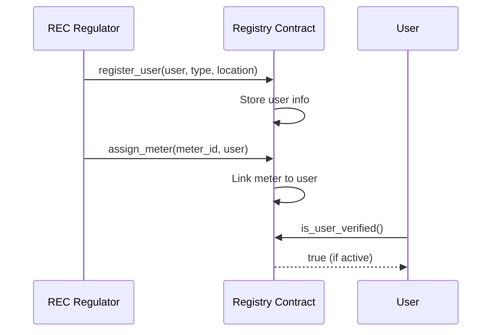
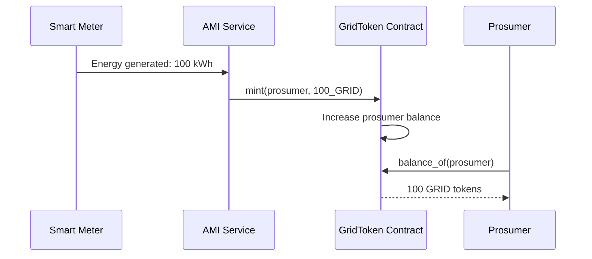
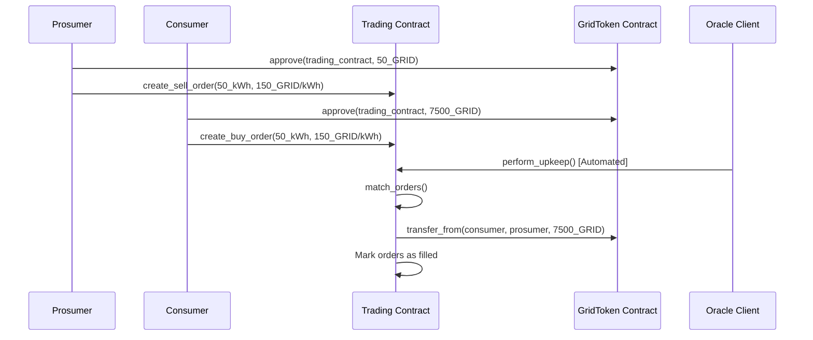
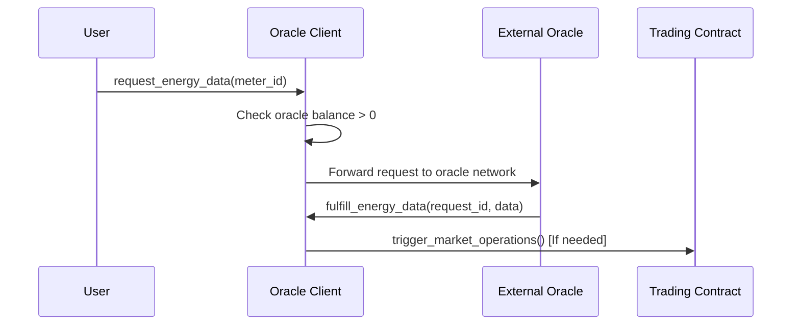

# P2P Energy Trading Platform - Technical Summary

## Overview

The P2P Energy Trading Platform is a comprehensive blockchain-based solution for peer-to-peer solar energy trading within university campuses. Built using ink! smart contracts on the Substrate framework, the platform enables prosumers to trade excess solar energy directly with consumers through a decentralized marketplace.

## System Architecture

### Technology Stack

- **Smart Contract Framework**: ink! 4.3
- **Blockchain Platform**: Substrate-based chains with contracts pallet
- **Token Standard**: PSP22 (Polkadot Standard Proposal 22) with OpenBrush
- **Programming Language**: Rust (Edition 2021)
- **Oracle Integration**: Chainlink-compatible oracle client
- **Storage**: ink! storage with Mapping data structures

### Core Components

The platform consists of four interoperable smart contracts:

```
┌─────────────────┐    ┌─────────────────┐
│   Registry      │    │   GridToken     │
│   Contract      │    │   Contract      │
│                 │    │   (PSP22)       │
└─────────────────┘    └─────────────────┘
         │                       │
         │                       │
         └───────────┬───────────┘
                     │
         ┌───────────▼───────────┐
         │                       │
┌─────────────────┐    ┌─────────────────┐
│   Trading       │    │   OracleClient  │
│   Contract      │    │   Contract      │
└─────────────────┘    └─────────────────┘
```

## Contract Details

### 1. Registry Contract

**Purpose**: Identity and access management layer

**Key Data Structures**:
- **UserInfo**: Contains user type (Prosumer/Consumer), physical location, status (Active/Suspended), and registration timestamp
- **UserType**: Enum defining Prosumer (can generate and consume energy) vs Consumer (consume only)
- **UserStatus**: Active, Suspended, or Inactive states
- **MeterId**: String-based identifier for smart meters

**Core Functions**:
- `register_user()` - REC regulator registers new users
- `assign_meter()` - Links smart meters to users
- `is_user_verified()` - Validates user status
- `add_rec_regulator()` - Adds new REC regulators
- `remove_rec_regulator()` - Removes REC regulators

**Access Control**:
- REC Regulators: Can register users, assign meters, manage system
- Users: Can view their own information and meter assignments

### 2. GridToken Contract (PSP22 Compatible)

**Purpose**: Energy tokenization and transfer mechanism

**Token Economics**:
- 1 kWh solar generation = 1 GRID token
- 18 decimal places for precision
- Mintable by authorized minters (AMI Integration Service)
- Burnable for energy consumption tracking

**Key Features**:
- **PSP22 Standard Implementation**: Complete compatibility with Polkadot Standard Proposal 22
- **Transfer Operations**: Standard token transfers between accounts
- **Approval System**: Allowance-based spending authorization
- **Delegated Transfers**: Third-party transfers with approval
- **Custom Energy Trading Features**: Specialized minting and burning for energy operations
- **Authorization Management**: Role-based minter and burner permissions

**Authorization Levels**:
- Minters: AMI Integration Service, Oracle Client
- Burners: Trading Contract for energy consumption
- Users: Standard PSP22 token operations

### 3. Trading Contract

**Purpose**: Order book management and automated market clearing

**Market Structure**:
- **Epoch Duration**: 15 minutes (900 seconds)
- **Order Types**: Buy orders (consumers), Sell orders (prosumers)
- **Matching Algorithm**: Price-time priority
- **Settlement**: Automatic GRID token transfers

**Order Management**:
- **Order Structure**: Contains user account, energy amount (kWh), price per kWh (GRID tokens), timestamp, and status
- **Order Status Types**: Active, Filled, Cancelled, Expired
- **Order Lifecycle**: Creation → Active → Matched/Cancelled/Expired
- **Price Discovery**: Market-driven pricing through order book

**Market Operations**:
- `create_sell_order()` - Prosumers offer energy
- `create_buy_order()` - Consumers request energy
- `match_orders()` - Automated order matching
- `cancel_order()` - User cancellation
- `get_market_price()` - Current market rate

### 4. OracleClient Contract

**Purpose**: External data integration and automated operations

**Oracle Integration**:
- **Data Sources**: Smart meter readings, market data
- **Automation**: Chainlink Keepers for periodic operations
- **Funding Model**: Prepaid oracle operations

**Key Functions**:
- **Oracle Data Requests**: Request energy data from specific meters with unique request IDs
- **Data Fulfillment**: Oracle callback system for external data integration
- **Automation Functions**: Chainlink Keepers integration for periodic operations
- **Upkeep Management**: Automated market clearing and system maintenance
- **Funding Management**: Payable funding system for oracle operations

**Oracle Request Flow**:
1. User requests energy data for their meter
2. Oracle balance checked (must be > 0)
3. Request created with unique ID
4. External oracle fulfills request
5. Data callback triggers automated operations

## API and Integration Layer

### REST API Architecture

**API Gateway Functions**:
- **Authentication**: JWT-based user authentication with smart contract address verification
- **Rate Limiting**: API call limits per user type (prosumers get higher limits for meter data)
- **Data Aggregation**: Combine blockchain and database data for comprehensive responses
- **Real-Time Updates**: WebSocket connections for live market data and order status

**Core API Endpoints**:
- **User Management**: Registration status, meter assignments, energy statistics
- **Market Data**: Current prices, order book depth, trading volume, market history
- **Trading Operations**: Order creation, cancellation, portfolio management, transaction history
- **Energy Analytics**: Generation/consumption patterns, carbon footprint, savings calculations
- **System Monitoring**: Network status, oracle health, contract state

### Blockchain Integration Services

**Smart Contract Interaction Layer**:
- **Contract Abstractions**: High-level interfaces for each smart contract
- **Transaction Management**: Gas optimization, nonce management, transaction queuing
- **Event Processing**: Real-time blockchain event monitoring and database updates
- **State Synchronization**: Periodic verification of blockchain vs database consistency

**Oracle Integration**:
- **Smart Meter APIs**: Direct integration with campus IoT infrastructure
- **External Price Feeds**: Integration with energy market price oracles
- **Weather Data**: Solar generation forecasting based on weather conditions
- **Grid Status**: Real-time campus energy grid status and demand forecasting

### Message Queue Integration

**Event-Driven Architecture**:
- **Blockchain Events**: User registration, token transfers, order matching, meter assignments
- **IoT Data Streams**: Real-time energy generation and consumption from smart meters
- **Market Events**: Price changes, order fulfillment, market epoch transitions
- **System Events**: Oracle updates, contract upgrades, maintenance notifications

**Queue Technologies**:
- **Apache Kafka**: High-throughput stream processing for IoT data and trading events
- **Redis Streams**: Lightweight queuing for API responses and user notifications
- **RabbitMQ**: Reliable message delivery for critical system operations
- **AWS SQS/Azure Service Bus**: Cloud-native queuing for scalable deployments

## System Workflows

### 1. User Registration and Setup



### 2. Energy Generation and Token Minting



### 3. Trading Workflow



### 4. Oracle Data Processing



## Technical Specifications

### Storage Optimization

**On-Chain Storage (Blockchain)**:
- **Registry Contract**: REC regulators mapping, user information mapping, meter ownership mapping, user-meter associations
- **GridToken Contract**: Account balance mappings, allowance mappings for delegated transfers, authorized minter mappings
- **Trading Contract**: Order storage mapping, user order associations, active order lists for buy/sell operations
- **Oracle Client**: Oracle operator authorization mapping, pending request tracking

**Off-Chain Database Requirements**:
- **Historical Data Storage**: Complete transaction history, order book archives, energy generation/consumption logs
- **Analytics Database**: Performance metrics, market statistics, user behavior patterns, energy flow analytics
- **Real-Time Data Cache**: Current market prices, active orders, recent transactions for fast API responses
- **Operational Database**: System configuration, user preferences, notification settings, audit logs

## Database Architecture

### Database Layer Integration

**Multi-Tier Data Strategy**:
- **Layer 1 (Blockchain)**: Critical state data, immutable records, consensus-required information
- **Layer 2 (Primary Database)**: Operational data, user profiles, meter readings, market analytics
- **Layer 3 (Cache Layer)**: High-frequency access data, real-time market feeds, session management
- **Layer 4 (Archive Storage)**: Historical data, compliance records, long-term analytics

### Database Technologies

**Primary Database Options**:
- **PostgreSQL**: Recommended for ACID compliance, complex queries, and energy market analytics
- **TimescaleDB**: Specialized for time-series energy consumption and generation data
- **InfluxDB**: High-performance time-series database for IoT sensor data and smart meter readings

**Cache Layer**:
- **Redis**: In-memory cache for real-time market data, session management, and API response caching

### Data Synchronization Strategy

**Blockchain-Database Sync**:
- **Event Indexing**: Monitor blockchain events and update database records in real-time
- **State Synchronization**: Periodic sync of critical state data between blockchain and database
- **Data Validation**: Cross-verification between on-chain and off-chain data for consistency
- **Rollback Handling**: Database transaction rollback mechanisms for blockchain reorganizations

**Sync Components**:
- **Event Listeners**: Monitor smart contract events (UserRegistered, OrderCreated, TokenTransfer, etc.)
- **State Indexers**: Extract current state from blockchain and maintain in database
- **Data Validators**: Ensure consistency between blockchain and database records
- **Recovery Services**: Handle sync failures and data inconsistencies

### Database Schema Design

**Core Tables**:

**Users Table**:
- User account ID, registration details, KYC status, energy preferences
- Links to blockchain user registry for verification

**Smart Meters Table**:
- Meter ID, location, user assignment, calibration data
- Real-time reading cache and historical data references

**Energy Transactions Table**:
- Transaction hash, buyer/seller IDs, energy amount, price, timestamp
- Linked to blockchain transaction for verification

**Market Orders Table**:
- Order ID, user ID, order type, energy amount, price, status, timestamps
- Real-time order book maintenance and historical order tracking

**Energy Generation/Consumption Logs**:
- Meter ID, timestamp, energy amount, generation/consumption type
- High-frequency time-series data from smart meters

**Market Analytics Table**:
- Market prices, trading volumes, liquidity metrics, volatility measures
- Aggregated data for dashboard and reporting purposes

### Data Flow Architecture

**Real-Time Data Pipeline**:
1. **Smart Meter Data**: IoT sensors → Message Queue → Database → Blockchain (via Oracle)
2. **Trading Data**: User Interface → API → Database → Blockchain Smart Contracts
3. **Market Data**: Blockchain Events → Event Processor → Database → Real-time Dashboard

**Data Processing Components**:
- **Message Queues**: Apache Kafka or RabbitMQ for high-throughput data ingestion
- **Stream Processing**: Apache Storm or Kafka Streams for real-time data processing
- **ETL Pipeline**: Apache Airflow for scheduled data processing and analytics
- **API Gateway**: Rate limiting, authentication, and data routing for client applications

### Database Performance Optimization

**Indexing Strategy**:
- **Primary Indexes**: User IDs, transaction hashes, meter IDs, timestamps
- **Composite Indexes**: User-meter combinations, time-range queries, market data lookups
- **Partial Indexes**: Active orders only, recent transactions, current market data

**Partitioning Strategy**:
- **Time-Based Partitioning**: Historical data partitioned by date ranges
- **User-Based Partitioning**: Large user datasets partitioned by user ID ranges
- **Geographic Partitioning**: Multi-campus deployments with location-based partitioning

**Query Optimization**:
- **Read Replicas**: Separate read-only databases for analytics and reporting
- **Connection Pooling**: Efficient database connection management
- **Query Caching**: Frequently accessed data cached at application level
- **Materialized Views**: Pre-computed aggregations for dashboard queries

### Data Security and Compliance

**Security Measures**:
- **Encryption at Rest**: All sensitive data encrypted using AES-256
- **Encryption in Transit**: TLS 1.3 for all database connections
- **Access Control**: Role-based database permissions aligned with smart contract roles
- **Audit Logging**: Complete audit trail of all database operations

**Compliance Requirements**:
- **GDPR Compliance**: User data protection, right to erasure, data portability
- **Energy Regulations**: Meter data retention, trading record keeping, regulatory reporting
- **Financial Compliance**: Transaction records, anti-money laundering (AML) monitoring
- **Data Residency**: Location-specific data storage requirements

### Backup and Disaster Recovery

**Backup Strategy**:
- **Continuous Backup**: Real-time database replication to secondary systems
- **Point-in-Time Recovery**: Ability to restore database to any point in time
- **Cross-Region Backup**: Geographic distribution of backup data
- **Blockchain Sync Recovery**: Ability to rebuild database from blockchain data

**Disaster Recovery**:
- **RTO (Recovery Time Objective)**: Target 15 minutes for critical operations
- **RPO (Recovery Point Objective)**: Maximum 1 minute of data loss acceptable
- **Failover Procedures**: Automated failover to backup database systems
- **Data Consistency**: Ensure blockchain-database consistency after recovery

### Gas Optimization Techniques

1. **Efficient Data Structures**: Use `Mapping` instead of `Vec` for key-value lookups
2. **Batch Operations**: Group related operations to minimize transaction costs
3. **Event Emission**: Use indexed events for efficient querying
4. **Storage Minimization**: Pack structs efficiently, use appropriate integer sizes

### Error Handling

**Comprehensive Error Types**:
- **Registry Errors**: NotRecRegulator, UserNotFound, UserAlreadyExists, MeterAlreadyAssigned, RecRegulatorAlreadyExists, CannotRemoveLastRecRegulator
- **Trading Errors**: OrderNotFound, InsufficientBalance, InvalidOrderAmount, OrderAlreadyFilled, UnauthorizedCancellation
- **Oracle Errors**: InsufficientOracleBalance, UnauthorizedOperator, RequestNotFound, RequestAlreadyFulfilled
- **Token Errors**: InsufficientBalance, InsufficientAllowance, UnauthorizedMinter, TransferToSelf

## Security Considerations

### Access Control Matrix

| Function | REC Regulator | AMI Service | Oracle Operator | Regular User |
|----------|---------------|-------------|-----------------|--------------|
| Register User | ✅ | ❌ | ❌ | ❌ |
| Mint Tokens | ❌ | ✅ | ✅ | ❌ |
| Create Orders | ❌ | ❌ | ❌ | ✅ |
| Fulfill Oracle | ❌ | ❌ | ✅ | ❌ |
| Cancel Own Orders | ❌ | ❌ | ❌ | ✅ |

### Security Features

1. **Role-Based Access Control**: Multi-level authorization system
2. **Balance Validation**: Prevent double-spending and insufficient balance operations
3. **Oracle Funding**: Require prepaid oracle operations to prevent spam
4. **Order Validation**: Comprehensive order validation before execution
5. **Event Logging**: Complete audit trail through blockchain events

## Testing Framework

### Test Coverage

**Registry Contract** (6 tests):
- Constructor initialization
- REC regulator management
- User registration
- Meter assignment
- Access control validation

**GridToken Contract** (6 tests):
- PSP22 standard compliance
- Minting authorization
- Token transfers
- Burn operations
- Unauthorized access prevention

**Trading Contract** (5 tests):
- Order creation and management
- Market maker authorization
- Order cancellation
- Balance requirements

**Oracle Client** (5 tests):
- Oracle funding requirements
- Data request processing
- Operator authorization
- Balance management

### Test Environment Setup

**Testing Commands**:
- Run all tests: `cargo test`
- Run specific contract tests: `cargo test -p [contract_name]`
- Check contract compilation: `cargo check`

**Test Categories**:
- Unit tests for individual functions
- Integration tests for cross-contract interactions
- Error condition testing for edge cases
- Access control validation tests

## Deployment Configuration

### Contract Dependencies

**Workspace Dependencies**:
- **ink! Framework**: Version 4.3 with default features disabled for no_std compatibility
- **Scale Codec**: Parity Scale Codec v3 with derive features for serialization
- **Scale Info**: Version 2.6 for metadata generation with derive features
- **OpenBrush**: Version 4.0.0-beta for PSP22 token standard implementation

### Build Profiles

**Release Profile**:
- Overflow checks disabled for performance
- Link Time Optimization (LTO) enabled
- Single codegen unit for size optimization
- Size optimization level "z" for minimal binary size

**Development Profile**:
- Overflow checks enabled for debugging
- Standard compilation settings for faster builds

### Deployment Order

1. **Registry Contract** - Identity foundation
2. **GridToken Contract** - Token infrastructure
3. **Trading Contract** - Market operations
4. **Oracle Client** - External data integration

### Contract Interaction Setup

**Cross-Contract Communication**:
- **Trading Contract Configuration**: Registry contract address setting for user verification, Token contract address setting for GRID token operations
- **Oracle Client Configuration**: Trading contract address setting for automated market operations
- **Dependency Chain**: Registry → GridToken → Trading → Oracle Client
- **Interface Standards**: All contracts implement standard ink! traits for cross-contract calls

## Performance Metrics

### Blockchain Performance

**Transaction Throughput**:
- **Block Time**: ~6 seconds (Substrate default)
- **Transactions per Block**: Limited by block gas limit
- **Contract Call Gas**: 500,000 - 2,000,000 gas units

**Storage Efficiency**:
- **User Record**: ~100 bytes
- **Order Record**: ~80 bytes
- **Token Balance**: ~32 bytes
- **Oracle Request**: ~120 bytes

### Database Performance

**Query Performance Targets**:
- **User Lookup**: < 50ms response time
- **Market Data Queries**: < 100ms for real-time feeds
- **Historical Analytics**: < 2 seconds for complex aggregations
- **Order Book Updates**: < 10ms for real-time trading

**Data Throughput**:
- **Smart Meter Data**: 10,000+ readings/minute during peak generation
- **Trading Operations**: 1,000+ orders/minute during market epochs
- **Event Processing**: Real-time blockchain event ingestion (< 1 second delay)
- **API Requests**: 10,000+ requests/minute for user interfaces

**Storage Growth Projections**:
- **Daily Data Volume**: 50-100 GB (including IoT sensor data)
- **Annual Growth**: 20-40 TB per campus deployment
- **Retention Policy**: 7 years for compliance, archived after 2 years active
- **Backup Storage**: 3x primary storage for redundancy and geographic distribution

### Oracle Operations

- **Request Processing**: ~30 seconds (external oracle dependent)
- **Market Clearing**: Every 15 minutes (900 seconds)
- **Data Validation**: Real-time
- **Database Sync**: < 5 seconds for critical events, < 30 seconds for bulk updates

## Future Enhancements

### Planned Features

1. **Dynamic Pricing**: AI-powered pricing algorithms using historical database analytics
2. **Grid Balancing**: Real-time supply-demand optimization with predictive database models
3. **Multi-Campus Support**: Cross-university trading with federated database architecture
4. **Mobile Integration**: Native mobile applications with offline database synchronization
5. **Renewable Energy Certificates**: Automated REC generation with compliance database tracking

### Scalability Improvements

1. **State Channels**: Off-chain order matching with database-backed dispute resolution
2. **Sharding**: Horizontal scaling across multiple chains with distributed database architecture
3. **Cross-Chain Bridges**: Inter-blockchain energy trading with cross-chain database synchronization
4. **Database Optimization**: Advanced indexing, partitioning, and caching for high-throughput operations


## Conclusion

The P2P Energy Trading Platform represents a complete, production-ready solution for decentralized energy trading. Built with modern Rust and ink! smart contracts, it provides a secure, efficient, and scalable foundation for renewable energy marketplaces within campus environments.

The modular architecture allows for easy extension and integration with existing energy infrastructure, while the comprehensive testing framework ensures reliability and security for real-world deployment.
