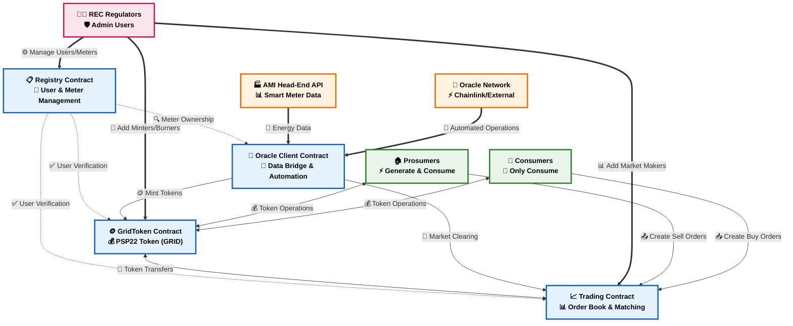
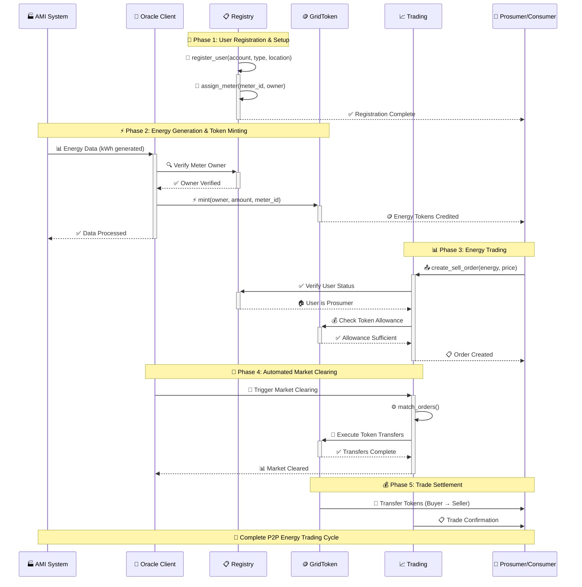
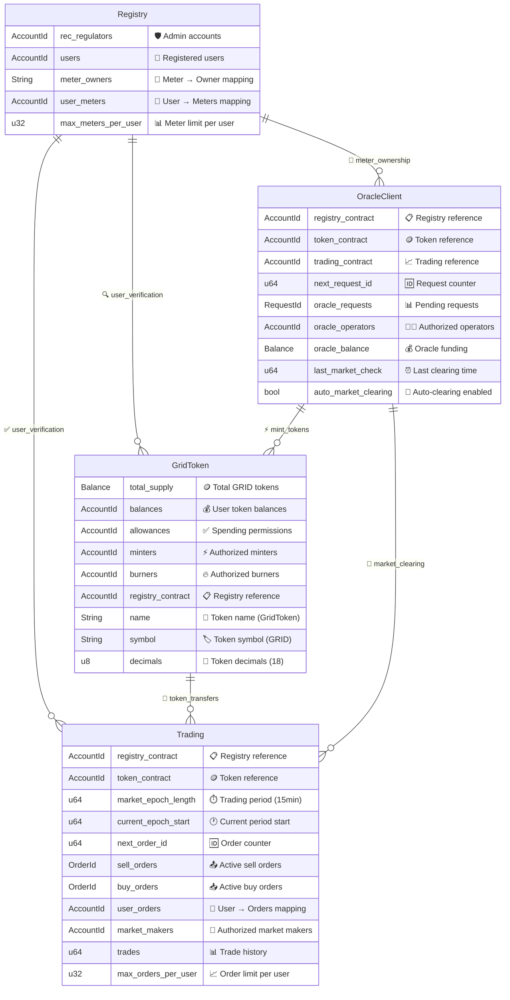
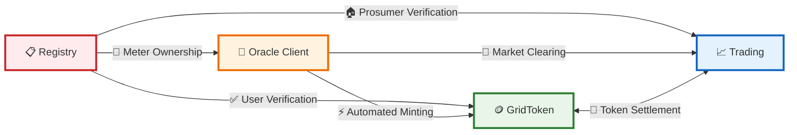

# P2P Energy Trading Smart Contracts Architecture

## Contract Relationships Diagram



## Detailed Contract Architecture

```mermaid
graph TB
    subgraph Registry ["📋 Registry Contract"]
        direction TB
        R1["👤 User Registration<br/><small>register_user()</small>"]
        R2["📡 Meter Assignment<br/><small>assign_meter()</small>"]
        R3["👨‍💼 REC Regulator Management<br/><small>add_rec_regulator()</small>"]
        R4["✅ User Verification<br/><small>is_user_verified()</small>"]
        
        R1 --> R2
        R3 --> R1
        R3 --> R2
        R1 --> R4
    end
    
    subgraph GridToken ["🪙 GridToken Contract (PSP22)"]
        direction TB
        G1["💰 PSP22 Token Standard<br/><small>transfer(), approve()</small>"]
        G2["⚡ Mint Energy Tokens<br/><small>mint()</small>"]
        G3["🔥 Burn Energy Tokens<br/><small>burn()</small>"]
        G4["💸 Transfer Management<br/><small>transfer_from_to()</small>"]
        G5["🔑 Minter/Burner Authorization<br/><small>add_minter()</small>"]
        
        G5 --> G2
        G5 --> G3
        G2 --> G1
        G3 --> G1
        G1 --> G4
    end
    
    subgraph OracleClient ["🌉 Oracle Client Contract"]
        direction TB
        O1["📊 Energy Data Requests<br/><small>request_energy_data()</small>"]
        O2["🤖 Market Clearing Automation<br/><small>check_upkeep()</small>"]
        O3["👨‍🔧 Oracle Operator Management<br/><small>add_oracle_operator()</small>"]
        O4["🔄 Cross-Contract Calls<br/><small>fulfill_energy_data()</small>"]
        
        O3 --> O1
        O3 --> O2
        O1 --> O4
        O2 --> O4
    end
    
    subgraph Trading ["📈 Trading Contract"]
        direction TB
        T1["📚 Order Book Management<br/><small>get_order()</small>"]
        T2["📊 Buy/Sell Orders<br/><small>create_sell_order()</small>"]
        T3["⚙️ Order Matching Engine<br/><small>match_orders()</small>"]
        T4["💰 Trade Settlement<br/><small>execute_trade()</small>"]
        T5["🏪 Market Maker Management<br/><small>add_market_maker()</small>"]
        
        T5 --> T3
        T2 --> T1
        T1 --> T3
        T3 --> T4
    end
    
    %% Cross-contract relationships with enhanced styling
    R4 -.->|"✅ Verify Users"| G2
    R4 -.->|"🏠 Verify Prosumers"| T2
    R2 -.->|"📡 Meter Ownership"| O1
    
    O4 -.->|"⚡ Mint for Generation"| G2
    O2 -.->|"🔔 Trigger Clearing"| T3
    
    G4 -.->|"💸 Token Settlement"| T4
    T4 -.->|"💰 Execute Transfers"| G4
    
    %% Enhanced Styling with gradients and better colors
    classDef registryStyle fill:linear-gradient(135deg, #ffebee 0%, #ffcdd2 100%),stroke:#c62828,stroke-width:3px,color:#000,font-weight:bold
    classDef tokenStyle fill:linear-gradient(135deg, #e8f5e8 0%, #c8e6c9 100%),stroke:#2e7d32,stroke-width:3px,color:#000,font-weight:bold
    classDef oracleStyle fill:linear-gradient(135deg, #fff3e0 0%, #ffe0b2 100%),stroke:#ef6c00,stroke-width:3px,color:#000,font-weight:bold
    classDef tradingStyle fill:linear-gradient(135deg, #e3f2fd 0%, #bbdefb 100%),stroke:#1565c0,stroke-width:3px,color:#000,font-weight:bold
    
    class R1,R2,R3,R4 registryStyle
    class G1,G2,G3,G4,G5 tokenStyle
    class O1,O2,O3,O4 oracleStyle
    class T1,T2,T3,T4,T5 tradingStyle
```

## Data Flow Diagram



## Contract Storage Overview



## 🎯 Key Features Summary

### 📋 Registry Contract
- **🎯 Purpose**: Identity and meter management for campus energy ecosystem
- **🔧 Key Functions**: 
  - `register_user()` - User registration with type classification
  - `assign_meter()` - Smart meter assignment to users
  - `is_user_verified()` - User verification for other contracts
- **🛡️ Access Control**: REC regulators manage all user and meter operations
- **📊 Capacity**: Up to 10 meters per user (configurable)

### 🪙 GridToken Contract (PSP22)
- **🎯 Purpose**: Energy-backed token standard (1 kWh = 1 GRID token)
- **🔧 Key Functions**: 
  - `mint()` - Create tokens for energy generation
  - `burn()` - Destroy tokens for energy consumption
  - `transfer()` - PSP22-compliant token transfers
- **⚡ Integration**: Minted by Oracle Client, traded in Trading contract
- **🔒 Security**: Role-based minting/burning with registry verification

### 🌉 Oracle Client Contract
- **🎯 Purpose**: Secure bridge between blockchain and external energy systems
- **🔧 Key Functions**: 
  - `request_energy_data()` - Fetch AMI meter readings
  - `check_upkeep()` - Automated market clearing triggers
  - `fulfill_energy_data()` - Process oracle responses
- **🤖 Automation**: Chainlink Keepers compatible for 24/7 operations
- **💰 Economics**: Self-funded oracle operations with balance management

### 📈 Trading Contract
- **🎯 Purpose**: Decentralized P2P energy marketplace
- **🔧 Key Functions**: 
  - `create_sell_order()` - Prosumers sell excess energy
  - `create_buy_order()` - Consumers purchase energy
  - `match_orders()` - Automated order matching engine
- **⏰ Market Structure**: Periodic clearing every 15 minutes (configurable)
- **📊 Scalability**: Up to 100 orders per user per epoch

## 🔗 Cross-Contract Dependencies



### 🔄 Integration Flow
1. **📋 Registry → 🪙 GridToken**: User verification prevents unauthorized minting
2. **📋 Registry → 📈 Trading**: Prosumer verification enables sell orders
3. **📋 Registry → 🌉 Oracle Client**: Meter ownership validation for data requests
4. **🌉 Oracle Client → 🪙 GridToken**: Automated token minting for verified energy generation
5. **🌉 Oracle Client → 📈 Trading**: Scheduled market clearing every 15 minutes
6. **📈 Trading ↔ 🪙 GridToken**: Bidirectional token transfers for trade settlement