# P2P Energy Tra    
    %% User Types
    EngDept["Engineering Department<br/>System Authority"]
    Students["Engineering Students<br/>    %% Cross-program relationships with enhanced styling
    R4 -.->|"Ver    Trading->>+Registry: Verify En    Registry {
        Pubkey e        Pubkey registry_program "Regi    Governance {
        Pubkey eng    Governance ||--o{ Oracle : "or### Trading Program
- **Purpose**: Engineering Complex P2P energy marketplace
- **Key Functions**: 
  - `create_sell_order()` - Engineering prosumers sell excess energy
  - `create_buy_order()` - Engineering consumers purchase energy
  - `match_orders()` - Automated order matching every 15 minutes
- **Market Structure**: 15-minute epochs aligned with AMI data intervals
- **Scalability**: Optimized for Engineering Complex scale (15 meters)

### Governance Program
- **Purpose**: Engineering Department system administration and control
- **Key Functions**: 
  - `update_parameters()` - Modify system configuration
  - `emergency_pause()` - Emergency system controls
  - `manage_authorities()` - Authority and permission management
- **Authority**: Engineering Department single validator exclusive control
- **Security**: Complete system governance under Engineering Department authority

## Cross-Program Dependencies

```mermaid
graph LR
    A["Registry"] -->|"User Verification"| B["Energy Token (SPL)"]
    A -->|"Prosumer Verification"| C["Trading"]
    A -->|"Meter Ownership"| D["Oracle Program"]
    
    D -->|"Automated Minting"| B
    D -->|"Market Clearing"| C
    B <-->|"SPL Token Settlement"| C  Governance ||--o{ Trading : "market_parameter_control"eering_authority "Engineering Department authority"
        Pubkey single_validator "Engineering validator pubkey"
        bool emergency_pause "System pause status"
        u64 system_parameters "Configurable parameters"
        Pubkey authorized_programs "Managed program addresses"
        String campus_network "Engineering Complex network"
    }
    
    %% Enhanced relationships with Engineering Department focus
    Registry ||--o{ EnergyToken : "engineering_user_verification"
    Registry ||--o{ Trading : "engineering_user_verification"
    Registry ||--o{ Oracle : "engineering_meter_assignment"
    EnergyToken ||--o{ Trading : "spl_token_transfers"
    Oracle ||--o{ EnergyToken : "automated_token_minting"
    Oracle ||--o{ Trading : "scheduled_market_clearing"
    Governance ||--o{ Registry : "engineering_authority_control"
    Governance ||--o{ EnergyToken : "mint_authority_control"ence"
    }
    
    Oracle {
        Pubkey engineering_authority "Engineering Department authority"
        Pubkey registry_program "Registry program reference"
        Pubkey token_program "SPL token program reference"
        Pubkey trading_program "Trading program reference"
        u64 market_clearing_interval "15-minute intervals (900 seconds)"
        u64 last_market_clearing "Last clearing timestamp"_authority "Engineering Department authority"
        Pubkey users "Registered Engineering users"
        String meter_assignments "Meter → User mapping"
        Pubkey user_meters "User → Meters mapping"
        u8 max_meters_per_user "Meter limit per user"
        String building_location "Engineering Complex"
    }
    
    EnergyToken {
        Pubkey mint_authority "Engineering Department mint auth"
        Pubkey associated_token_accounts "User SPL token accounts"
        u64 total_supply "Total GRID tokens"
        u8 decimals "SPL token decimals (9)"
        String name "Token name (Engineering GRID)"
        String symbol "Token symbol (ENG_GRID)"tatus
    Registry-->>-Trading: User is Engineering Student/Faculty
    Trading->>+Token: Check SPL Token Balance
    Token-->>-Trading: Balance Sufficient
    Trading-->>-User: Order Created
    
    %% Market Clearing
    Note over Oracle,Trading: Phase 4: Automated Market Clearing (15-min)s"| G2
    R4 -.->|"Verify Students/Faculty"| T2
    R2 -.->|"Meter Assignment"| O1
    
    O4 -.->|"Mint for Generation"| G2
    O2 -.->|"Trigger Clearing"| T3
    
    G4 -.->|"SPL Token Settlement"| T4
    T4 -.->|"Execute Transfers"| G4
    
    G9 -.->|"Control Registry"| R3
    G9 -.->|"Control Token"| G5
    G9 -.->|"Control Oracle"| O3
    G9 -.->|"Control Trading"| T5sumers"]
    Faculty["Engineering Faculty<br/>Prosumers & Consumers"]Anchor Programs Architecture

## Program Relationships Diagram

```mermaid
graph TB
    %% External Systems
    AMI["Engineering Complex AMI<br/>Smart Meter Data (ENG_001-015)"]
    EngineeringAuth["Engineering Department<br/>Single Validator Authority"]
    
    %% Anchor Programs
    Registry["Registry Program<br/>User & Meter Management"]
    EnergyToken["Energy Token Program<br/>SPL Token (GRID)"]
    Oracle["Oracle Program<br/>AMI Integration & Automation"]
    Trading["Trading Program<br/>Order Book & Market Clearing"]
    Governance["Governance Program<br/>Engineering Department Admin"]
    
    %% User Types
    EngDept["👨‍💼 Engineering Department<br/>🛡️ System Authority"]
    Students["� Engineering Students<br/>⚡ Prosumers & Consumers"]
    Faculty["👨‍� Engineering Faculty<br/>🏠 Prosumers & Consumers"]
    
    %% Program Interactions - Core Flow
    Registry -.->|User Verification| EnergyToken
    Registry -.->|User Verification| Trading
    Registry -.->|Meter Assignment| Oracle
    
    EnergyToken <-->|SPL Token Transfers| Trading
    Oracle -->|Mint SPL Tokens| EnergyToken
    Oracle -->|Market Clearing (15min)| Trading
    Governance -->|System Control| Registry
    Governance -->|Mint Authority| EnergyToken
    Governance -->|Market Parameters| Trading
    Governance -->|Oracle Management| Oracle
    
    %% External Interactions
    AMI ==>|Engineering AMI Data| Oracle
    EngineeringAuth ==>|Single Validator| Governance
    
    %% User Interactions - Management
    EngDept ==>|Manage Users/Meters| Registry
    EngDept ==>|SPL Token Authority| EnergyToken
    EngDept ==>|Market Operations| Trading
    
    %% User Interactions - Trading
    Students -->|Create Orders| Trading
    Students <-->|SPL Token Operations| EnergyToken
    Faculty -->|Create Orders| Trading
    Faculty <-->|SPL Token Operations| EnergyToken
    
    %% Styling - Enhanced with Solana colors
    classDef program fill:#e3f2fd,stroke:#1565c0,stroke-width:3px,color:#000,font-weight:bold
    classDef external fill:#fff3e0,stroke:#ef6c00,stroke-width:3px,color:#000,font-weight:bold
    classDef user fill:#e8f5e8,stroke:#2e7d32,stroke-width:3px,color:#000,font-weight:bold
    classDef authority fill:#fce4ec,stroke:#c2185b,stroke-width:3px,color:#000,font-weight:bold
    
    class Registry,EnergyToken,Oracle,Trading,Governance program
    class AMI,EngineeringAuth external
    class Students,Faculty user
    class EngDept authority
```

## Detailed Program Architecture

```mermaid
graph TB
    subgraph Registry ["Registry Program"]
        direction TB
        R1["User Registration<br/><small>register_user()</small>"]
        R2["Meter Assignment<br/><small>assign_meter()</small>"]
        R3["Engineering Authority<br/><small>Engineering Department Only</small>"]
        R4["User Verification<br/><small>verify_user()</small>"]
        
        R3 --> R1
        R3 --> R2
        R1 --> R4
        R2 --> R4
    end
    
    subgraph EnergyToken ["Energy Token Program (SPL)"]
        direction TB
        G1["SPL Token Standard<br/><small>transfer(), approve()</small>"]
        G2["Mint Energy Tokens<br/><small>mint_to()</small>"]
        G3["Burn Energy Tokens<br/><small>burn()</small>"]
        G4["Associated Token Accounts<br/><small>create_associated_token_account()</small>"]
        G5["Engineering Mint Authority<br/><small>Engineering Department Only</small>"]
        
        G5 --> G2
        G5 --> G3
        G2 --> G1
        G3 --> G1
        G1 --> G4
    end
    
    subgraph Oracle ["Oracle Program"]
        direction TB
        O1["AMI Data Processing<br/><small>submit_meter_data()</small>"]
        O2["Market Clearing (15min)<br/><small>trigger_market_clearing()</small>"]
        O3["Engineering Authority<br/><small>Engineering Department Only</small>"]
        O4["Cross Program Invocation<br/><small>CPI calls to other programs</small>"]
        
        O3 --> O1
        O3 --> O2
        O1 --> O4
        O2 --> O4
    end
    
    subgraph Trading ["Trading Program"]
        direction TB
        T1["Order Book Management<br/><small>get_order()</small>"]
        T2["Buy/Sell Orders<br/><small>create_sell_order()</small>"]
        T3["Automated Order Matching<br/><small>match_orders()</small>"]
        T4["Trade Settlement<br/><small>settle_trade()</small>"]
        T5["Engineering Oversight<br/><small>Engineering Department Control</small>"]
        
        T5 --> T3
        T2 --> T1
        T1 --> T3
        T3 --> T4
    end
    
    subgraph Governance ["Governance Program"]
        direction TB
        G6["Engineering Department Authority<br/><small>Single Validator Control</small>"]
        G7["System Parameters<br/><small>update_parameters()</small>"]
        G8["Emergency Controls<br/><small>emergency_pause()</small>"]
        G9["Authority Management<br/><small>manage_authorities()</small>"]
        
        G6 --> G7
        G6 --> G8
        G6 --> G9
    end
    
    %% Cross-program relationships with enhanced styling
    R4 -.->|"✅ Verify Users"| G2
    R4 -.->|"� Verify Students/Faculty"| T2
    R2 -.->|"📡 Meter Assignment"| O1
    
    O4 -.->|"⚡ Mint for Generation"| G2
    O2 -.->|"🔔 Trigger Clearing"| T3
    
    G4 -.->|"💸 SPL Token Settlement"| T4
    T4 -.->|"💰 Execute Transfers"| G4
    
    G9 -.->|"🔑 Control Registry"| R3
    G9 -.->|"🔑 Control Token"| G5
    G9 -.->|"🔑 Control Oracle"| O3
    G9 -.->|"🔑 Control Trading"| T5
    
    %% Enhanced Styling with Solana theme
    classDef registryStyle fill:linear-gradient(135deg, #ffebee 0%, #ffcdd2 100%),stroke:#c62828,stroke-width:3px,color:#000,font-weight:bold
    classDef tokenStyle fill:linear-gradient(135deg, #e8f5e8 0%, #c8e6c9 100%),stroke:#2e7d32,stroke-width:3px,color:#000,font-weight:bold
    classDef oracleStyle fill:linear-gradient(135deg, #fff3e0 0%, #ffe0b2 100%),stroke:#ef6c00,stroke-width:3px,color:#000,font-weight:bold
    classDef tradingStyle fill:linear-gradient(135deg, #e3f2fd 0%, #bbdefb 100%),stroke:#1565c0,stroke-width:3px,color:#000,font-weight:bold
    classDef governanceStyle fill:linear-gradient(135deg, #fce4ec 0%, #f8bbd9 100%),stroke:#c2185b,stroke-width:3px,color:#000,font-weight:bold
    
    class R1,R2,R3,R4 registryStyle
    class G1,G2,G3,G4,G5 tokenStyle
    class O1,O2,O3,O4 oracleStyle
    class T1,T2,T3,T4,T5 tradingStyle
    class G6,G7,G8,G9 governanceStyle
```

## Data Flow Diagram

```mermaid
sequenceDiagram
    participant AMI as Engineering AMI
    participant Oracle as Oracle Program
    participant Registry as Registry Program
    participant Token as Energy Token (SPL)
    participant Trading as Trading Program
    participant User as Engineering Student/Faculty
    
    %% User Registration Flow
    Note over Registry: Phase 1: Engineering Department Registration
    Registry->>+Registry: register_user(account, type, location)
    Registry->>Registry: assign_meter(meter_id, owner)
    Registry-->>-User: Registration Complete
    
    %% Energy Generation Flow
    Note over AMI,Token: Phase 2: Energy Generation & SPL Token Minting
    AMI->>+Oracle: Engineering AMI Data (kWh generated)
    Oracle->>+Registry: Verify Meter Assignment
    Registry-->>-Oracle: Engineering User Verified
    Oracle->>+Token: mint_to(user_ata, amount * 1e9)
    Token-->>-User: SPL Energy Tokens Credited
    Oracle-->>-AMI: Data Processed
    
    %% Trading Flow
    Note over User,Trading: Phase 3: Energy Trading (15-min Epochs)
    User->>+Trading: create_sell_order(energy, price)
    Trading->>+Registry: ✅ Verify Engineering User Status
    Registry-->>-Trading: � User is Engineering Student/Faculty
    Trading->>+Token: 💰 Check SPL Token Balance
    Token-->>-Trading: ✅ Balance Sufficient
    Trading-->>-User: 📋 Order Created
    
    %% Market Clearing
    Note over Oracle,Trading: 🤖 Phase 4: Automated Market Clearing (15-min)
    Oracle->>+Trading: trigger_market_clearing()
    Trading->>Trading: match_orders()
    Trading->>+Token: Execute SPL Token Transfers
    Token-->>-Trading: Transfers Complete
    Trading-->>-Oracle: Market Cleared
    
    %% Settlement
    Note over Token,User: Phase 5: SPL Token Settlement
    Token->>User: Transfer SPL Tokens (Buyer → Seller)
    Trading->>User: Trade Confirmation
    
    %% Styling
    Note over AMI,User: Complete Engineering P2P Energy Trading Cycle
```



## Program Storage Overview

```mermaid
erDiagram
    Registry {
        Pubkey engineering_authority "🛡️ Engineering Department authority"
        Pubkey users "👥 Registered Engineering users"
        String meter_assignments "📡 Meter → User mapping"
        Pubkey user_meters "👤 User → Meters mapping"
        u8 max_meters_per_user "📊 Meter limit per user"
        String building_location "🏢 Engineering Complex"
    }
    
    EnergyToken {
        Pubkey mint_authority "🔑 Engineering Department mint auth"
        Pubkey associated_token_accounts "💰 User SPL token accounts"
        u64 total_supply "🪙 Total GRID tokens"
        u8 decimals "� SPL token decimals (9)"
        String name "📛 Token name (Engineering GRID)"
        String symbol "🏷️ Token symbol (ENG_GRID)"
        Pubkey registry_program "� Registry program reference"
    }
    
    Oracle {
        Pubkey engineering_authority "🛡️ Engineering Department authority"
        Pubkey registry_program "📋 Registry program reference"
        Pubkey token_program "🪙 SPL token program reference"
        Pubkey trading_program "📈 Trading program reference"
        u64 market_clearing_interval "⏰ 15-minute intervals (900 seconds)"
        u64 last_market_clearing "� Last clearing timestamp"
        String ami_endpoint "Engineering AMI endpoint"
        bool auto_clearing_enabled "Auto-clearing status"
    }
    
    Trading {
        Pubkey engineering_authority "Engineering Department authority"
        Pubkey registry_program "Registry program reference"
        Pubkey token_program "SPL token program reference"
        u64 market_epoch_length "Trading epoch (900 seconds)"
        u64 current_epoch_start "Current epoch start time"
        u64 next_order_id "Order counter"
        OrderId sell_orders "Active sell orders"
        OrderId buy_orders "Active buy orders"
        Pubkey user_orders "User → Orders mapping"
        u32 max_orders_per_user "Order limit per user"
        TradeId completed_trades "Trade history"
    }
    
    Governance {
        Pubkey engineering_authority "🛡️ Engineering Department authority"
        Pubkey single_validator "🔑 Engineering validator pubkey"
        bool emergency_pause "🚨 System pause status"
        u64 system_parameters "⚙️ Configurable parameters"
        Pubkey authorized_programs "� Managed program addresses"
        String campus_network "🏫 Engineering Complex network"
    }
    
    %% Enhanced relationships with Engineering Department focus
    Registry ||--o{ EnergyToken : "🔍 engineering_user_verification"
    Registry ||--o{ Trading : "✅ engineering_user_verification"
    Registry ||--o{ Oracle : "📡 engineering_meter_assignment"
    EnergyToken ||--o{ Trading : "💸 spl_token_transfers"
    Oracle ||--o{ EnergyToken : "⚡ automated_token_minting"
    Oracle ||--o{ Trading : "🔔 scheduled_market_clearing"
    Governance ||--o{ Registry : "🛡️ engineering_authority_control"
    Governance ||--o{ EnergyToken : "🔑 mint_authority_control"
    Governance ||--o{ Oracle : "🤖 oracle_management"
    Governance ||--o{ Trading : "� market_parameter_control"
```



## Key Features Summary

### Registry Program
- **Purpose**: Identity and meter management for Engineering Complex energy ecosystem
- **Key Functions**: 
  - `register_user()` - Engineering student/faculty registration
  - `assign_meter()` - Smart meter assignment within Engineering Complex
  - `verify_user()` - User verification for other programs
- **Access Control**: Engineering Department has exclusive registration authority
- **Capacity**: Up to 10 meters per user (configurable by Engineering Department)

### Energy Token Program (SPL)
- **Purpose**: SPL token standard for energy trading (1 kWh = 1 GRID token, 9 decimals)
- **Key Functions**: 
  - `mint_to()` - Create SPL tokens for energy generation
  - `burn()` - Destroy tokens for energy consumption
  - `transfer()` - Standard SPL token transfers
- **Integration**: Minted by Oracle Program, traded in Trading Program
- **Security**: Engineering Department mint authority with automated oracle minting

### Oracle Program
- **Purpose**: Secure bridge between Engineering AMI and Solana blockchain
- **Key Functions**: 
  - `submit_meter_data()` - Process Engineering Complex AMI readings
  - `trigger_market_clearing()` - Automated 15-minute market clearing
  - `process_energy_data()` - Validate and mint SPL tokens
- **Automation**: Engineering Department controlled 24/7 operations
- **Economics**: Direct SPL token minting for verified energy generation

### 📈 Trading Program
- **🎯 Purpose**: Engineering Complex P2P energy marketplace
- **🔧 Key Functions**: 
  - `create_sell_order()` - Engineering prosumers sell excess energy
  - `create_buy_order()` - Engineering consumers purchase energy
  - `match_orders()` - Automated order matching every 15 minutes
- **⏰ Market Structure**: 15-minute epochs aligned with AMI data intervals
- **📊 Scalability**: Optimized for Engineering Complex scale (15 meters)

### ⚙️ Governance Program
- **🎯 Purpose**: Engineering Department system administration and control
- **🔧 Key Functions**: 
  - `update_parameters()` - Modify system configuration
  - `emergency_pause()` - Emergency system controls
  - `manage_authorities()` - Authority and permission management
- **�️ Authority**: Engineering Department single validator exclusive control
- **🔒 Security**: Complete system governance under Engineering Department authority

## 🔗 Cross-Program Dependencies

```mermaid
graph LR
    A["📋 Registry"] -->|"✅ User Verification"| B["🪙 Energy Token (SPL)"]
    A -->|"🏠 Prosumer Verification"| C["📈 Trading"]
    A -->|"📡 Meter Ownership"| D["🌉 Oracle Program"]
    
    D -->|"⚡ Automated Minting"| B
    D -->|"🔔 Market Clearing"| C
    B <-->|"💸 SPL Token Settlement"| C
    
    style A fill:#ffebee,stroke:#c62828,stroke-width:3px
    style B fill:#e8f5e8,stroke:#2e7d32,stroke-width:3px
    style C fill:#e3f2fd,stroke:#1565c0,stroke-width:3px
    style D fill:#fff3e0,stroke:#ef6c00,stroke-width:3px
```



### Integration Flow
1. **Registry → Energy Token (SPL)**: Engineering user verification prevents unauthorized minting
2. **Registry → Trading**: Engineering prosumer verification enables sell orders
3. **Registry → Oracle Program**: Engineering meter ownership validation for data requests
4. **Oracle Program → Energy Token (SPL)**: Automated SPL token minting for verified energy generation
5. **Oracle Program → Trading**: Scheduled market clearing every 15 minutes
6. **Trading ↔ Energy Token (SPL)**: Bidirectional SPL token transfers for trade settlement