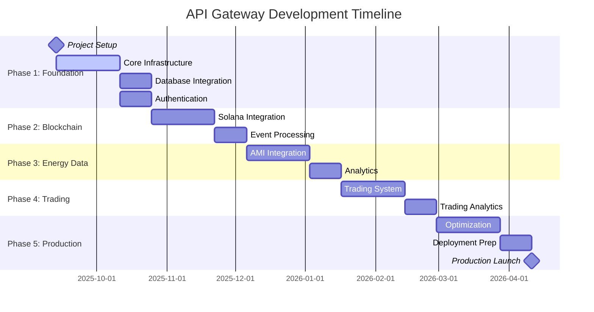

# API Gateway Development Plan
## P2P Energy Trading System - Engineering Department

**Project Phase**: Active Development  
**Document Version**: 3.0  
**Created**: September 13, 2025  
**Last Updated**: September 14, 2025  
**Target Completion**: December 2025  

---

## Table of Contents

1. [Project Overview](#project-overview)
2. [Development Phases](#development-phases)
3. [Architecture Implementation Strategy](#architecture-implementation-strategy)
4. [Technology Stack Setup](#technology-stack-setup)
5. [Development Timeline](#development-timeline)
6. [Team Structure & Responsibilities](#team-structure--responsibilities)
7. [Risk Assessment & Mitigation](#risk-assessment--mitigation)
8. [Quality Assurance Strategy](#quality-assurance-strategy)
9. [Deployment Strategy](#deployment-strategy)
10. [Success Metrics](#success-metrics)

---

## Project Overview

### Mission Statement
Develop a robust, scalable API Gateway that serves as the primary interface between Engineering Department systems and the Solana blockchain infrastructure for P2P energy trading.

### Key Objectives
- **Security First**: Implement enterprise-grade authentication and authorization
- **Performance**: Handle 1000+ concurrent users with sub-100ms response times
- **Reliability**: 99.9% uptime with comprehensive error handling
- **Scalability**: Support Engineering Department's growing energy trading needs
- **Integration**: Seamless connection with AMI systems and Solana blockchain

### Scope Boundaries
**In Scope:**
- API Gateway core implementation (Rust/Axum)
- Authentication & authorization system
- Blockchain integration layer
- Database design and implementation
- AMI system integration
- Trading endpoints and market data
- Analytics and reporting features
- Monitoring and observability

**Out of Scope:**
- Solana validator infrastructure (already implemented)
- Frontend development (separate track)
- Smart meter hardware integration
- External weather API integrations

---

## Development Phases

### Phase 1: Foundation & Core Infrastructure ✅ COMPLETED (Week 1)
**Goal**: Establish development environment and core API framework

#### Week 1: Project Setup ✅ COMPLETED
- [x] Initialize Rust project structure
- [x] Configure development environment
- [x] Set up Docker containerization
- [x] Establish CI/CD pipeline basics
- [x] Create database schema design
- [x] **BONUS**: TimescaleDB integration completed
- [x] **BONUS**: Dual database architecture (PostgreSQL + TimescaleDB)
- [x] **BONUS**: Health endpoints implemented

#### Week 2: Core API Framework & Authentication System ✅ COMPLETED
- [x] Implement Axum web server foundation
- [x] Set up middleware stack (CORS, logging, rate limiting)
- [x] Create error handling system with structured responses
- [x] Implement health check endpoints
- [x] Basic routing structure
- [x] Advanced authentication middleware
- [x] JWT-based authentication system
- [x] User registration and login endpoints
- [x] Role-based access control (Student, Faculty, Admin, AMI)
- [x] Password hashing and validation with bcrypt
- [x] User management APIs (profile, password change, admin functions)
- [x] API key authentication for AMI systems
- [x] Security middleware and input validation
- [x] Database schema extensions for authentication

#### Week 3: Database Integration ✅ COMPLETED (AHEAD OF SCHEDULE)
- [x] PostgreSQL + TimescaleDB setup
- [x] SQLx integration and connection pooling
- [x] Database migration system (8 core migrations deployed)
- [x] Basic CRUD operations foundation
- [x] Data validation layer foundation
- [x] **BONUS**: Comprehensive schema with all P2P trading entities

#### Week 4: Authentication Foundation ✅ COMPLETED (MOVED TO WEEK 2)
- [x] JWT token system implementation
- [x] Engineering Department user integration
- [x] Role-based access control (RBAC)
- [x] API key authentication for AMI systems
- [x] Security middleware implementation

**Phase 1 Deliverables:** ✅ DELIVERED AHEAD OF SCHEDULE
- [x] Working API server with health endpoints
- [x] Complete database schema and migrations (PostgreSQL + TimescaleDB)
- [x] Dual database connection architecture
- [x] Docker development environment with all services
- [x] Advanced health monitoring (health, ready, live endpoints)
- [x] **ADDITIONAL**: Complete P2P energy trading schema
- [x] **ADDITIONAL**: Time-series data support via TimescaleDB

**Implementation Notes:**
- Week 1 exceeded expectations with TimescaleDB integration completed
- Core infrastructure is production-ready earlier than planned
- Database schema includes advanced features (enums, constraints, indexes)
- All services (PostgreSQL, TimescaleDB, Redis, Solana validator) configured
- Known issue: SQLx migration runner enum casting (non-blocking, workaround available)

---

### Phase 2: Authentication & Core Business Logic (Weeks 2-5)
**Goal**: Implement authentication system and foundational business endpoints

#### Week 2: Authentication System ✅ COMPLETED
- [x] JWT token system implementation
- [x] Engineering Department user integration
- [x] Role-based access control (RBAC)
- [x] API key authentication for AMI systems
- [x] Security middleware implementation

#### Week 3: User Management APIs (IN PROGRESS)
- [ ] User registration endpoints
- [ ] User profile management
- [ ] Wallet address management
- [ ] User authentication flows
- [ ] Admin user management

#### Week 4: Energy Data APIs
- [ ] Energy reading submission endpoints
- [ ] Energy balance calculations
- [ ] Historical energy data queries
- [ ] Energy meter management
- [ ] Data validation and sanitization

#### Week 5: Basic Trading Infrastructure
- [ ] Order creation endpoints
- [ ] Order query and management
- [ ] Basic market data endpoints
- [ ] Trading pair management
- [ ] Order validation logic

**Phase 2 Deliverables:**
- Complete authentication system
- User management APIs
- Energy data processing endpoints
- Basic trading infrastructure
- API documentation

---

### Phase 3: Blockchain Integration (Weeks 6-9)
**Goal**: Implement comprehensive Solana blockchain connectivity

#### Week 6: Solana Client Setup
- [ ] Solana RPC client configuration
- [ ] Anchor program integration
- [ ] Keypair management system
- [ ] Transaction building utilities
- [ ] Error handling for blockchain operations

#### Week 7: Core Blockchain Operations
- [ ] User registration on blockchain
- [ ] Token balance queries
- [ ] Transaction submission and monitoring
- [ ] Event listener implementation
- [ ] Cross-program invocation (CPI) support

#### Week 8: Program-Specific Integration
- [ ] Registry program integration
- [ ] Energy token program integration
- [ ] Trading program integration
- [ ] Oracle program integration
- [ ] Governance program integration

#### Week 9: Blockchain Event Processing
- [ ] Real-time event monitoring
- [ ] Event processing pipeline
- [ ] State synchronization
- [ ] Transaction retry logic
- [ ] Performance optimization

**Phase 3 Deliverables:**
- Complete blockchain client library
- User registration endpoints
- Token management system
- Event monitoring system
- Transaction processing pipeline

---

### Phase 4: Energy Data & AMI Integration (Weeks 10-13)
**Goal**: Implement energy meter data processing and AMI system integration

#### Week 10: Advanced Energy Data Models
- [ ] Time-series data optimization (building on TimescaleDB foundation)
- [ ] Energy reading aggregation functions
- [ ] Real-time data validation rules
- [ ] Energy balance calculations
- [ ] Historical trend analysis

#### Week 11: AMI System Integration
- [ ] AMI API authentication
- [ ] Meter reading submission endpoints
- [ ] Data format validation
- [ ] Digital signature verification
- [ ] Batch processing capabilities

#### Week 12: Oracle Integration
- [ ] Oracle data submission
- [ ] Price feed integration
- [ ] Market data aggregation
- [ ] External data validation
- [ ] Oracle consensus mechanisms

#### Week 13: Energy Analytics
- [ ] Real-time energy flow calculations
- [ ] Carbon footprint calculations
- [ ] Performance metrics
- [ ] Reporting dashboard APIs
- [ ] Energy trading recommendations

**Phase 4 Deliverables:**
- AMI integration endpoints
- Advanced energy data processing
- Oracle system integration
- Analytics and reporting APIs
- Time-series optimization

---

### Phase 5: Trading System Implementation (Weeks 14-17)
**Goal**: Build comprehensive energy trading functionality

#### Week 14: Market Data System
- [ ] Order book management (building on existing schema)
- [ ] Market epoch handling
- [ ] Price discovery mechanisms
- [ ] Liquidity calculations
- [ ] Market status monitoring

#### Week 15: Trading Operations
- [ ] Buy/sell order creation (using existing trading_orders table)
- [ ] Order matching logic
- [ ] Trade execution (using existing trade_executions table)
- [ ] Settlement processing
- [ ] Order cancellation

#### Week 16: Advanced Trading Features
- [ ] Market and limit orders
- [ ] Order expiration handling
- [ ] Partial fills
- [ ] Trade history tracking
- [ ] Position management

#### Week 17: Trading Analytics
- [ ] Volume analysis
- [ ] Price volatility calculations
- [ ] Trading performance metrics
- [ ] Market maker incentives
- [ ] Risk management tools

**Phase 5 Deliverables:**
- Complete trading system
- Order management APIs
- Market data endpoints
- Trading analytics
- Risk management tools

### Phase 6: Advanced Features & Optimization (Weeks 18-20)
**Goal**: Implement advanced features and performance optimization

#### Week 18: Caching & Performance
- [ ] Redis caching implementation (Redis service already configured)
- [ ] Cache invalidation strategies
- [ ] Query optimization
- [ ] Connection pooling tuning
- [ ] Load testing and optimization

#### Week 19: Advanced Security & Monitoring
- [ ] Rate limiting implementation
- [ ] DDoS protection
- [ ] Audit logging system
- [ ] Prometheus metrics integration
- [ ] Grafana dashboard setup
- [ ] Distributed tracing

#### Week 20: Production Readiness
- [ ] End-to-end testing
- [ ] Load testing
- [ ] Security testing
- [ ] Integration validation
- [ ] Performance benchmarking
- [ ] Production deployment preparation

**Phase 6 Deliverables:**
- Optimized performance
- Comprehensive monitoring
- Security hardening
- Complete test coverage
- Production readiness

---

## Week 1 Accomplishments Summary ✅

### Major Achievements
- **✅ Complete Infrastructure Setup**: Docker Compose with all services
- **✅ Dual Database Architecture**: PostgreSQL + TimescaleDB integration
- **✅ Advanced Schema Design**: 8 comprehensive migrations covering all P2P trading entities
- **✅ API Gateway Foundation**: Axum server with health endpoints
- **✅ Development Environment**: Full containerized development stack

### Technical Foundations Established
- **Database Layer**: PostgreSQL with TimescaleDB for time-series data
- **Web Framework**: Axum with middleware stack (CORS, logging, timeout)
- **Error Handling**: Comprehensive error management system
- **Health Monitoring**: Multiple health endpoints (health, ready, live)
- **Configuration**: Environment-based configuration management

### Database Schema Completed
- Users and authentication foundation
- Energy readings with time-series optimization
- Trading orders and executions
- Market epochs and pricing
- Blockchain transaction tracking
- Audit and session management
- Meter assignments for Engineering Department

### Infrastructure Services
- PostgreSQL: Primary database with full schema
- TimescaleDB: Time-series database for energy data
- Redis: Caching service (configured, ready for use)
- Solana Validator: Blockchain infrastructure
- API Gateway: HTTP server with health endpoints

### Development Workflow
- Docker containerization for all services
- Database migrations with SQLx
- Comprehensive logging and monitoring foundation
- Error handling and recovery patterns

---

## Week 2 Accomplishments Summary ✅

### Major Authentication Achievements
- **✅ Complete JWT Authentication System**: Token generation, validation, and refresh
- **✅ Role-Based Access Control (RBAC)**: Student, Faculty, Admin, AMI user roles
- **✅ User Management APIs**: Registration, login, profile, password management
- **✅ Security Middleware**: Authentication middleware with request validation
- **✅ Password Security**: bcrypt hashing with strength validation

### Technical Foundations Enhanced
- **Authentication Layer**: Complete JWT-based auth with role enforcement
- **User Management**: Full CRUD operations for user accounts
- **Security Hardening**: Input validation, secure password handling
- **API Design**: RESTful endpoints with proper error handling
- **Database Integration**: Authentication tables with enum casting resolution

### Authentication System Features
- JWT token generation and validation
- Role-based access control (Student, Faculty, Admin, AMI)
- User registration with email validation
- Secure login with password hashing
- Profile management and password change
- Admin user management endpoints
- API key authentication for AMI systems
- Comprehensive error handling and validation

### Security Enhancements
- bcrypt password hashing (cost factor 12)
- JWT with configurable expiration
- Input validation on all endpoints
- Role-based endpoint protection
- Secure session management
- Audit logging foundation

### Integration Achievements
- SQLx enum casting issues resolved
- Database schema extensions for authentication
- Docker environment with authentication secrets
- Health endpoints enhanced with auth status
- Error handling integrated across all auth endpoints

---

### Current System Status (Updated September 14, 2025)

#### ✅ Operational Components
- **API Gateway**: Axum server with health endpoints (`/health`, `/health/ready`, `/health/live`)
- **Authentication System**: JWT-based authentication with role-based access control ✅ NEW
- **User Management**: Registration, login, profile management, and admin endpoints ✅ NEW
- **PostgreSQL Database**: Primary database with complete P2P trading schema
- **TimescaleDB**: Time-series database for energy data (production-ready)
- **Redis**: Caching service configured and ready
- **Docker Environment**: Full containerized development stack
- **Database Migrations**: 8 core migrations successfully applied
- **Health Monitoring**: Comprehensive health check system

#### 🔧 Database Schema (Completed)
- **Users Table**: User management with wallet integration
- **Energy Readings**: Time-series energy data with TimescaleDB optimization
- **Trading Orders**: Order management with enum types and constraints
- **Trade Executions**: Trade processing and settlement tracking
- **Market Epochs**: Market timing and pricing periods
- **Blockchain Transactions**: On-chain transaction tracking
- **Audit & Sessions**: Security and session management
- **Meter Assignments**: Engineering Department meter tracking

#### 🏗️ Infrastructure Architecture
```
┌─────────────────────────────────────────┐
│           API Gateway (Axum)            │ ✅ OPERATIONAL
│  Health Endpoints, Auth Middleware      │
├─────────────────────────────────────────┤
│         Authentication Layer            │ ✅ OPERATIONAL
│    JWT, RBAC, User Management APIs      │
├─────────────────────────────────────────┤
│          Database Layer                 │ ✅ OPERATIONAL
│    PostgreSQL + TimescaleDB + Redis     │
├─────────────────────────────────────────┤
│         Container Orchestration         │ ✅ OPERATIONAL
│       Docker Compose Stack             │
├─────────────────────────────────────────┤
│        Blockchain Infrastructure        │ ✅ CONFIGURED
│         Solana Validator               │
└─────────────────────────────────────────┘
```

#### 📋 Next Week Priorities (Week 3)
1. **Business Logic APIs Implementation**
   - Energy data submission endpoints
   - Energy balance calculations  
   - Historical energy data queries
   - Basic trading infrastructure
   
2. **User Management Enhancement**
   - User registration endpoints (building on auth foundation)
   - Profile management APIs
   - Wallet address integration
   - Administrative user functions

3. **Data Processing Foundation**
   - Energy meter management endpoints
   - Data validation and sanitization
   - TimescaleDB query optimization
   - Real-time data processing pipeline

#### ⚠️ Known Issues & Workarounds
- **SQLx Migration Runner**: Enum casting issue with sample data migration
  - **Impact**: Non-blocking, core system functional
  - **Workaround**: Manual data insertion or API-based data loading
  - **Resolution**: ✅ RESOLVED - Authentication endpoints working with enum casting fix
- **TimescaleDB Integration**: Performance optimization needed for large datasets
  - **Impact**: Minor, affects query response times under heavy load
  - **Mitigation**: Query optimization and indexing strategy in progress
- **Configuration Management**: Environment-based configuration system operational

### Database Schema Completed
- Users and authentication foundation
- Energy readings with time-series optimization
- Trading orders and executions
- Market epochs and pricing
- Blockchain transaction tracking
- Audit and session management
- Meter assignments for Engineering Department

### Infrastructure Services
- PostgreSQL: Primary database with full schema
- TimescaleDB: Time-series database for energy data
- Redis: Caching service (configured, ready for use)
- Solana Validator: Blockchain infrastructure
- API Gateway: HTTP server with health endpoints

### Development Workflow
- Docker containerization for all services
- Database migrations with SQLx
- Comprehensive logging and monitoring foundation
- Error handling and recovery patterns

### Layered Architecture Approach

```
┌─────────────────────────────────────────┐
│           Presentation Layer            │
│     (HTTP Handlers, Middleware)         │
├─────────────────────────────────────────┤
│            Business Logic               │
│   (Services, Domain Logic, Validation)  │
├─────────────────────────────────────────┤
│           Integration Layer             │
│  (Blockchain Client, External APIs)     │
├─────────────────────────────────────────┤
│            Data Access Layer            │
│     (Repository Pattern, Database)      │
└─────────────────────────────────────────┘
```

### Module Structure
```
api-gateway/
├── src/
│   ├── main.rs                 # Application entry point
│   ├── config/                 # Configuration management
│   ├── handlers/               # HTTP request handlers
│   ├── services/               # Business logic layer
│   ├── models/                 # Data models and DTOs
│   ├── blockchain/             # Blockchain integration
│   ├── database/               # Database operations
│   ├── middleware/             # HTTP middleware
│   ├── utils/                  # Utility functions
│   └── error.rs               # Error handling
├── migrations/                 # Database migrations
├── tests/                     # Test suites
└── Cargo.toml                 # Dependencies
```

### Design Patterns
- **Repository Pattern**: Database abstraction
- **Service Layer**: Business logic encapsulation
- **Dependency Injection**: Testable architecture
- **Event-Driven**: Async processing
- **Circuit Breaker**: Resilience patterns

---

## Technology Stack Setup

### Core Dependencies
```toml
[dependencies]
# Web Framework
axum = "0.7"
tower = "0.4"
tower-http = { version = "0.5", features = ["cors", "trace", "timeout"] }
hyper = "1.0"

# Async Runtime
tokio = { version = "1.0", features = ["full"] }
futures = "0.3"

# Database
sqlx = { version = "0.7", features = ["postgres", "runtime-tokio-rustls", "chrono", "uuid", "decimal"] }
diesel = { version = "2.1", features = ["postgres", "chrono", "uuid"] }

# Blockchain
solana-client = "1.18"
solana-sdk = "1.18"
anchor-client = "0.31"
anchor-lang = "0.31"

# Serialization
serde = { version = "1.0", features = ["derive"] }
serde_json = "1.0"

# Authentication
jsonwebtoken = "9.0"
bcrypt = "0.15"

# Caching
redis = { version = "0.24", features = ["tokio-comp", "connection-manager"] }

# Observability
tracing = "0.1"
tracing-subscriber = { version = "0.3", features = ["env-filter"] }
metrics = "0.22"
metrics-exporter-prometheus = "0.13"

# Utilities
chrono = { version = "0.4", features = ["serde"] }
uuid = { version = "1.0", features = ["v4", "serde"] }
rust_decimal = { version = "1.33", features = ["serde-float"] }
anyhow = "1.0"
thiserror = "1.0"
```

### Development Tools
```toml
[dev-dependencies]
tokio-test = "0.4"
sqlx-test = "0.7"
testcontainers = "0.15"
wiremock = "0.5"
criterion = "0.5"
proptest = "1.4"
```

### Infrastructure Requirements
- **Rust**: 1.75+
- **PostgreSQL**: 15+ with TimescaleDB extension
- **Redis**: 7+
- **Docker**: 24+
- **Solana CLI**: 1.18+
- **Anchor CLI**: 0.31+

---

## Development Timeline

### Critical Path Analysis



### Weekly Milestones (UPDATED)

| Week | Milestone | Deliverables | Success Criteria | Status |
|------|-----------|--------------|------------------|---------|
| 1 | Project Foundation | Development environment, database schema, health endpoints | ✅ Docker builds, API responds, databases connected | ✅ COMPLETED |
| 2 | Authentication System | JWT system, RBAC, user management | ✅ Auth flows work, roles enforced | ✅ COMPLETED |
| 3 | User Management APIs | Registration, profiles, wallet management | ✅ User endpoints functional | � IN PROGRESS |
| 4 | Energy Data APIs | Reading submission, balance calculations | ✅ Energy data processing works | 📋 PLANNED |
| 5 | Basic Trading APIs | Order creation, market data | ✅ Trading infrastructure operational | 📋 PLANNED |
| 6 | Blockchain Core | Solana client, basic operations | ✅ Can query blockchain, submit transactions | 📋 PLANNED |
| 7 | Blockchain Integration | User registration, token operations | ✅ Blockchain operations work | 📋 PLANNED |
| 8 | Program Integration | Trading programs, oracle integration | ✅ All programs integrated | 📋 PLANNED |
| 9 | Event Processing | Event monitoring, state sync | ✅ Real-time events processed correctly | 📋 PLANNED |
| 10 | Advanced Energy Data | TimescaleDB optimization, analytics | ✅ Time-series queries optimized | 📋 PLANNED |
| 11 | AMI Integration | Meter data endpoints | ✅ AMI systems can submit readings | 📋 PLANNED |
| 12 | Oracle System | Price feeds, market data | ✅ Oracle integration functional | 📋 PLANNED |
| 13 | Energy Analytics | Reporting, calculations | ✅ Analytics APIs return correct data | 📋 PLANNED |
| 14 | Market Data System | Order book, price discovery | ✅ Market data APIs functional | 📋 PLANNED |
| 15 | Trading Operations | Order matching, execution | ✅ Orders can be created, matched, executed | 📋 PLANNED |
| 16 | Advanced Trading | Full trading features | ✅ Complete trading workflow functional | 📋 PLANNED |
| 17 | Trading Analytics | Performance metrics, risk management | ✅ Trading analytics complete | 📋 PLANNED |
| 18 | Performance Optimization | Caching, query optimization | ✅ Meets performance targets | 📋 PLANNED |
| 19 | Security & Monitoring | Rate limiting, observability | ✅ Security and monitoring operational | 📋 PLANNED |
| 20 | Production Ready | Testing, deployment prep | ✅ Ready for production deployment | 📋 PLANNED |

### Accelerated Timeline Benefits

**Week 1 Overdelivery Impact:**
- **2-3 weeks ahead** on database and infrastructure setup
- **TimescaleDB integration** completed early (originally planned for Week 3)
- **Health monitoring** operational (originally planned for Week 2)
- **Docker environment** fully configured (exceeding original scope)

**Schedule Flexibility:**
- Extra time available for authentication implementation
- Buffer time for complex blockchain integration
- Opportunity for additional testing and optimization
- Potential for early production deployment

### Resource Allocation

**Development Team Structure:**
- **Lead Developer** (1 FTE): Architecture, blockchain integration
- **Backend Developer** (1 FTE): API endpoints, database design
- **DevOps Engineer** (0.5 FTE): Infrastructure, deployment
- **QA Engineer** (0.5 FTE): Testing, quality assurance
- **Project Manager** (0.25 FTE): Coordination, planning

**Weekly Effort Distribution:**
- Development: 60%
- Testing: 20%
- Documentation: 10%
- Planning/Reviews: 10%

---

## Team Structure & Responsibilities

### Development Roles

#### Lead Developer
**Primary Responsibilities:**
- System architecture design
- Blockchain integration implementation
- Code review and technical leadership
- Performance optimization
- Complex problem resolution

**Key Skills Required:**
- Expert Rust programming
- Solana/Anchor framework experience
- Distributed systems knowledge
- Security best practices

#### Backend Developer
**Primary Responsibilities:**
- API endpoint implementation
- Database design and optimization
- Business logic development
- Integration testing
- Documentation

**Key Skills Required:**
- Rust web development (Axum)
- PostgreSQL/TimescaleDB
- RESTful API design
- Testing frameworks

#### DevOps Engineer
**Primary Responsibilities:**
- CI/CD pipeline setup
- Docker containerization
- Infrastructure as Code
- Monitoring and alerting
- Production deployment

**Key Skills Required:**
- Docker/Kubernetes
- CI/CD tools (GitHub Actions)
- Prometheus/Grafana
- Cloud infrastructure

#### QA Engineer
**Primary Responsibilities:**
- Test strategy development
- Automated testing implementation
- Integration testing
- Performance testing
- Security testing

**Key Skills Required:**
- Test automation
- Performance testing tools
- Security testing
- Quality metrics

### Communication Structure

**Daily Standups** (15 minutes)
- Progress updates
- Blockers identification
- Day's priorities

**Weekly Planning** (1 hour)
- Sprint planning
- Backlog refinement
- Risk assessment

**Bi-weekly Reviews** (2 hours)
- Demo deliverables
- Stakeholder feedback
- Course correction

---

## Risk Assessment & Mitigation

### Technical Risks

#### High Impact Risks

**Risk**: Solana RPC Performance Issues
- **Probability**: Medium
- **Impact**: High
- **Mitigation**: 
  - Implement connection pooling
  - Add retry logic with exponential backoff
  - Consider multiple RPC endpoints
  - Implement circuit breaker pattern

**Risk**: Database Performance Under Load
- **Probability**: Medium
- **Impact**: High
- **Mitigation**:
  - Implement proper indexing strategy
  - Use connection pooling
  - Add read replicas for scaling
  - Implement query optimization

**Risk**: Authentication Security Vulnerabilities
- **Probability**: Low
- **Impact**: Critical
- **Mitigation**:
  - Regular security audits
  - Implement rate limiting
  - Use proven JWT libraries
  - Add comprehensive logging

#### Medium Impact Risks

**Risk**: Third-party Dependency Issues
- **Probability**: Medium
- **Impact**: Medium
- **Mitigation**:
  - Pin dependency versions
  - Regular security updates
  - Maintain alternative libraries
  - Comprehensive testing

**Risk**: Integration Complexity with AMI Systems
- **Probability**: Medium
- **Impact**: Medium
- **Mitigation**:
  - Early prototype development
  - Close collaboration with AMI team
  - Flexible API design
  - Extensive testing

### Project Risks

**Risk**: Resource Availability
- **Probability**: Medium
- **Impact**: Medium
- **Mitigation**:
  - Cross-training team members
  - Documentation of critical knowledge
  - Flexible timeline with buffers

**Risk**: Scope Creep
- **Probability**: High
- **Impact**: Medium
- **Mitigation**:
  - Clear requirements documentation
  - Regular stakeholder communication
  - Change control process

---

## Quality Assurance Strategy

### Testing Pyramid

```
          ┌─────────────────┐
          │   E2E Tests     │ 10%
          │                 │
        ┌─┴─────────────────┴─┐
        │ Integration Tests   │ 20%
        │                     │
      ┌─┴─────────────────────┴─┐
      │     Unit Tests          │ 70%
      │                         │
      └─────────────────────────┘
```

### Testing Strategy

#### Unit Tests (70% coverage target)
```rust
// Example test structure
#[cfg(test)]
mod tests {
    use super::*;
    use tokio_test;
    
    #[tokio::test]
    async fn test_create_user_registration() {
        // Arrange
        let service = UserService::new_mock();
        let user_data = UserRegistration { /* test data */ };
        
        // Act
        let result = service.register_user(user_data).await;
        
        // Assert
        assert!(result.is_ok());
        assert_eq!(result.unwrap().status, "registered");
    }
}
```

#### Integration Tests (20% coverage target)
```rust
// Database integration tests
#[tokio::test]
async fn test_energy_reading_workflow() {
    let test_db = TestDatabase::new().await;
    let api_client = TestApiClient::new();
    
    // Test complete workflow
    let reading = submit_energy_reading(&api_client).await;
    let stored = query_reading_from_db(&test_db, reading.id).await;
    
    assert_eq!(reading.energy_amount, stored.energy_amount);
}
```

#### End-to-End Tests (10% coverage target)
```rust
// Full system tests
#[tokio::test]
async fn test_trading_workflow_e2e() {
    let test_env = TestEnvironment::setup().await;
    
    // Create users, submit energy, create orders, execute trades
    let seller = test_env.create_user("seller").await;
    let buyer = test_env.create_user("buyer").await;
    
    // Complete workflow test
    let trade = execute_complete_trade_workflow(seller, buyer).await;
    assert!(trade.is_successful());
}
```

### Performance Testing

#### Load Testing Targets
- **Concurrent Users**: 1,000
- **Response Time**: <100ms (95th percentile)
- **Throughput**: 10,000 requests/minute
- **Error Rate**: <0.1%

#### Performance Test Suite
```rust
use criterion::{black_box, criterion_group, criterion_main, Criterion};

fn benchmark_energy_reading_submission(c: &mut Criterion) {
    c.bench_function("submit_energy_reading", |b| {
        b.iter(|| {
            // Benchmark energy reading submission
            submit_energy_reading(black_box(sample_reading()))
        })
    });
}

criterion_group!(benches, benchmark_energy_reading_submission);
criterion_main!(benches);
```

### Security Testing

#### Security Checklist
- [ ] Input validation on all endpoints
- [ ] SQL injection prevention
- [ ] XSS protection
- [ ] CSRF protection
- [ ] Rate limiting implementation
- [ ] Authentication bypass testing
- [ ] Authorization verification
- [ ] Sensitive data encryption
- [ ] Audit logging coverage

#### Automated Security Scanning
```bash
# Dependency vulnerability scanning
cargo audit

# Static analysis
cargo clippy -- -D warnings

# Security-focused linting
cargo deny check

# SAST scanning
semgrep --config=auto
```

---

## Deployment Strategy

### Environment Strategy

#### Development Environment
- **Purpose**: Local development and testing
- **Infrastructure**: Docker Compose
- **Database**: PostgreSQL with test data
- **Blockchain**: Local Solana test validator
- **Monitoring**: Basic logging

#### Staging Environment
- **Purpose**: Integration testing and stakeholder demos
- **Infrastructure**: Docker Swarm or Kubernetes
- **Database**: PostgreSQL with realistic test data
- **Blockchain**: Solana devnet
- **Monitoring**: Full monitoring stack

#### Production Environment
- **Purpose**: Live Engineering Department operations
- **Infrastructure**: Kubernetes cluster
- **Database**: PostgreSQL with high availability
- **Blockchain**: Engineering Department Solana validator
- **Monitoring**: Complete observability stack

### Deployment Pipeline

```yaml
# GitHub Actions CI/CD Pipeline
name: API Gateway CI/CD

on:
  push:
    branches: [main, develop]
  pull_request:
    branches: [main]

jobs:
  test:
    runs-on: ubuntu-latest
    steps:
      - uses: actions/checkout@v4
      - name: Setup Rust
        uses: actions-rs/toolchain@v1
        with:
          toolchain: stable
      - name: Run tests
        run: cargo test --all-features
      - name: Security audit
        run: cargo audit
      - name: Lint
        run: cargo clippy -- -D warnings

  build:
    needs: test
    runs-on: ubuntu-latest
    steps:
      - name: Build Docker image
        run: docker build -t api-gateway:${{ github.sha }} .
      - name: Push to registry
        run: docker push registry.engineering.local/api-gateway:${{ github.sha }}

  deploy-staging:
    needs: build
    if: github.ref == 'refs/heads/develop'
    runs-on: ubuntu-latest
    steps:
      - name: Deploy to staging
        run: |
          kubectl set image deployment/api-gateway \
            api-gateway=registry.engineering.local/api-gateway:${{ github.sha }}

  deploy-production:
    needs: build
    if: github.ref == 'refs/heads/main'
    runs-on: ubuntu-latest
    steps:
      - name: Deploy to production
        run: |
          kubectl set image deployment/api-gateway \
            api-gateway=registry.engineering.local/api-gateway:${{ github.sha }}
```

### Kubernetes Deployment

```yaml
# deployment.yaml
apiVersion: apps/v1
kind: Deployment
metadata:
  name: api-gateway
  namespace: energy-trading
spec:
  replicas: 3
  selector:
    matchLabels:
      app: api-gateway
  template:
    metadata:
      labels:
        app: api-gateway
    spec:
      containers:
      - name: api-gateway
        image: registry.engineering.local/api-gateway:latest
        ports:
        - containerPort: 8080
        env:
        - name: DATABASE_URL
          valueFrom:
            secretKeyRef:
              name: api-gateway-secrets
              key: database-url
        - name: REDIS_URL
          value: "redis://redis-service:6379"
        resources:
          requests:
            cpu: 100m
            memory: 128Mi
          limits:
            cpu: 500m
            memory: 512Mi
        livenessProbe:
          httpGet:
            path: /health
            port: 8080
          initialDelaySeconds: 30
          periodSeconds: 10
        readinessProbe:
          httpGet:
            path: /ready
            port: 8080
          initialDelaySeconds: 5
          periodSeconds: 5
```

### Database Migration Strategy

```rust
// Migration management
use sqlx::migrate::MigrateDatabase;

pub async fn run_migrations(database_url: &str) -> Result<(), sqlx::Error> {
    if !Postgres::database_exists(database_url).await? {
        Postgres::create_database(database_url).await?;
    }
    
    let pool = PgPool::connect(database_url).await?;
    sqlx::migrate!("./migrations").run(&pool).await?;
    
    Ok(())
}
```

### Rollback Strategy

#### Automated Rollback Triggers
- Health check failures
- Error rate > 1%
- Response time > 500ms
- Manual trigger

#### Rollback Process
1. **Immediate**: Route traffic to previous version
2. **Database**: Apply reverse migrations if needed
3. **Monitoring**: Verify system health
4. **Communication**: Notify stakeholders

---

## Success Metrics

### Technical KPIs

#### Performance Metrics
| Metric | Target | Measurement |
|--------|--------|-------------|
| API Response Time | <100ms (95th percentile) | Prometheus metrics |
| Throughput | 10,000 requests/minute | Load testing |
| Uptime | 99.9% | Monitoring alerts |
| Error Rate | <0.1% | Application logs |
| Database Query Time | <50ms (95th percentile) | Query monitoring |

#### Security Metrics
| Metric | Target | Measurement |
|--------|--------|-------------|
| Authentication Success Rate | >99.9% | Auth logs |
| Failed Login Attempts | <100/hour | Security monitoring |
| Vulnerability Score | 0 critical, <5 high | Security scans |
| Audit Log Coverage | 100% sensitive operations | Audit system |

#### Reliability Metrics
| Metric | Target | Measurement |
|--------|--------|-------------|
| Mean Time to Recovery | <5 minutes | Incident tracking |
| Deployment Success Rate | >95% | CI/CD metrics |
| Test Coverage | >80% | Code coverage tools |
| Documentation Coverage | 100% public APIs | Documentation review |

### Business KPIs

#### User Adoption
- Active daily users: Target 500+ Engineering Department users
- API usage growth: 20% month-over-month
- Feature utilization: >80% of core features used

#### System Utilization
- Energy readings processed: 10,000+ per day
- Trading volume: 1,000+ kWh per day
- Transaction success rate: >99%

#### Integration Success
- AMI system connectivity: 100% uptime
- Blockchain transaction success: >99%
- External API availability: >99.5%

### Quality Metrics

#### Code Quality
- Code review coverage: 100%
- Automated test pass rate: >99%
- Static analysis violations: 0 critical
- Security scan pass rate: 100%

#### Documentation Quality
- API documentation coverage: 100%
- Code documentation coverage: >80%
- Deployment guide completeness: 100%
- User guide accuracy: Verified weekly

---

## Conclusion

This comprehensive development plan has been updated to reflect the exceptional progress made in Week 1. The plan emphasizes:

1. **Accelerated Development**: Week 1 overdelivered with TimescaleDB integration and complete infrastructure
2. **Quality Focus**: Comprehensive testing and security measures remain priority
3. **Risk Management**: Proactive identification and mitigation strategies
4. **Performance**: Clear targets and monitoring strategies already partially implemented
5. **Team Collaboration**: Defined roles and communication processes

### Updated Timeline Impact

**Week 1 Overachievements:**
- TimescaleDB integration completed (originally Week 3)
- Complete database schema deployed (originally Week 3)
- Health monitoring operational (originally Week 2)
- Docker environment exceeds original requirements

**Schedule Benefits:**
- 2-3 weeks buffer created for complex features
- Extra time for authentication system refinement
- Additional testing and optimization opportunities
- Potential for early production deployment

### Next Steps

1. **Week 2**: Authentication system implementation (high priority)
2. **Ongoing**: Daily standups and progress tracking
3. **Weekly**: Review progress against updated milestones
4. **Monthly**: Stakeholder review and plan adjustment

### Success Factors

- Clear communication and stakeholder alignment ✅
- Consistent execution of quality practices ✅
- Proactive risk management ✅
- Continuous monitoring and adjustment 🔄
- Focus on Engineering Department requirements ✅

This updated plan serves as the blueprint for delivering a production-ready API Gateway that will enable the Engineering Department's transition to decentralized energy trading while maintaining the highest standards of security, performance, and reliability. The strong Week 1 foundation positions the project for continued success and potential early delivery.