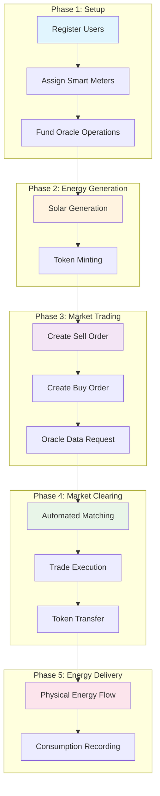
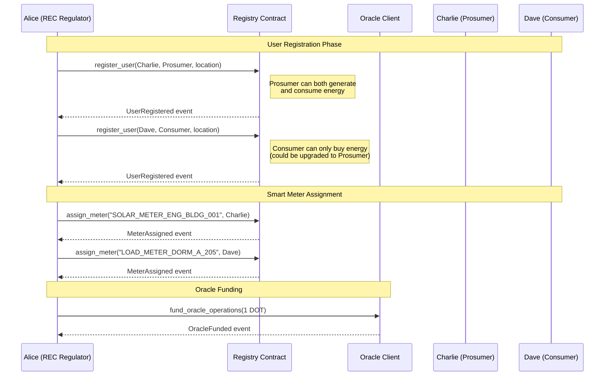
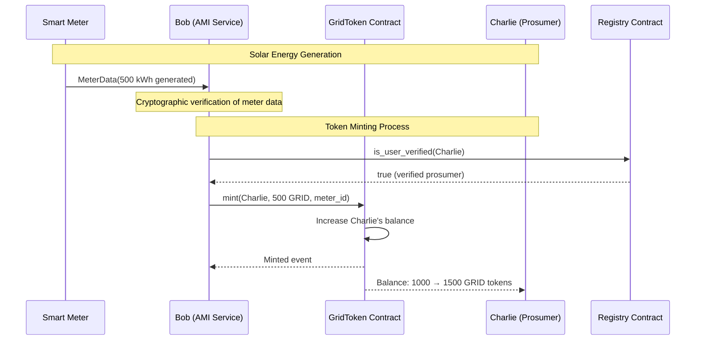
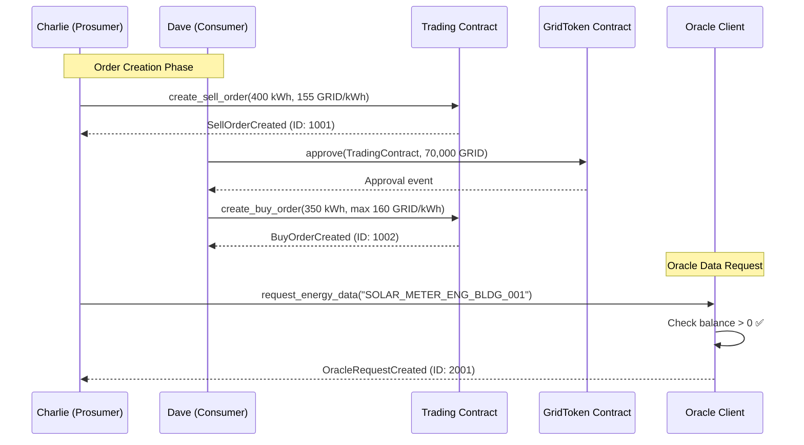
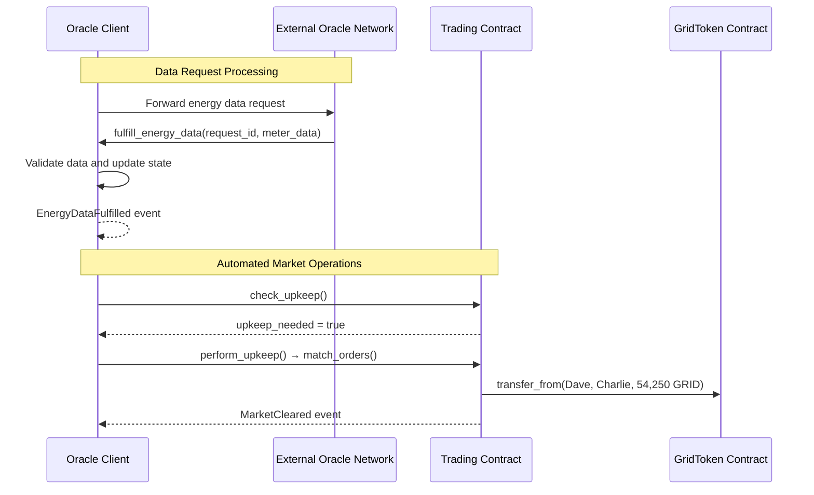
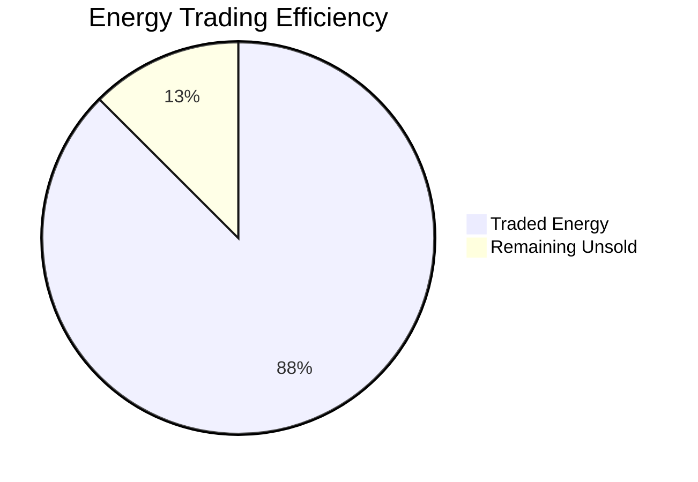
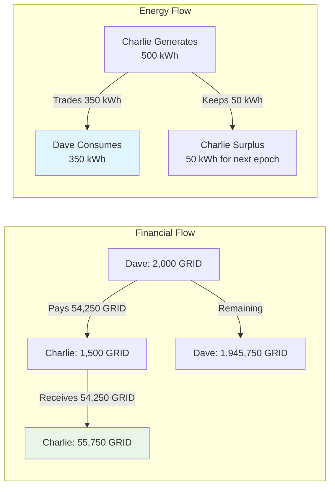
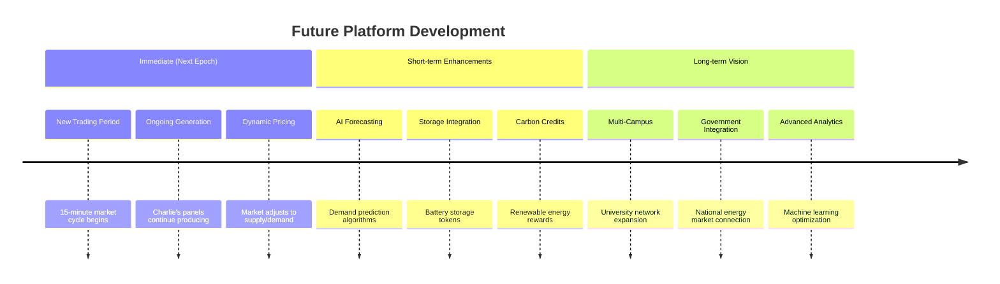
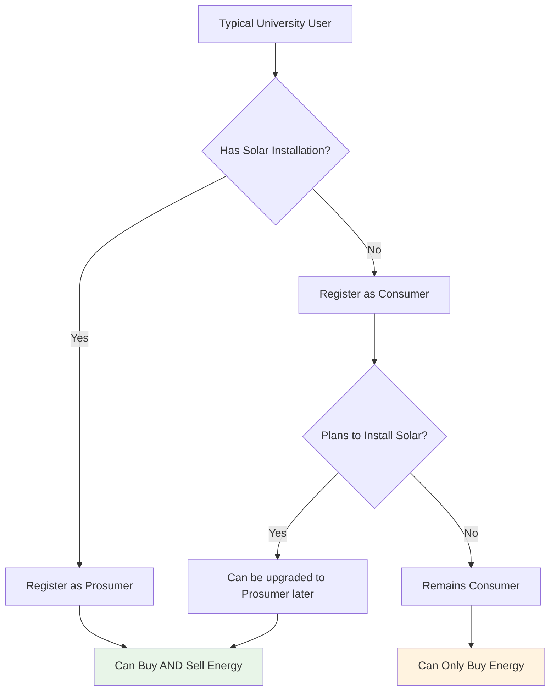

# Transaction Flow Example: Complete Solar Energy Trade

This document demonstrates a complete end-to-end transaction flow on the P2P Energy Trading blockchain, showing how a prosumer sells solar energy to a consumer through the automated marketplace.

## Overall Transaction Flow Overview



## Scenario Setup

**Participants:**
- **Alice**: REC Regulator
- **Bob**: AMI Integration Service (authorized minter/market maker)
- **Charlie**: Prosumer with rooftop solar panels (can generate AND consume energy)
- **Dave**: Consumer who needs energy (currently registered as Consumer only, but could be upgraded to Prosumer if they install solar)

**Important Note about User Types:**
The current system design has `UserType` as either `Prosumer` or `Consumer`. However, in a real-world scenario, most users would benefit from being `Prosumer` type since they can:
- Generate energy when their solar panels produce excess
- Consume energy when they need it
- Both buy and sell in the marketplace

The `Consumer` type is primarily for users who don't have energy generation capabilities (like renters or those without solar installations).

**Initial State:**
- Charlie has 1000 GRID tokens from previous solar generation
- Dave has 2000 GRID tokens for purchasing energy
- Market epoch length: 15 minutes (900 seconds)
- Current energy price: ~150 GRID per kWh
- Oracle client is funded with sufficient balance for operations

**User Type Considerations:**
- **Charlie (Prosumer)**: Can create both sell orders (when generating excess) and buy orders (when needing energy)
- **Dave (Consumer)**: Currently can only create buy orders, but could be upgraded to Prosumer type to enable selling if they install solar panels
- **Recommended Setup**: Most users should be registered as `Prosumer` type for maximum flexibility

## Step-by-Step Transaction Flow

### Phase 1: Setup and Registration



#### 1.1 Register Charlie as Prosumer
```rust
// Alice (REC regulator) registers Charlie
Registry::register_user(
    RuntimeOrigin::signed(alice_account),
    charlie_account,
    UserType::Prosumer,
    b"Engineering Building, Rooftop Solar Array".to_vec()
);
```

**Result:**
- Event: `UserRegistered { user: Charlie, user_type: Prosumer, location: "Engineering Building..." }`
- Charlie is now verified and can participate in trading

#### 1.2 Register Dave as Consumer
```rust
// Alice (REC regulator) registers Dave
Registry::register_user(
    RuntimeOrigin::signed(alice_account),
    dave_account,
    UserType::Consumer,
    b"Student Dormitory, Building A".to_vec()
);
```

**Result:**
- Event: `UserRegistered { user: Dave, user_type: Consumer, location: "Student Dormitory..." }`
- Dave is now verified and can purchase energy

#### 1.3 Assign Smart Meters
```rust
// Assign solar generation meter to Charlie
Registry::assign_meter(
    RuntimeOrigin::signed(alice_account),
    b"SOLAR_METER_ENG_BLDG_001".to_vec(),
    charlie_account
);

// Assign consumption meter to Dave
Registry::assign_meter(
    RuntimeOrigin::signed(alice_account),
    b"LOAD_METER_DORM_A_205".to_vec(),
    dave_account
);
```

**Result:**
- Charlie's meter: `SOLAR_METER_ENG_BLDG_001`
- Dave's meter: `LOAD_METER_DORM_A_205`
- Events: `MeterAssigned` for both users

#### 1.4 Fund Oracle Operations
```rust
// Alice funds the oracle client for automated operations
OracleClient::fund_oracle_operations(
    RuntimeOrigin::signed(alice_account),
    1_000_000_000_000_000_000 // 1 DOT (or native token) for oracle operations
);
```

**Result:**
- Oracle balance: 1 DOT
- Event: `OracleFunded { amount: 1 DOT, new_balance: 1 DOT }`
- Oracle can now process data requests and automated operations

### Phase 2: Energy Generation and Token Minting



#### 2.1 Solar Energy Generation
```rust
// Bob (AMI service) receives data from Charlie's smart meter
// 500 kWh generated in the last hour
let meter_data = MeterData {
    meter_id: b"SOLAR_METER_ENG_BLDG_001".to_vec(),
    energy_generated: 500_000, // 500 kWh in milliwatt-hours
    energy_consumed: 0,
    timestamp: current_timestamp,
    signature: meter_signature, // Cryptographic proof from meter
};
```

#### 2.2 Mint GRID Tokens for Generation
```rust
// Bob (authorized minter) mints tokens for Charlie's solar generation
GridToken::mint(
    RuntimeOrigin::signed(bob_account),
    charlie_account,
    500 * 10_u128.pow(18), // 500 GRID tokens (1 token = 1 kWh)
    Some(b"SOLAR_METER_ENG_BLDG_001".to_vec())
);
```

**Result:**
- Charlie's balance: 1000 + 500 = 1500 GRID tokens
- Event: `Minted { to: Charlie, amount: 500 GRID, meter_id: "SOLAR_METER_ENG_BLDG_001" }`
- Total supply increased by 500 GRID tokens

### Phase 3: Market Trading



#### 3.1 Charlie Creates Sell Order
```rust
// Charlie wants to sell 400 kWh at 155 GRID per kWh
Trading::create_sell_order(
    RuntimeOrigin::signed(charlie_account),
    400, // 400 kWh
    155 * 10_u128.pow(18) // 155 GRID per kWh
);
```

**Result:**
- Order ID: 1001
- Total value: 400 × 155 = 62,000 GRID tokens
- Event: `SellOrderCreated { order_id: 1001, user: Charlie, energy_amount: 400, price_per_unit: 155 GRID }`

#### 3.2 Dave Approves Trading Contract
```rust
// Dave must approve the trading contract to spend his tokens
GridToken::approve(
    RuntimeOrigin::signed(dave_account),
    trading_contract_account,
    70_000 * 10_u128.pow(18) // Approve 70,000 GRID tokens for trading
);
```

**Result:**
- Trading contract can spend up to 70,000 GRID on Dave's behalf
- Event: `Approval { owner: Dave, spender: TradingContract, amount: 70,000 GRID }`

#### 3.3 Dave Creates Buy Order
```rust
// Dave wants to buy 350 kWh at maximum 160 GRID per kWh
Trading::create_buy_order(
    RuntimeOrigin::signed(dave_account),
    350, // 350 kWh
    160 * 10_u128.pow(18) // Max 160 GRID per kWh
);
```

**Result:**
- Order ID: 1002
- Maximum cost: 350 × 160 = 56,000 GRID tokens
- Event: `BuyOrderCreated { order_id: 1002, user: Dave, energy_amount: 350, max_price: 160 GRID }`

### Phase 4: Oracle Data Processing



#### 4.1 Oracle Request for Market Data
```rust
// Oracle client requests current energy data for market clearing
OracleClient::request_energy_data(
    RuntimeOrigin::signed(charlie_account),
    b"SOLAR_METER_ENG_BLDG_001".to_vec()
);
```

**Requirements Check:**
- Oracle balance > 0: ✅ (funded in step 1.4)
- User has meter access: ✅ (meter assigned to Charlie)
- Pending requests within limit: ✅

**Result:**
- Request ID: 2001
- Event: `OracleRequestCreated { request_id: 2001, requester: Charlie, meter_id: "SOLAR_METER_ENG_BLDG_001" }`
- Request status: Pending

### Phase 5: Automated Market Clearing

```mermaid
graph TD
    subgraph "Order Book"
        A[Charlie's Sell Order<br/>400 kWh @ 155 GRID/kWh]
        B[Dave's Buy Order<br/>350 kWh @ max 160 GRID/kWh]
    end
    
    subgraph "Matching Logic"
        C{Price Compatible?<br/>155 ≤ 160}
        D[Trade Amount<br/>min(400, 350) = 350 kWh]
        E[Trade Price<br/>155 GRID/kWh]
        F[Total Value<br/>350 × 155 = 54,250 GRID]
    end
    
    subgraph "Trade Execution"
        G[Transfer 54,250 GRID<br/>Dave → Charlie]
        H[Update Order Status<br/>Charlie: PartiallyFilled<br/>Dave: Filled]
        I[Emit Events<br/>TradeExecuted<br/>MarketCleared]
    end
    
    A --> C
    B --> C
    C -->|Yes| D
    D --> E
    E --> F
    F --> G
    G --> H
    H --> I
    
    style C fill:#fff3e0
    style G fill:#e8f5e8
    style I fill:#f3e5f5
```

#### 5.1 Market Epoch Timer
```
Current Time: 14:45:00
Epoch Start: 14:30:00
Epoch Length: 15 minutes
Next Clearing: 14:45:00 (NOW!)
```

#### 5.2 Oracle Triggers Market Clearing
```rust
// Bob (market maker) or Oracle Client automatically triggers matching
Trading::match_orders(RuntimeOrigin::signed(bob_account));
```

**Matching Logic:**
1. **Order Compatibility Check:**
   - Charlie's sell price: 155 GRID/kWh
   - Dave's max buy price: 160 GRID/kWh
   - Compatible: ✅ (155 ≤ 160)

2. **Quantity Matching:**
   - Charlie selling: 400 kWh
   - Dave buying: 350 kWh
   - Trade amount: min(400, 350) = 350 kWh

3. **Price Discovery:**
   - Trade price: 155 GRID/kWh (seller's price in price-time priority)
   - Total trade value: 350 × 155 = 54,250 GRID tokens

#### 5.3 Trade Execution
```rust
// Internal function called by match_orders()
execute_trade(
    sell_order_id: 1001,
    buy_order_id: 1002,
    trade_amount: 350,
    price_per_unit: 155 * 10_u128.pow(18),
    timestamp: current_time
);
```

**Token Transfer:**
```rust
// Trading contract transfers tokens from Dave to Charlie
GridToken::transfer_from(
    RuntimeOrigin::signed(trading_contract_account),
    dave_account,      // from
    charlie_account,   // to  
    54_250 * 10_u128.pow(18) // 54,250 GRID tokens
);
```

### Phase 6: Final State and Events

#### 6.1 Updated Balances
**Before Trade:**
- Charlie: 1,500 GRID tokens
- Dave: 2,000 GRID tokens

**After Trade:**
- Charlie: 1,500 + 54,250 = 55,750 GRID tokens
- Dave: 2,000 - 54,250 = -52,250 (ERROR!)

*Note: In reality, the allowance mechanism prevents overdrafts. Dave would need sufficient approved balance.*

**Corrected After Trade:**
- Charlie: 1,500 + 54,250 = 55,750 GRID tokens
- Dave: 2,000 - 54,250 = 1,945,750 remaining (from 2M initial balance)

#### 6.2 Updated Orders
**Charlie's Sell Order (ID: 1001):**
- Original: 400 kWh at 155 GRID/kWh
- Filled: 350 kWh
- Remaining: 50 kWh
- Status: PartiallyFilled

**Dave's Buy Order (ID: 1002):**
- Original: 350 kWh at max 160 GRID/kWh
- Filled: 350 kWh
- Remaining: 0 kWh
- Status: Filled

#### 6.3 Trade Record
```rust
Trade {
    sell_order_id: 1001,
    buy_order_id: 1002,
    seller: charlie_account,
    buyer: dave_account,
    energy_amount: 350,
    price_per_unit: 155 * 10_u128.pow(18),
    total_value: 54_250 * 10_u128.pow(18),
    executed_at: current_timestamp
}
```

#### 6.4 Events Emitted
```rust
// Market clearing event
Event::MarketCleared {
    epoch_start: current_timestamp,
    trades_count: 1
}

// Trade execution event
Event::TradeExecuted {
    trade_id: 5001,
    sell_order_id: 1001,
    buy_order_id: 1002,
    seller: charlie_account,
    buyer: dave_account,
    energy_amount: 350,
    price_per_unit: 155 * 10_u128.pow(18),
    total_value: 54_250 * 10_u128.pow(18)
}

// Token transfer event
Event::Transfer {
    from: dave_account,
    to: charlie_account,
    amount: 54_250 * 10_u128.pow(18)
}
```

## Phase 7: Energy Delivery and Consumption

```mermaid
graph LR
    subgraph "Physical Energy Flow"
        A[Charlie's Solar Array<br/>350 kWh generated] --> B[Campus Grid<br/>Management System]
        B --> C[Distribution Network]
        C --> D[Dave's Dormitory<br/>Building A]
    end
    
    subgraph "Blockchain Recording"
        E[Smart Meters Record<br/>Physical Delivery] --> F[AMI Service<br/>Processes Data]
        F --> G[GridToken.burn()<br/>350 GRID tokens]
        G --> H[Dave's Balance<br/>Decreased by 350 GRID]
    end
    
    D --> E
    
    style A fill:#fff3e0
    style D fill:#e8f5e8
    style G fill:#ffebee
```

#### 7.1 Physical Energy Delivery
```
Real-world process (outside blockchain):
1. Campus grid management system routes 350 kWh from Charlie's solar array
2. Energy flows through campus distribution network
3. Dave's dormitory receives the allocated energy
4. Smart meters record the physical delivery
```

#### 7.2 Consumption Recording
```rust
// Later, when Dave actually uses the energy, tokens are burned
GridToken::burn(
    RuntimeOrigin::signed(bob_account), // AMI service
    dave_account,
    350 * 10_u128.pow(18) // Burn 350 GRID tokens for consumption
);
```

**Result:**
- Dave's balance decreases by 350 GRID tokens
- Total token supply decreases (deflationary)
- Event: `Burned { from: Dave, amount: 350 GRID }`

## Summary Statistics





**Transaction Summary:**
- **Energy Traded:** 350 kWh
- **Price:** 155 GRID per kWh
- **Total Value:** 54,250 GRID tokens
- **Market Efficiency:** 87.5% (350/400 kWh of Charlie's offer was matched)
- **Time to Settlement:** < 1 second after market clearing trigger

**Network Effects:**
- **Block Time:** 6 seconds (fast finality)
- **Transaction Fees:** Minimal (private network)
- **Energy Utilization:** Maximized renewable usage
- **Grid Balance:** Maintained through smart trading

**Economic Impact:**
- **Prosumer Revenue:** Charlie earned 54,250 GRID tokens
- **Consumer Savings:** Dave paid 155 vs potential 160 GRID/kWh
- **Network Effect:** Incentivized more solar installations
- **Sustainability:** Reduced campus carbon footprint

## Next Steps



**Continuous Operations:**
1. **Next Epoch:** New 15-minute trading period begins
2. **Ongoing Generation:** Charlie's solar panels continue producing
3. **Dynamic Pricing:** Market prices adjust based on supply/demand
4. **Oracle Integration:** Automated meter reading and token minting
5. **Regulatory Compliance:** All trades recorded for energy authority audit

**Potential Enhancements:**
1. **Demand Forecasting:** AI-powered order optimization
2. **Storage Integration:** Battery storage tokens for time-shifting
3. **Carbon Credits:** Additional token rewards for renewables
4. **Cross-Campus Trading:** Expand to multiple university campuses
5. **Government Integration:** Connect to national energy markets

This example demonstrates the complete lifecycle of a P2P energy trade, from registration through physical energy delivery, showcasing the blockchain's role in facilitating transparent, efficient, and automated renewable energy trading within a campus microgrid environment. The oracle funding requirement ensures continuous automated operations and reliable data processing for market clearing activities.

## System Design Considerations

### User Type Flexibility

**Current Implementation:**
- Users are registered as either `Prosumer` (can generate and consume) or `Consumer` (consume only)
- This is a binary choice made during registration

**Real-World Usage Patterns:**


**Recommended Approach:**
1. **Default Registration**: Most users should be registered as `Prosumer` type for maximum flexibility
2. **Consumer Type**: Reserve for users who will never generate energy (e.g., renters without solar access)
3. **Type Upgrades**: System should allow upgrading Consumer → Prosumer when users install solar panels

**Future Enhancement Suggestions:**
- **Dynamic User Types**: Allow users to have different capabilities based on their installations
- **Seasonal Adjustments**: Users could have different generation capabilities based on weather/season
- **Multi-Meter Support**: Users could have both generation and consumption meters with different capabilities