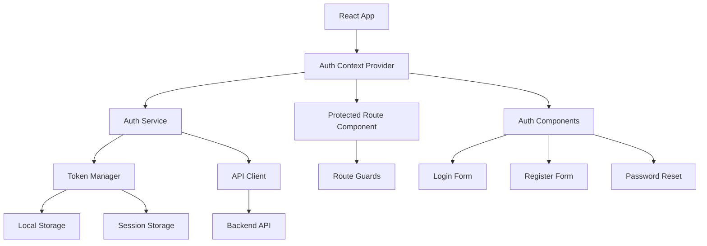
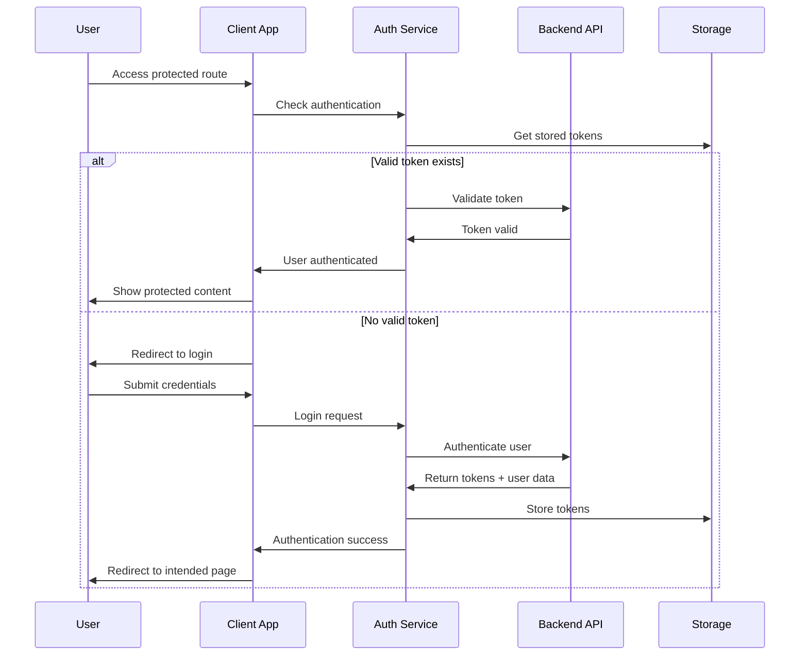

# Authentication System Design

## Overview

The authentication system will be implemented as a comprehensive solution for the P2P Energy Trading application, providing secure user registration, login, session management, and role-based access control. The system will integrate seamlessly with the existing React/TypeScript application using modern authentication patterns and best practices.

The design leverages the existing technology stack including React 18, TypeScript, React Router DOM, React Query, Axios, React Hook Form with Zod validation, and Tailwind CSS for styling.

## Architecture

### High-Level Architecture



### Authentication Flow



## Components and Interfaces

### Core Types and Interfaces

```typescript
// User and Authentication Types
interface User {
  id: string;
  email: string;
  firstName: string;
  lastName: string;
  userType: UserType;
  role: Role;
  isVerified: boolean;
  createdAt: string;
  updatedAt: string;
}

interface AuthTokens {
  accessToken: string;
  refreshToken: string;
  expiresAt: number;
}

interface AuthState {
  user: User | null;
  tokens: AuthTokens | null;
  isAuthenticated: boolean;
  isLoading: boolean;
  error: string | null;
}

enum UserType {
  STUDENT = 'student',
  FACULTY = 'faculty',
  STAFF = 'staff',
  ADMIN = 'admin'
}

enum Role {
  USER = 'user',
  MODERATOR = 'moderator',
  ADMIN = 'admin',
  SUPER_ADMIN = 'super_admin'
}

// Form Types
interface LoginFormData {
  email: string;
  password: string;
  rememberMe: boolean;
}

interface RegisterFormData {
  email: string;
  password: string;
  confirmPassword: string;
  firstName: string;
  lastName: string;
  userType: UserType;
}

interface PasswordResetFormData {
  email: string;
}

interface NewPasswordFormData {
  password: string;
  confirmPassword: string;
}
```

### Authentication Context

The authentication context will provide global state management for user authentication:

```typescript
interface AuthContextType {
  // State
  user: User | null;
  isAuthenticated: boolean;
  isLoading: boolean;
  error: string | null;
  
  // Actions
  login: (credentials: LoginFormData) => Promise<void>;
  register: (userData: RegisterFormData) => Promise<void>;
  logout: () => void;
  resetPassword: (email: string) => Promise<void>;
  setNewPassword: (token: string, password: string) => Promise<void>;
  verifyEmail: (token: string) => Promise<void>;
  resendVerification: () => Promise<void>;
  refreshToken: () => Promise<void>;
  clearError: () => void;
}
```

### Protected Route Component

A higher-order component that wraps protected routes:

```typescript
interface ProtectedRouteProps {
  children: React.ReactNode;
  requiredRole?: Role;
  requireVerification?: boolean;
  fallback?: React.ComponentType;
}
```

### Authentication Service

Core service class handling all authentication operations:

```typescript
class AuthService {
  private apiClient: AxiosInstance;
  private tokenManager: TokenManager;
  
  async login(credentials: LoginFormData): Promise<AuthResponse>;
  async register(userData: RegisterFormData): Promise<void>;
  async logout(): Promise<void>;
  async refreshToken(): Promise<AuthTokens>;
  async resetPassword(email: string): Promise<void>;
  async setNewPassword(token: string, password: string): Promise<void>;
  async verifyEmail(token: string): Promise<void>;
  async resendVerification(): Promise<void>;
  async getCurrentUser(): Promise<User>;
}
```

### Token Manager

Handles secure token storage and management:

```typescript
class TokenManager {
  setTokens(tokens: AuthTokens, rememberMe: boolean): void;
  getTokens(): AuthTokens | null;
  clearTokens(): void;
  isTokenExpired(token: string): boolean;
  shouldRefreshToken(): boolean;
}
```

## Data Models

### User Model Validation

Using Zod for runtime validation:

```typescript
const UserSchema = z.object({
  id: z.string().uuid(),
  email: z.string().email(),
  firstName: z.string().min(1).max(50),
  lastName: z.string().min(1).max(50),
  userType: z.nativeEnum(UserType),
  role: z.nativeEnum(Role),
  isVerified: z.boolean(),
  createdAt: z.string().datetime(),
  updatedAt: z.string().datetime(),
});

const LoginFormSchema = z.object({
  email: z.string().email('Please enter a valid email address'),
  password: z.string().min(1, 'Password is required'),
  rememberMe: z.boolean().default(false),
});

const RegisterFormSchema = z.object({
  email: z.string().email('Please enter a valid email address'),
  password: z.string()
    .min(8, 'Password must be at least 8 characters')
    .regex(/^(?=.*[a-z])(?=.*[A-Z])(?=.*\d)(?=.*[@$!%*?&])[A-Za-z\d@$!%*?&]/, 
           'Password must contain uppercase, lowercase, number, and special character'),
  confirmPassword: z.string(),
  firstName: z.string().min(1, 'First name is required').max(50),
  lastName: z.string().min(1, 'Last name is required').max(50),
  userType: z.nativeEnum(UserType),
}).refine((data) => data.password === data.confirmPassword, {
  message: "Passwords don't match",
  path: ["confirmPassword"],
});
```

### API Response Models

```typescript
interface AuthResponse {
  user: User;
  tokens: AuthTokens;
  message: string;
}

interface ApiError {
  message: string;
  code: string;
  details?: Record<string, string[]>;
}
```

## Error Handling

### Error Types and Handling Strategy

```typescript
enum AuthErrorCode {
  INVALID_CREDENTIALS = 'INVALID_CREDENTIALS',
  EMAIL_NOT_VERIFIED = 'EMAIL_NOT_VERIFIED',
  TOKEN_EXPIRED = 'TOKEN_EXPIRED',
  TOKEN_INVALID = 'TOKEN_INVALID',
  USER_NOT_FOUND = 'USER_NOT_FOUND',
  EMAIL_ALREADY_EXISTS = 'EMAIL_ALREADY_EXISTS',
  WEAK_PASSWORD = 'WEAK_PASSWORD',
  NETWORK_ERROR = 'NETWORK_ERROR',
  SERVER_ERROR = 'SERVER_ERROR',
  PERMISSION_DENIED = 'PERMISSION_DENIED'
}

class AuthError extends Error {
  constructor(
    public code: AuthErrorCode,
    message: string,
    public details?: Record<string, string[]>
  ) {
    super(message);
    this.name = 'AuthError';
  }
}
```

### Error Handling Patterns

1. **Form Validation Errors**: Display field-specific errors using React Hook Form
2. **API Errors**: Show user-friendly messages with toast notifications using Sonner
3. **Network Errors**: Implement retry logic with exponential backoff
4. **Token Expiration**: Automatic token refresh with fallback to login redirect
5. **Permission Errors**: Redirect to appropriate error pages or show access denied messages

## Testing Strategy

### Unit Testing

- **Authentication Service**: Test all authentication methods with mocked API responses
- **Token Manager**: Test token storage, retrieval, and expiration logic
- **Form Validation**: Test Zod schemas with various input combinations
- **Utility Functions**: Test helper functions for token validation and user role checking

### Integration Testing

- **Authentication Flow**: Test complete login/logout cycles
- **Protected Routes**: Test route protection with different user roles
- **Form Submissions**: Test form handling with validation and API integration
- **Error Scenarios**: Test error handling for various failure cases

### End-to-End Testing

Using Playwright for E2E testing:

- **User Registration Flow**: Complete registration process including email verification
- **Login/Logout Flow**: Test authentication with different user types
- **Protected Route Access**: Test route protection and redirects
- **Password Reset Flow**: Test complete password reset process
- **Session Management**: Test session persistence and expiration

### Test Structure

```typescript
// Example test structure
describe('AuthService', () => {
  describe('login', () => {
    it('should authenticate user with valid credentials');
    it('should throw error for invalid credentials');
    it('should handle network errors gracefully');
  });
  
  describe('register', () => {
    it('should register new user successfully');
    it('should throw error for existing email');
    it('should validate password requirements');
  });
});

describe('ProtectedRoute', () => {
  it('should render children for authenticated users');
  it('should redirect to login for unauthenticated users');
  it('should check role permissions correctly');
});
```

## Security Considerations

### Token Security

- **Access Token**: Short-lived (15 minutes), stored in memory when possible
- **Refresh Token**: Longer-lived (30 days), stored in httpOnly cookies or secure storage
- **Token Rotation**: Implement refresh token rotation for enhanced security
- **XSS Protection**: Sanitize all user inputs and use Content Security Policy

### Storage Security

- **Sensitive Data**: Never store passwords or sensitive data in localStorage
- **Token Storage**: Use secure storage mechanisms based on "Remember Me" preference
- **Session Management**: Implement proper session timeout and cleanup

### API Security

- **HTTPS Only**: All authentication endpoints must use HTTPS
- **Rate Limiting**: Implement rate limiting for authentication endpoints
- **CSRF Protection**: Use CSRF tokens for state-changing operations
- **Input Validation**: Server-side validation for all authentication inputs

## Integration Points

### Existing Application Integration

1. **Layout Component**: Add authentication status and user menu to the existing Layout
2. **Navigation**: Update navigation to show/hide items based on authentication status
3. **API Client**: Integrate authentication tokens with existing Axios configuration
4. **Route Protection**: Wrap existing routes with ProtectedRoute components
5. **User Context**: Provide user information to existing components that need it

### Backend API Integration

The authentication system expects the following API endpoints:

- `POST /auth/login` - User authentication
- `POST /auth/register` - User registration
- `POST /auth/logout` - User logout
- `POST /auth/refresh` - Token refresh
- `POST /auth/forgot-password` - Password reset request
- `POST /auth/reset-password` - Set new password
- `POST /auth/verify-email` - Email verification
- `POST /auth/resend-verification` - Resend verification email
- `GET /auth/me` - Get current user information

### State Management Integration

The authentication system will integrate with the existing React Query setup for:

- **Caching**: Cache user data and authentication state
- **Synchronization**: Keep authentication state synchronized across tabs
- **Optimistic Updates**: Provide immediate feedback for authentication actions
- **Background Refetch**: Automatically refresh user data when needed